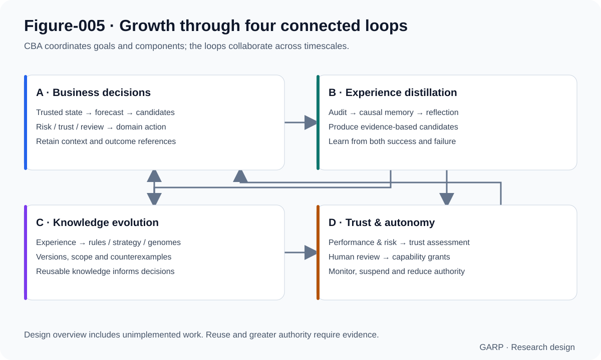
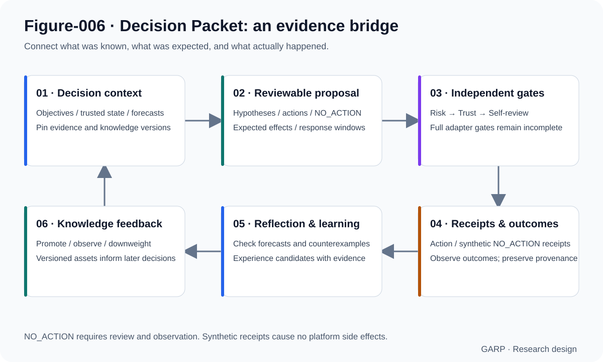
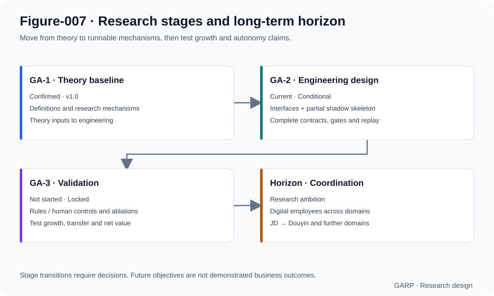

# Growth Agent Research Project (GARP)

**Enterprise agents that accumulate experience, evolve knowledge, and earn greater autonomy through verified business practice.**

[中文](README.md) · [Theory baseline](Research/GA-1/GA-1_Theory_v1.0.md) · [Architecture](Research/GA-2/Architecture_Overview_v0.2.md) · [Roadmap](ROADMAP.md) · [Apache-2.0](LICENSE)

GARP is an open research project on **Growth Agents for continuous business decision-making**. It asks whether enterprise agents can turn repeated operational tasks and authentic feedback into reusable experience, transferable strategies, and improving decision capability, while keeping responsibility aligned with demonstrated competence.

E-commerce operations provide the initial domain. JD advertising is the first engineering and future validation scenario; Douyin is deferred. The long-term ambition is enterprise-specific digital employees and a coordinated enterprise AI operating system.

> **Current stage: GA-2 Engineering Design, Conditional.** The repository contains a theory baseline, a four-loop architecture, key interface designs, and a runnable local fixture-shadow skeleton. Full growth loops, model training, and business outcomes remain to be implemented and validated. GA-3 experiments have not started. See the [release manifest](Research/GA-2/GA-2_Release_Manifest_v0.1.md).

## 1. Why study growth?

Business decisions have continuing consequences. A morning budget allocation affects evening reach; frequent interventions may disrupt plan stability; refunds and attribution overlap change the interpretation of returns; inventory and campaigns alter the next decision's context.

GARP studies capability after deployment: what evidence does an intervention leave? Can success and failure become experience with explicit boundaries? Does that experience transfer to other plans and future periods? What would justify granting an agent more authority?

Evaluation therefore extends beyond task completion to decision quality over time, knowledge transfer, risk constraints, and human coordination costs. **Growth requires longitudinal evidence; knowledge compounding requires useful reuse; autonomy requires revocable authorization.**

## 2. Research approach: four connected loops



| Loop | Mechanism | Question to test |
|---|---|---|
| A · Business decisions | Trusted state → forecasts → candidate reasoning → risk, trust and review → domain action → audit | Can the agent make justified decisions in changing conditions? |
| B · Experience distillation | Decision evidence → causal memory → outcome observation and reflection → experience candidates | Can it reduce recurring errors and retain useful lessons from failure? |
| C · Knowledge evolution | Experience → rules, strategies and parameter genomes → capability assets → decision feedback | Can local experience become transferable knowledge that improves future decisions? |
| D · Trust and autonomy | Performance and risk evidence → trust assessment → human promotion review → capability grants and monitoring | Can authority track demonstrated ability and contract when risks emerge? |

These loops operate at different timescales. Decisions span intraday and plan-level horizons; distillation waits for observable outcomes; knowledge evolution needs evidence across samples; autonomy changes require sustained performance and explicit authorization.

The **Chief Business Agent (CBA)** is the sole top-level coordinator of goals, resources, and component calls. Forecast Engine predicts future states; Reasoning Engine proposes candidates; Risk / Trust / Self-review control action eligibility. Domain agents and adapters handle controlled execution, while versioned knowledge supplies reusable decision context.

## 3. Decision Packet: an evidence bridge for growth



Each decision must connect what was known, why an action was proposed, what was expected, and what subsequently happened. A Decision Packet binds the objective snapshot, trusted state, forecasts, hypotheses, candidate actions, response windows, risk, trust, review, and references to receipts and outcomes.

This connects decisions to learning. Without a receipt, execution cannot be claimed. Without an observed outcome, a credible success label cannot be assigned. Without independent repetition and applicability boundaries, a single experience should not become an enterprise rule.

**NO_ACTION is a complete decision.** Stability, random noise, or an unfinished response window may justify deliberately leaving a plan unchanged. It still requires a rationale, review, observation, and reflection. The current contract separates ordinary-action `APPROVE` from `NO_ACTION_APPROVE`; a synthetic receipt cannot authorize platform side effects.

Causal memory preserves observation–hypothesis–action–result–reflection and evidence references. This structure supports scrutiny of explanations; causal business effects still require controls, confounder handling, and appropriate experimental designs.

## 4. Turning experience into enterprise assets

The design separates four responsibilities: Memory retains event evidence; Reflection organizes review and checks; Learning proposes experience candidates; Knowledge governs promotion, versions, applicability, counterexamples, and downweighting.

The knowledge path proceeds from raw data and business cases toward experience, operational rules, strategies, and stable capability. **Promotion Parameter Genomes** are reusable assets within this system: they encode product categories, plan purposes, lifecycle stages, objective preferences, budget and bidding priors, risk constraints, and response windows, then instantiate versioned templates for specific plans.

Knowledge must remain open to correction. New evidence can support promotion, observation, downweighting, or retirement. Historical versions and failure records retain lineage. Knowledge compounding means verified assets continue to improve later business decisions.

### Knowledge evolution and model capability updates

MiMo's engineering studies propose two tracks: business rules and changing parameters evolve in the Knowledge layer; more stable abilities such as scenario recognition, hypothesis construction, and constraint following can enter model weights through periodic training. Retrieval can make new knowledge available before retraining; weight changes require independent evaluation, versioning, and rollback.

The current Brain proposal uses hybrid reasoning: deterministic input assembly → small-model candidate generation → deterministic output validation → decision drafts. The model serves as a cognitive kernel; system gates control review and execution eligibility. **The hybrid kernel, base model, and training approach remain proposals awaiting confirmation. No completed training or demonstrated self-evolution is claimed.**

## 5. Initial domain: JD advertising operations

This domain grounds the growth mechanisms in observable operational problems:

- **Business-state validity:** distinguish platform-attributed sales from trusted order measures; account for pending payments, refunds, and attribution overlap.
- **Dynamic objectives:** adapt preferences to price bands, seeding/harvest intent, lifecycle, and enterprise goals.
- **Two timescales:** reason about intraday budget lifetime and longer-term investment value.
- **Stability and response windows:** avoid repeated adjustments driven by short-lived fluctuations.
- **Constraints across sources:** include inventory, warehouse lead times, budgets, and campaign events.

The Reasoning design covers five scenario skeletons: declining seeding reach, budget lifetime, harvest stability, campaign periods, and tight inventory. Adapter contracts reserve platform extension points; real JD or Douyin APIs are not connected.

## 6. Current deliverables and runnable entry point

| Layer | Available work | Boundary |
|---|---|---|
| Theory | GA-1 v1.0, research questions, internal innovation-claim index | Baseline confirmed; effectiveness and scholarly novelty comparisons remain research tasks |
| Architecture | CBA coordination, four loops, component boundaries | Mainline confirmed; most detailed contracts remain Draft |
| Engineering design | Packets, gates, shadow mode, runtime envelopes, knowledge/trust runtimes, calibration methods | A complete releasable GA-2 RC has not been established |
| Implementation | Standard-library Python skeleton, types, partial review/gates, FixtureTransport, self-checks | Partly runnable; full business engines and end-to-end loops are incomplete |
| Verification | 28 existing unit tests and default boot self-check pass | Does not establish full gate coverage, real business returns, or production readiness |

Python 3.10+; the current skeleton requires no third-party runtime dependencies:

```bash
git clone https://github.com/liux97325-sudo/Growth-Agent-Research.git
cd Growth-Agent-Research/garp
python3 -m unittest discover -s tests/unit -v
python3 apps/cli/selfcheck.py
```

Defaults are FIXTURE, SHADOW_READ_ONLY, and `dry_run=true`, with a fail-closed real-transport stub. Existing tests cover NO_ACTION packaging, review/action separation, shadow write rejection, and isolation of non-LIVE trust signals.

## 7. Outlook: from auditable decisions to growing capability



GARP's long-term opportunity is an enterprise-specific capability accumulation mechanism. Operational experience can become structured assets; failures can yield testable lessons; knowledge can transfer across plans; autonomy can expand cautiously with evidence. If these mechanisms work, the value of enterprise AI may increase through continued practice after deployment.

The research horizon has four progressively demanding objectives:

| Objective | Potential value | Evidence required |
|---|---|---|
| Auditable continuous decisions | More transparent judgments and fewer unjustified interventions | Complete contracts, gates, fixtures, and replayable traces |
| Reusable enterprise knowledge | Less repeated trial and error; retained operational experience | Transfer gains on future-period and cross-plan holdouts |
| Controlled digital employees | Lower human workload within quality and risk constraints | Joint validation of human costs, decision quality, review, and authority revocation |
| Enterprise AI operating system | Coordination across advertising, content, inventory, and pricing | Validated first-domain outcomes, cross-domain contracts, and goal-conflict resolution |

**Near term: engineering convergence.** Complete gates, machine-readable schemas, fixture coverage, end-to-end replay, and evidence tied to versions. Model choices and validation-stage entry still require explicit decisions.

**Next: test growth.** Compare against frozen rules and human-operation baselines; use no-reflection and no-knowledge-feedback ablations to identify contributing mechanisms. Report forecast accuracy, trusted ROI, wasted spend, knowledge transfer, human time, and risk guardrails together.

**Long term: business-domain coordination.** Build on evidence from JD operations before extending to Douyin, inventory, pricing, and content. Enterprise digital employees are a mature form to be established incrementally.

## 8. Explore the research

Most detailed source documents are currently in Chinese.

| Topic | Entry point |
|---|---|
| Definitions and theory boundaries | [GA-1 Theory v1.0](Research/GA-1/GA-1_Theory_v1.0.md) |
| Architecture and components | [Architecture v0.2](Research/GA-2/Architecture_Overview_v0.2.md) |
| Current versions and open items | [Release Manifest](Research/GA-2/GA-2_Release_Manifest_v0.1.md) |
| Decision contracts | [v0.1 fields](Research/GA-2/Decision_Packet_Schema_v0.1.md) → [v0.2 additions](Research/GA-2/Decision_Packet_Schema_v0.2.md) → [v0.2.1 semantic additions](Research/GA-2/Decision_Packet_Schema_v0.2.1.md) (read together) |
| Memory and knowledge boundaries | [Memory / Knowledge](Research/GA-2/Memory_Knowledge_Boundary_v0.1.md) |
| Dual-track model proposal | [Brain training plan](Research/GA-2/Brain_Model_Training_Finetune_Plan_v0.1.md) · [Feasibility outlook](Research/GA-2/Brain_Model_Training_Feasibility_Foresight_v0.1.md) (Draft) |
| Future validation structure | [Validation Protocol](Research/GA-2/GA-3_Validation_Protocol_Draft_v0.1.md) (Draft; GA-3 not started) |
| Implementation and tasks | [Skeleton guide](garp/README.md) · [Engineering TODO](Research/GA-2/Engineering_TODO.md) |
| Governance and authorization | [PROJECT_SPEC](PROJECT_SPEC.md) · [Decision Log](Meeting/Decision_Log.md) |

## 9. Research participation and contributions

Issues and PRs are welcome on machine-readable contracts, negative fixtures, replayable tests, knowledge-promotion evidence, forecast calibration, literature comparisons, and growth evaluation. State the research question, scope, evidence, and implications for the existing design.

Read the governance specification and latest formal decisions first. `Research/` is the source of truth. Theory revisions require an owner-authorized new version; engineering and figures must not reverse-edit the existing theory baseline. Platform access, writes, model training, and GA-3 execution follow their respective decision boundaries.

Homepage figures summarize documented mechanisms, including work awaiting implementation. Editable SVGs and corresponding Mermaid sources are in `Figures/`.

## 10. License and citation

Licensed under the [Apache License 2.0](LICENSE), permitting commercial use, modification, and redistribution subject to its terms, including preservation of required notices. The former noncommercial restriction has been removed. Third-party materials retain their respective licenses.

When citing GARP, include the repository URL, the commit or version used, and the relevant theory or engineering documents:

```text
Growth Agent Research Project (GARP).
https://github.com/liux97325-sudo/Growth-Agent-Research
Theory baseline: Research/GA-1/GA-1_Theory_v1.0.md
```
