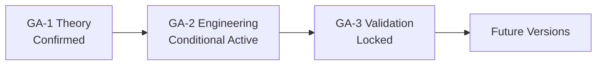
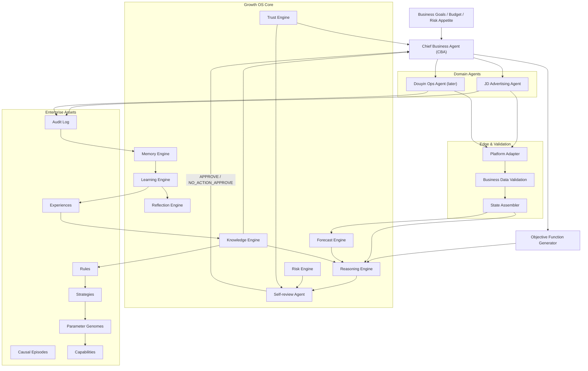
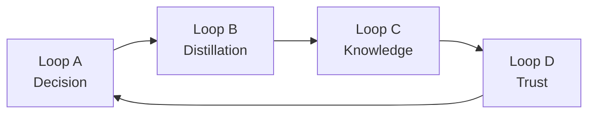

# Growth Agent Research Project (GARP)

**From task automation to enterprise digital employees that grow.**

[](LICENSE)
[](Research/GA-2/GA-2_Release_Manifest_v0.1.md)
[](garp/)
[](garp/tests/)

GARP is an open research repository for **Growth Agents**: enterprise AI systems that continuously practice in real business environments, learn from authentic feedback, distill experience into reusable knowledge, and gradually earn autonomy under risk controls.

This is **not** another “LLM + tools + workflow” ad-automation demo.  
It is a long-horizon program for **enterprise digital employees** whose value compounds after deployment.

---

## Why Growth Agents?

Most enterprise AI today stops at:

| Typical systems | Growth Agents |
|---|---|
| Execute a task and stop | Continuous business decision loops |
| No long-term memory | Causal memory + knowledge evolution |
| Fixed KPIs | Dynamic objective functions by product/plan/lifecycle |
| Trust the platform dashboard blindly | Business data validation first |
| Static permissions | Trust-scored autonomy ladder |
| Failures are logs | Failures are learning events |

**Core thesis (GA-1):**

> Enterprise AI should not remain at task automation. It should grow into a digital employee that practices continuously, learns from real feedback, distills experience, evolves knowledge, and makes risk-controlled decisions.

---

## Three-Stage Research Roadmap



| Stage | Question | Status |
|---|---|---|
| **GA-1 Theory** | Why do enterprises need Growth Agents? | **Confirmed** (`GA-1_Theory_v1.0.md`) |
| **GA-2 Engineering** | How do we build one safely? | **Conditional — Design Baseline Not Yet Releasable** |
| **GA-3 Validation** | Does it actually outperform baselines? | Locked (no experiments yet) |

Stage transitions require formal decisions in [`Meeting/Decision_Log.md`](Meeting/Decision_Log.md).

---

## System Architecture



**Source:** [`Figures/Mermaid/Figure-004_Growth_Agent_Architecture.mmd`](Figures/Mermaid/Figure-004_Growth_Agent_Architecture.mmd) · Spec: [`Research/GA-2/Architecture_Overview_v0.2.md`](Research/GA-2/Architecture_Overview_v0.2.md)

### Four growth loops (the real engine)



1. **Decision loop** — State → Forecast → Reasoning → Gate → Execute  
2. **Distillation loop** — Audit → Causal memory → Reflection → Experience  
3. **Knowledge loop** — Experience → Rules/Strategies/Genomes → Re-feed decisions  
4. **Trust loop** — Measured performance → Trust score → Wider autonomy  

> Implementing only Loop A yields a sophisticated workflow agent.  
> GARP requires Loops B+C (and D as maturity grows).

---

## Decision Packet: the atomic unit of growth

Every action that can touch the business must be packaged as a **Decision Packet** before Self-review:

| Field group | Examples |
|---|---|
| Identity | `decision_id`, `packet_kind`, `schema_version` |
| Lifecycle | `lifecycle_status` (Draft → … → Archived) |
| Review | `review_result` (only SRA writes) |
| Context | objective snapshot, state digest, forecast_ref |
| Intent | hypothesis, proposed_actions[] (incl. legal `NO_ACTION`) |
| Controls | risk, trust_required/actual, envelope |
| Evidence | receipts, outcome_ref, reflection_ref |

**Hard rules (DPK-I9–I12):**

- `NO_ACTION` packets must be non-empty and fully NO_ACTION  
- NO_ACTION ⇒ `review_result = NO_ACTION_APPROVE` only  
- Side-effect writes ⇒ `review_result = APPROVE` only  
- `NO_ACTION_APPROVE` must never authorize platform side effects  

Schema: [`Decision_Packet_Schema_v0.2.1.md`](Research/GA-2/Decision_Packet_Schema_v0.2.1.md)

---

## Safety gates (G-00 → G-09)

```text
G-00 Schema + Envelope
 → G-01 Lifecycle / Review / Action semantics
 → G-02 Trust capability
 → G-03 Risk hard-block
 → G-04 State drift / staleness
 → G-05 Idempotency
 → G-06 Inventory / budget revalidation
 → G-07 Runtime mode / dry_run / transport
 → G-08 Frequency & response window
 → G-09 Plan-mode compatibility
 → Platform write OR synthetic NO_ACTION receipt
```

Gate outcomes are **typed**, not a single boolean:

`PLATFORM_WRITE | SYNTHETIC_NO_ACTION | REJECT | HOLD | ESCALATE`

---

## Repository layout

```text
Growth-Agent-Research/
├── README.md
├── LICENSE                     # Apache-2.0
├── PROJECT_SPEC.md             # Governance
├── ROADMAP.md / CHANGELOG.md / Research_Context.md
├── Research/
│   ├── GA-1/                   # Theory source of truth
│   ├── GA-2/                   # Engineering design (architecture, contracts, runtimes)
│   └── GA-3/                   # Validation placeholder (locked)
├── Meeting/                    # Decisions, logs, remediation reports
├── Paper/ / Figures/ / Appendix/ / Templates/
└── garp/                       # Runnable fixture-shadow skeleton (stdlib Python)
```

### Key GA-2 design documents

| Area | Document |
|---|---|
| Architecture | [`Architecture_Overview_v0.2.md`](Research/GA-2/Architecture_Overview_v0.2.md) |
| Release manifest | [`GA-2_Release_Manifest_v0.1.md`](Research/GA-2/GA-2_Release_Manifest_v0.1.md) |
| Decision packet | [`Decision_Packet_Schema_v0.2.1.md`](Research/GA-2/Decision_Packet_Schema_v0.2.1.md) |
| Gates | [`Gate_Integration_Playbook_v0.2.1.md`](Research/GA-2/Gate_Integration_Playbook_v0.2.1.md) |
| JD adapter | [`JD_Adapter_Interface_v0.2.md`](Research/GA-2/JD_Adapter_Interface_v0.2.md) |
| Shadow mode | [`Shadow_Mode_Design_v0.1.md`](Research/GA-2/Shadow_Mode_Design_v0.1.md) |
| Completeness audit | [`GA-2_Completeness_Audit_v0.2.md`](Research/GA-2/GA-2_Completeness_Audit_v0.2.md) |

---

## Runnable skeleton (`garp/`)

A **fixture-only, no-network** Python package that implements the critical gate semantics:

- Dual-field packet status (`lifecycle_status` + `review_result`)
- Correct `is_no_action` / ordinary-write `APPROVE` separation
- Typed write-gate outcomes
- Fail-closed Live transport stub
- Evidence-based credential / egress self-checks
- Negative tests for audit §11.2 cases

```bash
cd garp
python3 -m unittest discover -s tests/unit -v
python3 apps/cli/selfcheck.py
# or: make test && make selfcheck
```

**Honesty note:** 28 unit tests prove skeleton gate semantics, **not** production readiness or real JD/Douyin connectivity.

---

## Business domain (first validation field)

Primary scenario: **JD.com advertising (Jingzhuntong-style operations)**.  
Douyin is reserved as a later domain agent.

Design must respect hard-won operational truths:

- Platform “ad GMV” ≠ real GMV (pending payment, refunds, attribution overlap)  
- Low-ASP FMCG vs mid/high-ASP brand goods need **different objective functions**  
- Seeding plans ≠ harvest plans (explore/scale vs stable ROI)  
- Inventory & warehouse lead times are **decision variables**  
- Sometimes the optimal action is **`NO_ACTION`**

---

## Current status (honest)

| Item | Status |
|---|---|
| GA-1 theory | Confirmed |
| GA-2 design baseline | Conditional (not RC) |
| Git history | Present (see tags) |
| Fixture shadow skeleton | Runnable; tests passing |
| Real ad API / write path | **Not connected / not authorized** |
| GA-3 experiments | **Not started** |
| Production parameters | All **Proposed** until calibrated |

See [`Research/GA-2/GA-2_Release_Manifest_v0.1.md`](Research/GA-2/GA-2_Release_Manifest_v0.1.md).

---

## Governance highlights

1. `Research/` is the single source of truth.  
2. `GA-1_Theory_v1.0.md` must not be reverse-edited from engineering.  
3. Major choices go to `Meeting/Decision_Log.md` as `GA-DEC-NNN`.  
4. Non-LIVE environments must never feed live Trust or auto-promote enterprise rules.  
5. Real platform connections require a separate authorization decision.

Accepted decisions include GA-DEC-003…006; GA-DEC-007 (GA-3 boundary pre-research) is **Proposed**.

---

## Contributing

1. Read [`PROJECT_SPEC.md`](PROJECT_SPEC.md) and latest decisions.  
2. Prefer extending GA-2 contracts/fixtures/tests over adding speculative engines.  
3. Keep dual-field gate semantics and Apache-2.0 attribution headers.  
4. Open issues/PRs with evidence (tests, traces), not only prose.

---

## License

Licensed under the **Apache License, Version 2.0** — commercial use permitted.

```text
Copyright 2026 Growth Agent Research Project contributors
```

See [LICENSE](LICENSE).

---

## Citation

If you use GARP in research or products, please cite this repository and the GA-1 theory document:

```text
Growth Agent Research Project (GARP).
https://github.com/liux97325-sudo/Growth-Agent-Research
Theory baseline: Research/GA-1/GA-1_Theory_v1.0.md
```
