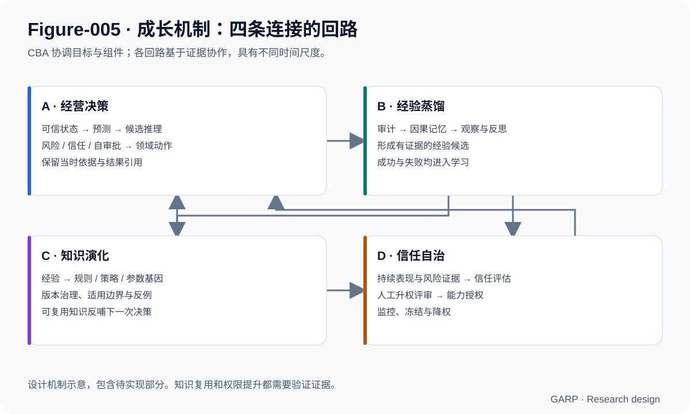
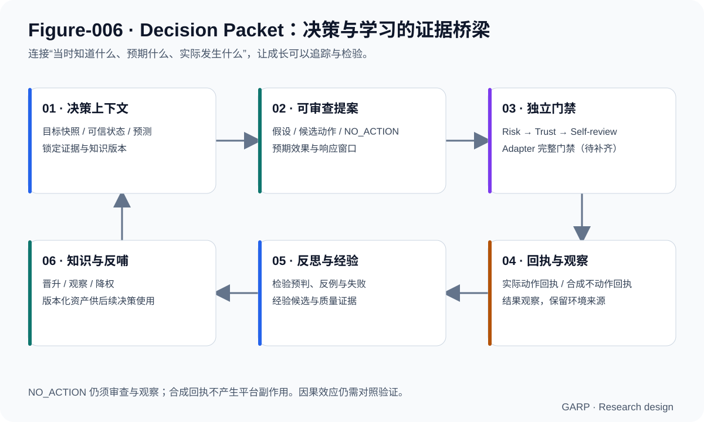
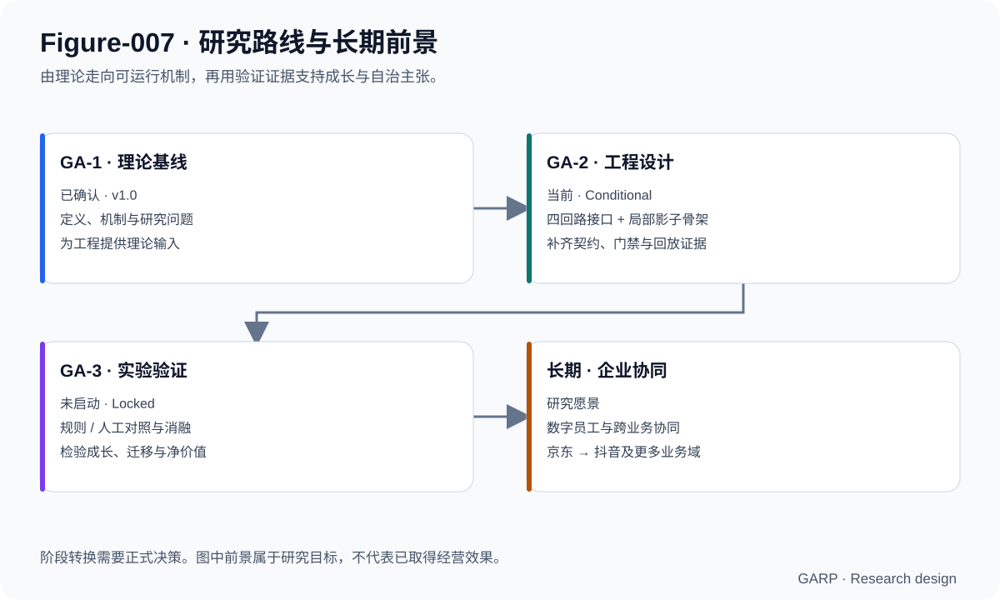

# Growth Agent Research Project（GARP）

**让企业智能体在经营实践中积累经验、演化知识，并以验证证据获得更大自治空间。**

[English](README.en.md) · [理论基线](Research/GA-1/GA-1_Theory_v1.0.md) · [工程架构](Research/GA-2/Architecture_Overview_v0.2.md) · [研究路线](ROADMAP.md) · [Apache-2.0](LICENSE)

GARP 是面向连续经营决策的成长型 AI Agent 开放研究项目。我们研究：企业智能体能否把一次次经营任务与真实反馈，转化为可复用经验、可迁移策略和持续改善的经营能力，同时让它承担的责任与已验证能力相匹配。

项目以电商运营为切入点，首个工程与未来验证场景是京东广告，抖音后置。长期目标是形成企业专属的数字员工与可协同的企业 AI 操作系统。

> **当前阶段：GA-2 工程设计，Conditional。** 已形成理论基线、四回路架构与关键接口设计，并提供可运行的本地影子骨架。完整成长闭环、模型训练和经营效果仍待实现与验证；GA-3 实验尚未启动。详见[发布清单](Research/GA-2/GA-2_Release_Manifest_v0.1.md)。

## 1. 为什么研究“成长”

企业经营具有连续性。今天的预算分配会影响晚间获量，频繁调整可能影响计划稳定性，退款与归因偏差会改变收益判断，库存和活动又会改变下一次决策的条件。任务完成之后，经营问题仍在继续。

GARP 把研究重点放在部署后的能力变化：一次调整留下怎样的证据？成功或失败能否转成有适用边界的经验？经验能否在其他计划和未来周期中复用？企业应凭什么把更大的决策权限交给 Agent？

这使项目的评价对象从单次任务完成率扩展到长期决策质量、知识迁移、风险约束和人机协作成本。**成长需要跨期证据，知识复利需要复用效果，自治需要可撤回的授权。**

## 2. 核心研究思路：四条相互连接的回路



| 回路 | 研究机制 | 要检验的问题 |
|---|---|---|
| A · 经营决策 | 可信状态 → 预测 → 候选推理 → 风险、信任与审查 → 领域动作 → 审计 | 能否在动态环境中做出合理、有依据的决策？ |
| B · 经验蒸馏 | 决策证据 → 因果记忆 → 结果观察与反思 → 经验候选 | 能否减少同类错误，并保留有价值的失败经验？ |
| C · 知识演化 | 经验 → 规则、策略与参数基因 → 能力资产 → 反哺决策 | 能否把局部经验转为未来可用、跨计划可迁移的知识？ |
| D · 信任自治 | 表现与风控证据 → 信任评估 → 人工升权评审 → 能力授权与监控 | 权限能否与已验证能力匹配，并在风险出现时收缩？ |

四条回路具有不同时间尺度：决策面向日内与计划周期，蒸馏发生在结果可观察之后，知识演化依赖跨样本证据，自治演进依赖持续表现与明确授权。把它们连接起来，才有可能形成持续成长机制。

架构中的 **Chief Business Agent（CBA）** 是唯一最高协调者，组织目标、资源与组件调用。Forecast Engine 预测未来状态，Reasoning Engine 提出候选，Risk / Trust / Self-review 控制动作资格；领域 Agent 与 Adapter 承担受控执行。知识层持续提供有版本和适用范围的决策依据。

## 3. Decision Packet：让成长有证据可追



每次决策都需要连接“当时知道什么”“为何这样判断”“预期发生什么”和“后来实际发生什么”。Decision Packet 将目标快照、可信状态、预测、假设、候选动作、响应窗口、风险、信任、审批及结果引用组织为可审计对象。

它连接经营决策与学习：没有动作回执，不能宣称动作已经执行；没有结果观察，不能形成可信的成功标签；没有独立复现与适用边界，单次经验不应直接晋升为企业规则。

**NO_ACTION（不调整）是完整决策。** 成熟计划的稳定性、随机噪声或尚未结束的响应窗口，都可能支持有意识地保持现状。它仍需要理由、审批、观察与复盘。现行契约把普通动作的 `APPROVE` 与不动作的 `NO_ACTION_APPROVE` 分开，合成回执不能授权平台副作用。

“因果记忆”保留观察—假设—动作—结果—反思及证据引用。这个结构帮助检验解释，但经营因果效应仍需要对照、混杂处理和实验设计来确认。

## 4. 让经营经验成为企业资产

项目区分四类职责：Memory 保存事件证据；Reflection 组织复盘与校验；Learning 提炼经验候选；Knowledge 治理晋升、版本、适用边界、反例与降权。

知识路径从原始数据和经营案例，逐步走向经验、运营规则、策略与稳定能力。**商品推广参数基因（Promotion Parameter Genome）** 是其中的可复用资产：记录商品类型、推广目的、生命周期、目标偏好、预算与出价先验、风险约束和响应窗口，并按版本实例化到具体计划。

知识资产需要能够被质疑和更新。新证据可能支持晋升，也可能触发观察、降权或退役；旧版本和失败记录保留追踪关系。项目追求的知识复利，是经验证知识在后续经营中持续产生价值。

### 知识演化与模型能力更新

MIMO 的工程研究提出双轨路线：经营规则和易变参数在 Knowledge 层演化；较稳定的场景识别、假设构造与约束响应能力，通过周期训练进入模型权重。知识可通过检索先影响决策，权重更新则需要独立评估、版本管理与回退。

当前 Brain 建议采用混合推理：确定性预组装 → 小模型提出候选 → 确定性后校验 → 决策草稿。模型承担认知内核职责，审批与执行资格由系统门禁控制。**混合内核、基座选型和训练方案仍为待确认建议，尚无训练完成或自进化成立的结论。**

## 5. 首个业务域：京东广告经营

这个场景能把成长机制落到具体、可观察的问题上：

- **经营状态真实性**：区分平台归因成交与可信订单口径，处理待付款、退款和归因重叠。
- **动态经营目标**：根据价格带、种草/收割目的、生命周期和企业目标调整偏好。
- **双时间尺度**：同时判断日内预算寿命与长周期投入价值。
- **稳定性与响应窗口**：避免用短时波动驱动反复调整。
- **跨源约束**：库存、仓配、预算和活动共同进入决策状态。

现有 Reasoning 设计包含种草获量下滑、预算寿命、收割稳定性、活动期和库存紧张五类场景骨架。Adapter 契约保留平台扩展能力；真实京东或抖音 API 尚未接入。

## 6. 当前成果与可运行入口

| 层次 | 已有成果 | 当前边界 |
|---|---|---|
| 理论 | GA-1 v1.0、研究问题与内部创新主张索引 | 理论基线已确认；有效性与文献创新性对照仍需研究 |
| 架构 | CBA 主协调、四条回路、组件边界 | 主线已确认；多数详细契约仍为 Draft |
| 工程设计 | 决策包、门禁、影子模式、运行信封、知识与信任运行时、标定方法 | 尚未形成可发布的完整 GA-2 RC |
| 实现 | Python 标准库影子骨架、类型、部分审批与门禁、FixtureTransport、自检 | 部分可运行；完整业务引擎与端到端闭环未齐 |
| 验证 | 现有 28 项单测与默认自检通过 | 不代表完整门禁、真实经营收益或生产就绪 |

Python 3.10+，当前骨架无需第三方运行依赖：

```bash
git clone https://github.com/liux97325-sudo/Growth-Agent-Research.git
cd Growth-Agent-Research/garp
python3 -m unittest discover -s tests/unit -v
python3 apps/cli/selfcheck.py
```

默认使用 FIXTURE、SHADOW_READ_ONLY 和 `dry_run=true`；真实传输为失败关闭的占位实现。测试覆盖包括 NO_ACTION 成包、审批语义分离、影子写拒绝及非 LIVE 信任信号隔离。

## 7. 前景展望：从可审计决策到持续成长能力



GARP 的长期机会在于建立企业专属的经营能力积累机制：人员经验可以被结构化，失败可以留下可检验教训，知识可以跨计划复用，自治可以随证据谨慎扩展。若这些机制成立，企业部署 AI 后的价值有望随实践持续增长。

研究前景分为四个递进目标：

| 目标 | 潜在价值 | 必须取得的证据 |
|---|---|---|
| 可审计的连续决策 | 提高经营判断透明度，减少无依据调整 | 完整契约、门禁、Fixture 与可重放轨迹 |
| 可复用的企业知识 | 降低重复试错，保留专属经营经验 | 跨计划、跨周期留出集上的迁移增益 |
| 受控的数字员工 | 在质量和风险约束下减少人工负担 | 人工成本、决策质量、权限评审与撤回机制的联合验证 |
| 企业 AI 操作系统 | 协调广告、内容、库存、定价等业务域 | 首域效果成立、跨域契约与目标冲突协调得到验证 |

**近期重点是工程收敛。** 补齐完整门禁、机器可读 Schema、全量 Fixture、端到端回放和绑定版本的证据；模型路线与验证阶段仍需明确决策。

**后续重点是检验成长。** 与冻结规则基线和人工运营基线比较，并通过无反思、无知识反哺等消融，判断改善来自哪些机制。预测准确度、可信 ROI、无效花费、知识迁移、人工时间与风险护栏需要联合报告。

**长期愿景是跨业务协同。** 以京东场景建立的机制为基础，再研究抖音以及库存、定价、内容等领域。企业数字员工是需要逐步证明的成熟形态。

## 8. 深入阅读

| 主题 | 入口 |
|---|---|
| 理论定义与边界 | [GA-1 Theory v1.0](Research/GA-1/GA-1_Theory_v1.0.md) |
| 架构与组件 | [Architecture v0.2](Research/GA-2/Architecture_Overview_v0.2.md) |
| 当前版本与开放项 | [Release Manifest](Research/GA-2/GA-2_Release_Manifest_v0.1.md) |
| 决策契约 | [v0.1 字段基线](Research/GA-2/Decision_Packet_Schema_v0.1.md) → [v0.2 增量](Research/GA-2/Decision_Packet_Schema_v0.2.md) → [v0.2.1 语义增量](Research/GA-2/Decision_Packet_Schema_v0.2.1.md)（合并阅读） |
| 知识与经验边界 | [Memory / Knowledge](Research/GA-2/Memory_Knowledge_Boundary_v0.1.md) |
| 模型双轨路线 | [Brain 训练计划](Research/GA-2/Brain_Model_Training_Finetune_Plan_v0.1.md) · [可行性前瞻](Research/GA-2/Brain_Model_Training_Feasibility_Foresight_v0.1.md)（Draft） |
| 未来验证结构 | [Validation Protocol](Research/GA-2/GA-3_Validation_Protocol_Draft_v0.1.md)（草案，GA-3 未启动） |
| 实现与任务 | [骨架说明](garp/README.md) · [Engineering TODO](Research/GA-2/Engineering_TODO.md) |
| 治理与授权 | [PROJECT_SPEC](PROJECT_SPEC.md) · [Decision Log](Meeting/Decision_Log.md) |

## 9. 参与研究与贡献

欢迎围绕机器可读契约、负向 Fixture、可重放测试、知识晋升证据、预测校准、文献对照与成长评估提出 Issue 或 PR。贡献应明确研究问题、适用范围、证据以及对现有设计的影响。

开始前请阅读治理规范和最新正式决策。`Research/` 是研究内容真相源；理论修订须形成经负责人授权的新版本，工程与图示不能反向改写既有理论基线。真实平台接入、写操作、模型训练与 GA-3 执行按各自决策边界推进。

首页配图是依据现行文档整理的机制示意，包含待实现部分；SVG 与对应 Mermaid 图源位于 `Figures/`。

## 10. 许可证与引用

项目采用 [Apache License 2.0](LICENSE)，允许商业使用、修改与再分发，须遵守许可证中的通知保留等条件。原有禁止商用限制已取消。第三方材料遵循各自许可证。

引用本项目时，请注明仓库地址、使用的提交或版本，以及相关理论/工程文档：

```text
Growth Agent Research Project (GARP).
https://github.com/liux97325-sudo/Growth-Agent-Research
Theory baseline: Research/GA-1/GA-1_Theory_v1.0.md
```
