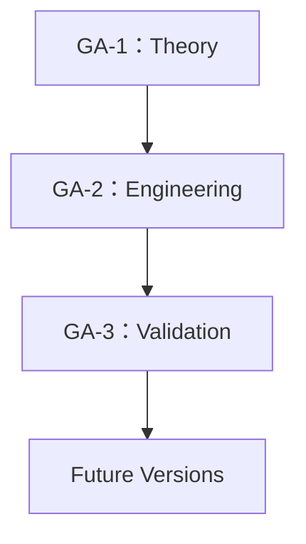

# Growth Agent Research Project 路线图

## 1. 总览

阶段转换不是自动发生的；必须满足完成标准，并在 `Meeting/Decision_Log.md` 中记录入口批准。

## 2. GA-1：Theory

**目标：** 建立经评审、术语统一、可追踪的 Growth Agent 理论基线。

**交付物：**

- 理论主文档与版本记录。
- 术语表、研究问题、创新清单、相关工作和理论图。
- 理论评审与重大决策记录。

**完成标准：**

- 核心术语均已确认，无未决命名冲突。
- 理论陈述、创新点和研究问题具备稳定编号与来源。
- GA-1 范围内的关键问题已处理或明确延期。
- 阶段评审正式批准理论基线。

**下一阶段入口：** 在 `Decision_Log.md` 记录 GA-2 启动批准、输入基线版本和允许的工程范围。

## 3. GA-2：Engineering

**目标：** 将经确认的 GA-1 理论转化为可实现、可追踪的工程设计。

**交付物：** 工程需求、架构、接口、数据与运行设计，以及理论到工程的追踪矩阵。

**完成标准：** 工程方案覆盖已批准理论要求，关键设计完成评审，并具备进入验证阶段的可执行基线。

**下一阶段入口：** 在 `Decision_Log.md` 记录 GA-3 启动批准、工程基线版本、验证范围和资源条件。

> 当前状态：**GA-2 Conditional — Design Baseline Not Yet Releasable**（Active，但尚未形成可发布 RC）。  
> 依据：GA-DEC-003（解锁）、GA-DEC-004（架构主线 Confirmed）、GA-DEC-005（工程基线 GA-2.0-Draft **已确认**，标签 `GA-2.0-Draft-20260911`；`Research/GA-2/GA-2.0_Baseline_Package.md`）。  
> 范围：Growth Agent 总体系统架构、决策包、门禁、影子运行与京东只读契约；输入基线：GA-1.0 / `GA-1_Theory_v1.0.md`。  
> 收敛要求：允许文档收敛、Fixture、契约测试与无网络影子骨架；**不允许**真实连接、真实写、GA-3 执行，或把 Proposed 参数表述为已验证结论。权威清单见 `Research/GA-2/GA-2_Release_Manifest_v0.1.md`（Draft，release_id=`GA-2.0-RC1-draft`）。  
> （2026-09-15：删除过期“基线待负责人审阅”表述。）

## 4. GA-3：Validation

**目标：** 以可复现的实验检验经批准的理论主张与工程实现。

**交付物：** 验证计划、实验记录、数据说明、结果、限制与复现材料。

**完成标准：** 验证范围覆盖批准的研究问题，实验可复现，结果与限制完成评审并可追溯。

**下一阶段入口：** 根据验证结论建立下一版本的变更提案，不直接覆盖历史基线。

> 当前状态：Locked。本文不包含实验设计。

## 5. Future Versions

**目标：** 根据验证证据进行理论修订、工程迭代和新一轮验证。

**交付物：** 经决策批准的新版本基线、迁移说明和完整变更记录。

**完成标准：** 每个变更均有证据、决策、版本和影响范围记录。

**下一阶段入口：** 依据变更性质进入新的 GA-1.x、GA-2.x 或 GA-3.x 周期。

