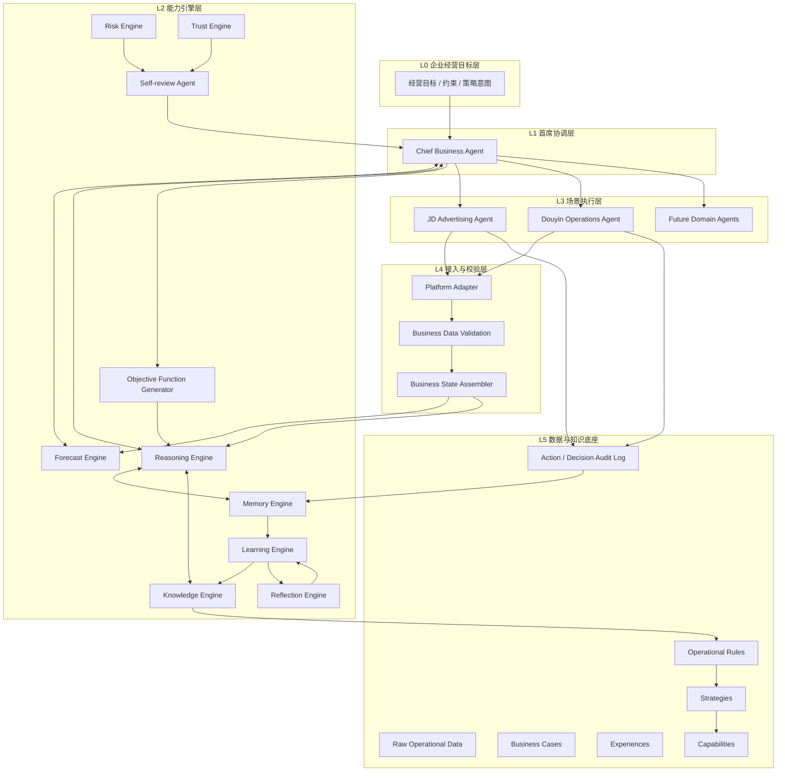
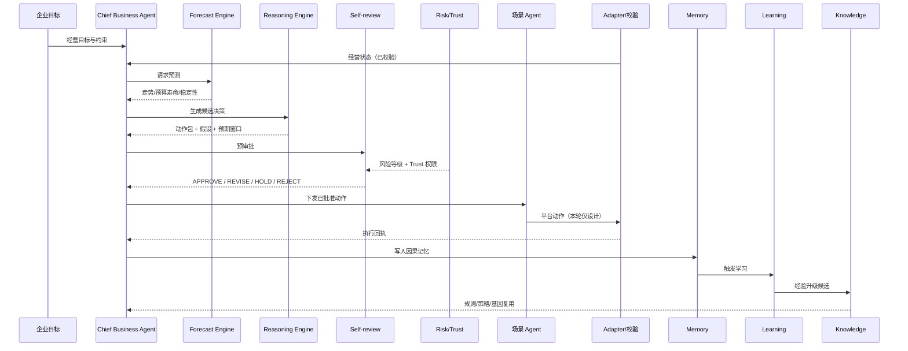

# GA-2：Growth Agent 总体系统架构草案

**文档编号：** GA-2-ARCH-001  
**版本：** v0.1  
**状态：** Draft（历史，已被 `Architecture_Overview_v0.2.md` 承接；勿作现行权威引用）  
**阶段：** GA-2 Engineering Design  
**输入基线：** `Research/GA-1/GA-1_Theory_v1.0.md`（GA-1.0 / v1.0，Confirmed）  
**授权依据：** `GA-DEC-003`（Accepted，2026-09-11）  
**作者角色：** MiMo Desktop（Local Research Operations Assistant），按理论基线做工程派生整理  
**约束：** 本文档为工程草案，不是新理论；与理论冲突时以理论基线为准并修订本文。

---

## 1. 文档目的

将 GA-1 已确认的 Growth Agent 理论，收敛为可继续深化的**总体系统架构**，回答：

1. 系统由哪些层与组件组成？  
2. Chief Business Agent 是否作为最高协调者？  
3. 预测、推理、记忆、知识、学习、反思、风险、信任如何分工？  
4. 京东广告 Agent 与抖音运营 Agent 如何接入而不污染核心？  
5. 理论模块如何映射到工程组件（见追踪矩阵）？

**本草案不包含：** 具体算法实现、真实 API 联调脚本、GA-3 实验设计、数据库选型终局裁决。

---

## 2. 架构原则（自理论派生）

| 原则 | 理论依据 | 工程含义 |
|---|---|---|
| P1 持续成长优先 | GA-INNOV-001；主命题 | 架构必须可闭环：执行→反馈→蒸馏→知识→策略→再执行 |
| P2 预测驱动 | GA-INNOV-002 | 决策链路以 Forecast 输出为前置输入，而非仅事后调参 |
| P3 经营状态先于动作 | GA-INNOV-003 | 任何对外动作前必须经过 State Aware + Data Validation |
| P4 知识可演化 | GA-INNOV-004/005/006 | Memory / Knowledge / Learning 分层，支持 Case→Rule→Strategy→Capability |
| P5 风险受控自治 | GA-INNOV-007 | 所有高影响动作经 Risk + Self-review + Trust 门禁 |
| P6 场景适配目标函数 | 动态目标函数理论 | 目标函数生成器按商品类型/计划类型/生命周期输出权重 |
| P7 稳定性优先 | §8.5 | 架构支持“不调整”作为合法决策输出 |
| P8 平台隔离 | 场景为验证而非边界 | 平台适配层可替换；核心经营能力不绑死单一平台 |

---

## 3. 总体分层架构



**图源文件：** `Figures/Mermaid/Figure-004_Growth_Agent_Architecture.mmd`

---

## 4. 组件职责定义（Draft）

### 4.1 Chief Business Agent（CBA）

**是否最高协调者：** 是（工程草案采用理论 §12 结构）。

职责：

- 解析企业经营目标、预算边界、风险偏好。  
- 组装跨 Agent 任务（种草/收割/活动/清仓）。  
- 汇总引擎输出，形成经营决策包。  
- 将决策包送入 Self-review 门禁后，下发场景 Agent。  
- 维护 Trust 相关权限门控的调用点。

**不负责：** 直接调用平台写 API；绕过风控；改写理论定义。

### 4.2 Forecast Engine

输入：校验后的经营状态、历史序列、活动/库存事件。  
输出（建议最小集）：

- 日内走势预测（花费/展现/点击/加购/成交/ROI）  
- 预算生命周期（Budget Lifetime Prediction）  
- 计划稳定性风险  
- 关键时段爆发概率（活动感知）

理论锚点：GA-INNOV-002；§5 预测驱动决策。

### 4.3 Reasoning Engine

职责：

- 结合 Forecast + State + Knowledge，生成候选动作。  
- 输出动作假设：观察、假设、依据、预期窗口、副作用。  
- 支持双时间尺度：日内干预 vs 7/15/30 天判断。  
- 允许输出 `NO_ACTION`（稳定性优先）。

### 4.4 Memory Engine

职责分层（与 Knowledge 严格区分）：

| 子层 | 内容 | 理论锚点 |
|---|---|---|
| Episode Memory | 单次计划/调整前后事实 | Causal Memory 样例 |
| Causal Memory | Observation/Hypothesis/Action/Result/Reflection | GA-INNOV-008 |
| Working Context | 当前经营窗口上下文 | §6.3 |

Memory 存“发生过什么与为什么”，不直接晋升为企业规则。

### 4.5 Knowledge Engine

职责：

- 承接 Learning 产出的高质量经验。  
- 执行 Knowledge Evolution：Case → Experience → Rule → Strategy → Capability。  
- 维护 Promotion Parameter Genome 与企业运营标准。  
- 执行 Experience Quality Score 与遗忘/降权。

理论锚点：GA-INNOV-004/005/006/009；§9–10。

### 4.6 Learning Engine

职责：

- 从执行日志与 Reflection 触发经验提取。  
- 跨计划关联分析（Cross-plan Learning）。  
- 判断经验是否升级、观察或丢弃。

与 Knowledge 边界：Learning 负责“从数据提炼候选知识”；Knowledge 负责“结晶、索引、复用与治理”。

### 4.7 Reflection Engine

职责：

- 执行三阶段推理闭环复盘（调整前/中/后）。  
- 周期反思（Weekly Reflection）。  
- 校验 Adjustment Response Window 假设。  
- 产出 Trust Score 更新信号与风控基线修正建议。

### 4.8 Risk Engine

职责：

- 维护 Dynamic Risk Baseline。  
- 按计划类型/商品类型/库存/活动给出风险等级。  
- 限制探索预算、调价幅度、日内频率、新建计划权限。

### 4.9 Trust Engine

职责：

- 维护 Trust Score。  
- 将信任映射为权限档位（建议→低风险调整→出价→预算→新建→自主经营）。  
- 对 CBA/场景 Agent 的动作能力做门控。

### 4.10 Self-review Agent

职责：在动作落地前做预审批（历史模型、库存、预算、合规、生命周期、经营目标、置信度、Trust）。

审批结果枚举（Draft）：`APPROVE` / `REVISE` / `HOLD` / `REJECT` / `ESCALATE_HUMAN`。

### 4.11 Objective Function Generator

职责：按商品价格带、计划类型、生命周期、活动状态生成动态目标权重（低客单 vs 中高客单；种草 vs 收割）。

理论锚点：§7.2–7.4、§8.2。

### 4.12 场景 Agent 与平台适配

| 组件 | 职责 |
|---|---|
| JD Advertising Agent | 京东种草/收割计划生命周期管理、出价/预算/人群等动作编排 |
| Douyin Operations Agent | 抖音内容/投流相关经营动作编排（范围后续细化） |
| Platform Adapter | 平台 API/后台数据的读写适配；认证、限流、字段映射 |
| Business Data Validation | 待付款/退款/跨计划归因/自然与推广耦合等真实性校验 |
| Business State Assembler | 组装库存、活动、预算、审核合规、类目竞争等经营状态 |

**重要：** 真实 API 接入与操作脚本不在本轮范围，须单独授权。

---

## 5. 关键控制流（决策闭环）



---

## 6. 数据与知识边界（第一轮约定）

```text
Raw Data
  --(Validation)--> Trusted State / Episode
  --(Memory)--> Causal Episodes
  --(Learning)--> Experience Candidates
  --(Quality Score + Evolution)--> Rules / Strategies / Genomes / Capabilities
```

| 边界问题 | 第一轮约定（Draft） |
|---|---|
| Memory 能否直接改策略？ | 否；必须经 Learning + Knowledge 治理 |
| 失败计划是否删除？ | 否；进入 Failure Pattern 与经验池，可降权不可无记录丢弃 |
| 平台原始指标能否直接优化？ | 否；先 Business Data Validation |
| 权限能否一次到位？ | 否；Trust 分级升级 |

---

## 7. 权限与门禁模型（Draft）

```text
Trust Level 0: 只读 + 建议
Trust Level 1: 低风险参数微调（需 Self-review）
Trust Level 2: 关键词/人群/出价
Trust Level 3: 预算调整
Trust Level 4: 新建计划（探索预算受限）
Trust Level 5: 完整自主经营（仍保留审计与否决）
```

门禁顺序：`Reasoning → Risk Baseline → Trust Capability → Self-review → Execute`。

---

## 8. 本轮明确非目标

1. 不修改 GA-1 理论。  
2. 不实现代码、不接真实广告账户。  
3. 不确定具体 LLM/数据库/消息队列技术栈终局。  
4. 不设计 GA-3 实验。  
5. 不把项目降级为通用 Workflow 编排器。  

---

## 9. 待决问题（需负责人/架构师后续确认）

| ID | 问题 | 建议 |
|---|---|---|
| Q1 | CBA 是否允许并行多场景 Agent 深度自治？ | 先串行审批+并行只读感知 |
| Q2 | Reflection 的触发频率是否只有周更？ | 周期反思 + 事件驱动双通道 |
| Q3 | Objective Function Generator 是否独立引擎？ | 先作为 Reasoning 子模块，避免过早微服务化 |
| Q4 | 抖音内容生成是否进入本架构？ | 先保留 Agent 壳，内容能力后置 |
| Q5 | Trust Level 与企业组织角色如何映射？ | GA-2 组件详设阶段补 RBAC |

---

## 10. 评审结论

**状态：** Draft，待项目负责人 / Research Architect 评审。  
**通过后动作：** 升版为 v0.2 或 Confirmed，并细化 GA2-T04～T07。

---

**Document Status:** Draft  
**Next Stage Input:** 理论到工程追踪矩阵 `Theory_Engineering_Trace.md`
