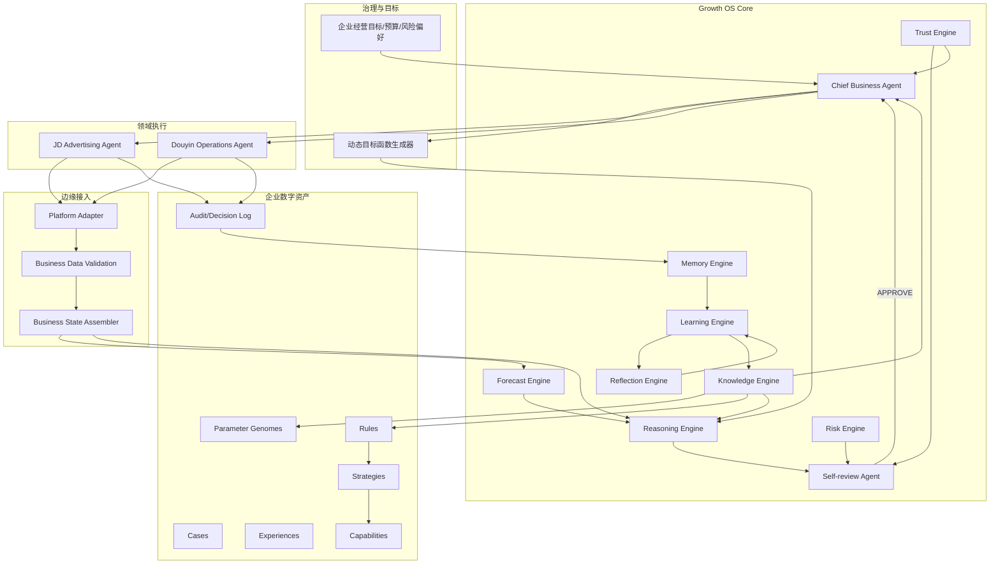

# GA-2：Growth Agent 总体系统架构

**文档编号：** GA-2-ARCH-001  
**版本：** v0.2  

### 统一元数据块

| 字段 | 值 |
|---|---|
| Document ID | GA-2-ARCH-001 |
| Version | v0.2 |
| Lifecycle Status | **Confirmed** |
| Review Result | Approved |
| Effective From | 2026-09-11（GA-DEC-004） |
| Supersedes | `Architecture_Overview_v0.1.md` |
| Superseded By | —（现行） |
| Authorizing Decision | **GA-DEC-004**（Accepted，冻结架构主线） |
| Authoritative For | GA-2 总体系统架构、组件边界、四回路与主线冻结要点 |

**阶段：** GA-2 Engineering Design  
**输入基线：** `Research/GA-1/GA-1_Theory_v1.0.md`（GA-1.0 / v1.0，Confirmed）  
**授权依据：** `GA-DEC-003`（解锁）+ `GA-DEC-004`（主线冻结）  
**发布清单：** `GA-2_Release_Manifest_v0.1.md`（Architecture 类现行权威）  
**相对 v0.1 变更：** 融合四类组件详设要点；强化四回路、决策包契约、里程碑与分水岭验收。  
**主线冻结要点：** CBA 唯一最高协调者；第一验证场=京东；Shadow/只读红线；默认参数一律 Proposed。

---

## 1. 一句话架构主张

> Growth Agent 不是“更聪明的广告工作流”，而是一套以**真实经营反馈**为燃料、以**知识演化**为复利引擎、以**信任门禁**为安全阀的企业成长操作系统。  
> 广告投放是首个可验证业务域，不是系统边界。

---

## 2. 架构原则（继承并强化）

| ID | 原则 | 工程含义 |
|---|---|---|
| P1 | 成长闭环优先 | 没有 Memory→Learning→Knowledge→Strategy 回写的系统，一律不算 Growth Agent |
| P2 | 预测先于动作 | Forecast 输出进入 Reasoning 的一等公民输入 |
| P3 | 状态先于相信 | Platform 原始指标必须经 Validation 再进入决策 |
| P4 | 目标函数动态生成 | 禁止全局固定 ROI 目标 |
| P5 | 稳定性可战胜贪婪 | `NO_ACTION` 合法；高频破坏稳定计划视为高风险 |
| P6 | 失败即学习事件 | Failure Pattern 强制入库，不可无痕删除 |
| P7 | 权限随信任生长 | Trust Level 控制动作半径 |
| P8 | 场景可插拔 | JD/Douyin 是 Adapter+Domain Agent，不是核心本体 |

---

## 3. 总体结构（v0.2）

**图源：** `Figures/Mermaid/Figure-004_Growth_Agent_Architecture.mmd`（随 v0.2 同步）

---

## 4. 四条主回路（系统真正的“发动机”）

### 回路 A：经营决策回路（日内/单计划）

`State → Forecast → Reasoning → Risk/Trust/Self-review → Domain Agent → Execute → Audit`

对应理论：Prediction-driven Decision、Business State Awareness、稳定性优先。

### 回路 B：经验蒸馏回路（单次调整后）

`Audit → Causal Memory → Reflection → Experience Candidate → Quality Score`

对应理论：Experience Distillation、Causal Memory、Three-stage Loop、Adjustment Response Window。

### 回路 C：知识演化回路（跨计划/周期）

`Experience → Rule → Strategy → Parameter Genome → Capability → 反哺 Reasoning/CBA`

对应理论：Knowledge Evolution、Knowledge Compounding、Cross-plan Learning。

### 回路 D：信任与自治回路（长期）

`历史达成率/风控表现 → Trust Score → Trust Level↑ → 动作半径扩大 → 更高风险动作需更严 Self-review`

对应理论：Trust-based Autonomous Growth。

> **判断：** 若只实现回路 A，系统只是高级 Workflow Agent。GARP 的工程差异化必须至少闭环 B+C，并在 C 起步后启动 D。

---

## 5. 组件边界（综合版）

| 组件 | 输入 | 输出 | 不做什么 |
|---|---|---|---|
| CBA | 企业目标、Trust、Knowledge 摘要、Domain 状态 | 决策任务包、资源分配 | 直接调平台写接口 |
| Forecast Engine | Trusted State、历史序列、事件 | 走势/预算寿命/稳定性/爆发概率 | 最终拍板 |
| Reasoning Engine | Forecast+State+Knowledge+目标函数 | 候选动作+假设+预期窗口+NO_ACTION | 绕过门禁 |
| Objective Function Gen. | 商品/计划类型/生命周期/活动 | 权重向量 | 固定全局 ROI |
| Memory Engine | Audit 流、人工标注 | Causal Episode | 直接晋升企业规则 |
| Reflection Engine | Episode、动作回执 | 复盘结论、Trust 信号、基线修正建议 | 直接改生产策略 |
| Learning Engine | 复盘+跨计划对比 | Experience Candidate | 跳过质量评分入库 |
| Knowledge Engine | 高质量 Experience | Rule/Strategy/Genome/Capability 索引 | 无版本覆盖历史 |
| Risk Engine | 动作候选+上下文 | 风险等级、限额 | 替代 Self-review 终审 |
| Trust Engine | 历史表现 | Trust Score/Level、能力集 | 无证据升权 |
| Self-review Agent | 动作包+Risk+Trust+合规 | APPROVE/REVISE/HOLD/REJECT/ESCALATE | 无记录静默改动作 |
| JD/DY Agent | 已批准动作 | 平台动作意图（经 Adapter） | 自建旁路凭证 |
| Adapter+Validation+State | 平台/店铺/库存源 | Trusted State | 把脏数据喂给 Forecast |

---

## 6. 决策包（Decision Packet）最小契约

任何对外经营动作在进入 Self-review 前必须形成可审计决策包。

**双字段语义（与 GA-DEC-004/005 及 GIP v0.2 / JD v0.2 对齐；关闭审计 C-02）：**

| 字段 | 说明 |
|---|---|
| decision_id | 全局唯一 |
| packet_kind | `standard` / `shadow_decision`（与 DPK/JD/Skeleton 一致；勿用 live_decision） |
| lifecycle_status | **生命周期**：Draft → Self-reviewed → Executed → Observed → Reflected → Archived/Superseded（禁止与审批结果混用） |
| review_result | **审批结果**（仅 SRA 可写）：APPROVE / NO_ACTION_APPROVE / REVISE / HOLD / REJECT / ESCALATE_HUMAN |
| objective_snapshot | 当时目标函数权重 |
| state_digest | 经营状态摘要哈希/引用 |
| forecast_ref | 预测引用与置信度 |
| hypothesis | 观察→假设 |
| proposed_actions[] | 动作、幅度、对象、预期窗口（含合法 NO_ACTION） |
| risk_grade | Risk Engine 输出 |
| trust_required / trust_actual | 所需与实际权限 |
| executor | Domain Agent |
| outcome_ref | 执行后回填 |
| reflection_ref | 复盘后回填 |

**可执行判定（权威公式见 GIP v0.2 §1.1）：**  
`lifecycle_status ∈ {Self-reviewed, Executed}` ∧ `review_result ∈ {APPROVE, NO_ACTION_APPROVE}` ∧ 非 Shadow 写路径 ∧ 无 hard_block。

这是回路 A→B 的物理连接点；没有它，“成长”无法工程化。

---

## 7. 落地路径（GA-2 建议里程碑）

| 里程碑 | 内容 | 退出标准 |
|---|---|---|
| M0 架构冻结 | v0.2 评审通过 | 负责人确认组件边界 |
| M1 数据边界 | Memory/Knowledge Schema + 决策包 | 样例可序列化、可追踪 |
| M2 门禁闭环 | Risk/Trust/Self-review 状态机 | 动作 100% 可门禁 |
| M3 领域接口 | JD Adapter 抽象契约（只读优先） | 脏数据校验规则可测 |
| M4 参数基因 | Genome 字段与默认模板目录 | 可按商品/计划类型实例化 |
| M5 影子运行设计 | 无写权限 shadow mode 设计稿 | 为 GA-3 预留验证钩子 |

**明确非目标：** 本轮不接真实账户、不做 GA-3 实验、不写论文正文、不改 GA-1 理论。

---

## 8. 与普通 Workflow / 广告工具的分水岭（工程验收视角）

| 检验问题 | Workflow Agent | Growth Agent（本架构） |
|---|---|---|
| 数据是否先校验？ | 常直接用平台数 | 强制 Validation |
| 失败是否进入知识系统？ | 日志即终点 | Failure Pattern + 经验升级 |
| 是否跨计划抽象规律？ | 无 | Learning→Knowledge |
| 是否动态目标函数？ | 固定 KPI | Objective Function Generator |
| 权限是否随表现变化？ | 静态 | Trust Level 演进 |
| 是否有“不调整”策略？ | 少见 | NO_ACTION 一等公民 |
| 知识是否企业资产化？ | 提示词/脚本碎片 | Rule/Strategy/Genome/Capability |

---

## 9. 组件详设索引

| 文档 | 覆盖 |
|---|---|
| `Decision_Packet_Schema_v0.1.md` | 决策包字段全集与不变式（Schema 权威） |
| `Forecast_Engine_Interface_v0.1.md` | 预测对象与 forecast_ref |
| `Reasoning_Engine_Interface_v0.1.md` | 推理契约与场景骨架 |
| `Memory_Knowledge_Boundary_v0.1.md` | Memory/Learning/Knowledge/Reflection 边界与 Schema |
| `Risk_Trust_SelfReview_v0.1.md` | 风控基线、Trust Score、审批状态机 |
| `Gate_Integration_Playbook_v0.2.md` | **现行门禁联调（双字段）** |
| `JD_Adapter_Interface_v0.2.md` | **现行京东域接入与数据校验契约** |
| `Shadow_Mode_Design_v0.1.md` / `Shadow_Trial_Run_Plan_v0.1.md` | 影子运行与试运行 |
| `Runtime_Envelope_Selfcheck_v0.1.md` | 运行时信封与启动自检 |
| `Learning_Reflection_Runtime_v0.1.md` | 回路 B 编排 |
| `Parameter_Genome_Templates_v0.1.md` | 参数基因与默认策略模板 |
| `Threshold_Calibration_Method_v0.1.md` / `Precalibration_Experiment_Design_v0.1.md` | 阈值标定 |
| `Module_Skeleton_Design_v0.1.md` | 实现骨架 |
| `Theory_Engineering_Trace.md` | 理论→工程追踪 |
| `GA-2.0_Baseline_Package.md` | 基线清单与不变量 |

**历史承接（非现行）：** `Architecture_Overview_v0.1.md`、`JD_Adapter_Interface_v0.1.md`、`Gate_Integration_Playbook_v0.1.md`。

---

## 10. 待决与升级条件

1. ~~架构评审通过后，将本文件状态升为 Under Review → Confirmed。~~ **已完成：** GA-DEC-004（2026-09-11）确认本文件为 Confirmed 主线；文末历史 Draft 标记已清理。  
2. M1–M4 详设评审后创建 GA-2.0 工程基线。**已部分完成：** GA-DEC-005 确认 `GA-2.0_Baseline_Package.md`（标签 `GA-2.0-Draft-20260911`）。后续 RC 以 `GA-2_Release_Manifest_v0.1.md` 为准。  
3. 任何真实 API 接入前，必须新增决策记录并单独授权。  
4. 若发现与 GA-1 理论冲突，优先改工程文档；理论修订走新版本文件。  
5. 架构主线后续修订须新版本文件（如 v0.2.1）并经新 GA-DEC，不得原地改写 Confirmed 语义。

---

**Document Status:** Confirmed（与文首一致；Authorizing Decision = GA-DEC-004）  
**Lifecycle Status:** Confirmed  
**Change from v0.1:** 强化四回路、决策包契约、里程碑与分水岭验收  
**2026-09-15 治理清理：** 删除文末过期 Draft 标记；§10 升级条件按 GA-DEC-004/005 回写；指向 Release Manifest
