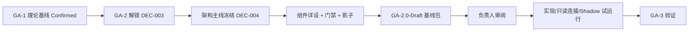

# GARP 完整研究包（供负责人审阅）

**文档编号：** GA-2-REVIEW-001  
**日期：** 2026-09-11  
**版本：** v1.0  
**状态：** Review Closed（负责人选项 A 通过）  
**项目：** Growth Agent Research Project（GARP）  
**阶段：** GA-2 Engineering Design（主线已冻结）  
**编制：** MiMo Desktop + 并行研究子代理  
**约束：** 未修改 GA-1 理论；未接真实广告写操作；未启动 GA-3  

---

## 0. 如何审阅（建议 30–60 分钟路径）

| 步骤 | 打开 | 你要判断什么 |
|---|---|---|
| 1 | 本文 §1–§3 | 项目理解是否正确、主线是否你要的方向 |
| 2 | `Architecture_Overview_v0.2.md` | 架构是否可接受（已是 Confirmed 主线） |
| 3 | `GA-2.0_Baseline_Package.md` | 工程基线范围与不变量 |
| 4 | 按兴趣抽查组件详设 | Decision Packet / 门禁 / Shadow / Adapter |
| 5 | `Engineering_TODO.md` §3.4 | 下一步优先级是否同意 |

若时间极短：只读本文 + Baseline Package 即可形成是否放行实现的判断。

---

## 1. 项目一句话

> GARP 研究的不是广告自动化工具，而是：企业 AI 如何在真实经营中通过**持续实践 → 反馈 → 经验蒸馏 → 知识演化 → 信任授权**，成长为可沉淀企业知识资产的数字员工。  
> 京东广告是第一验证场，不是理论边界。

---

## 2. 阶段进展总览

| 阶段 | 状态 |
|---|---|
| GA-1 Theory | Confirmed |
| GA-2 Engineering | **Active**；主线 Confirmed；基线 Draft 待审 |
| GA-3 Validation | Locked |

**正式决策：** GA-DEC-001/002/003/004 均 Accepted。

---

## 3. 核心主张（工程侧）

1. **四回路**才是 Growth Agent 发动机：经营决策 / 经验蒸馏 / 知识演化 / 信任自治。只做决策回路 = 高级 Workflow。  
2. **Decision Packet** 是成长最小原子：无审计决策包，则无法蒸馏、无法评信任。  
3. **门禁先于智能**：Reasoning → Risk → Trust → Self-review → Execute；`NO_ACTION` 一等公民。  
4. **Memory ≠ Knowledge**：因果事件 vs 规则/策略/能力；禁止一次失败直接改全局策略。  
5. **Shadow/只读红线**：先影子与只读，写权限单独授权。  
6. **参数全是 Proposed**：预标定前禁止当真值。  

---

## 4. 完整文档地图

### 4.1 入口与基线

| 文档 | 说明 |
|---|---|
| **本文件** | 审阅入口 |
| `GA-2.0_Baseline_Package.md` | 基线清单与不变量 |
| `GA-2_Preliminary_Answer_2026-09-11.md` | 研究理解与首轮答卷 |
| `Engineering_TODO.md` | 任务看板 |

### 4.2 架构与追踪

| 文档 | 说明 |
|---|---|
| `Architecture_Overview_v0.2.md` | **主线 Confirmed** |
| `Theory_Engineering_Trace.md` | 理论→工程映射 |
| `../GA-1/Research_Questions.md` | GA-RQ-001–018 |

### 4.3 核心契约

| 文档 | 说明 |
|---|---|
| `Decision_Packet_Schema_v0.1.md` | 决策包 Schema + JSON 样例 |
| `Forecast_Engine_Interface_v0.1.md` | 11 预测对象 + forecast_ref |
| `Reasoning_Engine_Interface_v0.1.md` | **基线后** 推理契约与五场景骨架 |
| `Memory_Knowledge_Boundary_v0.1.md` | 四层边界与演化状态机 |
| `Risk_Trust_SelfReview_v0.1.md` | R 档 / Trust L0–5 / 审批状态机 |
| `Learning_Reflection_Runtime_v0.1.md` | **基线后** 回路 B 编排 |

### 4.4 门禁与运行时

| 文档 | 说明 |
|---|---|
| `Gate_Integration_Playbook_v0.2.md` | **现行门禁语义（双字段）** |
| `JD_Adapter_Interface_v0.2.md` | **现行京东契约** |
| `Shadow_Mode_Design_v0.1.md` | 影子运行 |
| `Shadow_Trial_Run_Plan_v0.1.md` | **基线后** 无写试运行计划 |
| `Runtime_Envelope_Selfcheck_v0.1.md` | 防误装配自检 |
| `Fixture_Migration_Guide_v0.1.md` | v0.1→v0.2 样例迁移 |

### 4.5 参数与标定

| 文档 | 说明 |
|---|---|
| `Parameter_Genome_Templates_v0.1.md` | 参数基因 |
| `Threshold_Calibration_Method_v0.1.md` | 标定方法论 |
| `Precalibration_Experiment_Design_v0.1.md` | 无写实验设计 |

### 4.6 治理记录

| 文档 | 说明 |
|---|---|
| `Meeting/Decision_Log.md` | GA-DEC-001…004 |
| `Meeting/Meeting_Log.md` | GA-MTG-20260911-01… |
| `CHANGELOG.md` / `Research_Context.md` | 变更与上下文 |
| `../GA-1/GA-1_Theory_v1.0.md` | **理论真相源（未改）** |

### 4.7 图示

`Figures/Mermaid/Figure-004_Growth_Agent_Architecture.mmd`

---

## 5. 端到端故事（把文档串起来）

1. **只读接入**京东计划/指标/库存/预算 → **BDV** 校验（待付款、退款、归因、自然推广耦合）。  
2. **State Assembler** 产出 Trusted State → **Forecast** 输出走势/预算寿命/稳定性/爆发概率。  
3. **Reasoning**（下轮详设）结合 **Objective Function** 与 Knowledge，产出候选动作或 NO_ACTION。  
4. 打成 **Decision Packet**（含假设、风险、信任、预测引用）。  
5. **Risk → Trust → Self-review** 门禁；Shadow 下记账不外发。  
6. Live 写路径仅在授权 + 门禁通过后经 **JD Adapter**；回执带 `source_env`。  
7. 回执进 **Causal Memory** → **Reflection** → **Learning** → **Knowledge**（规则/策略/基因）。  
8. Knowledge 反哺后续 Reasoning/CBA；表现影响 **Trust Level**。  
9. 阈值用 **TCAL 方法 + 预标定实验** 从历史/模拟回填，版本化管理。  

---

## 6. 已关闭的关键问题

| ID | 问题 | 结论 |
|---|---|---|
| DPK-Q08 | status 混用生命周期与审批 | JD/GIP v0.2 双字段，已关闭 |
| JD-Q12 | Gate 仍写 status==APPROVE | GIP v0.2 已改双条件 |
| 主线五问 | 架构/CBA/京东/Shadow/Proposed | DEC-004 全部 Accepted |

---

## 7. 仍开放的关键风险（审阅时请关注）

| 风险 | 说明 | 缓解 |
|---|---|---|
| R-A | 阈值未历史标定 | 全 Proposed + TCAL + 人工评审 |
| R-B | Shadow 反事实不可识别 | 多层对照；不单指标定论 |
| R-C | 仿真/影子污染 Memory/Trust | Envelope + 隔离池 + 自检熔断 |
| R-D | 一包多动作部分失败语义 | GIP-Q9 / DPK-Q02 仍开放 |
| R-E | Reasoning 未详设 | 下一优先 T23 |
| R-F | 实现期误用 v0.1 status 语义 | 以 GIP v0.2 + JD v0.2 为唯一现行权威 |

---

## 8. 建议审阅结论选项（便于你回帖）

请任选其一或组合：

**A. 基线通过**  
- 确认 GA-2.0-Draft 升 Confirmed（建议新增 GA-DEC-005）  
- 授权进入实现准备 / 只读连接评估设计  

**B. 有条件通过**  
- 列出必须修改的文档与条目（我会改后重提）  

**C. 方向调整**  
- 指出主线问题；若偏离 v0.2 需新决策  

**D. 暂停扩展**  
- 仅保留现有文档，不进入实现与连接评估  

---

## 9. 我推荐的下一阶段（基线通过后）

1. **GA2-T23** Reasoning Engine 接口详设  
2. **GA2-T24** Learning/Reflection 运行时编排  
3. **GA2-T26** Shadow 试运行方案（仍无写）  
4. **GA2-T25** 真实只读连接评估（**需你单独授权**）  
5. 再考虑代码骨架与 GA-3 协议  

---

## 10. 结论

GA-1 已回答「为什么需要 Growth Agent」。  
本完整研究包回答「在不越权、不碰真实写账户的前提下，工程上如何先站稳」：

> **主线冻结的架构 + 可审计决策包 + 预测契约 + 记忆/知识分层 + 风控信任门禁 + 京东隔离接入 + 影子运行与运行时自检 + 参数标定方法。**

这不是最终系统，而是一份可被审查、可被实现、可被验证继续追问的 **GA-2.0-Draft 工程基线**。

请你审阅后给出 A/B/C/D 中的选择或具体修改意见。

> **审阅结论（2026-09-11）：** 负责人选择 **A（基线通过）**。对应决策：`GA-DEC-005` Accepted。`GA-2.0_Baseline_Package.md` 已升 Confirmed。

---

**Document Status:** Review Closed  
**Owner Decision:** 选项 A——基线通过（GA-DEC-005 Accepted，2026-09-11）  
**Next Decision:** 进入 Reasoning / Learning-Reflection / Shadow 试运行设计；真实只读连接仍须单独授权  
