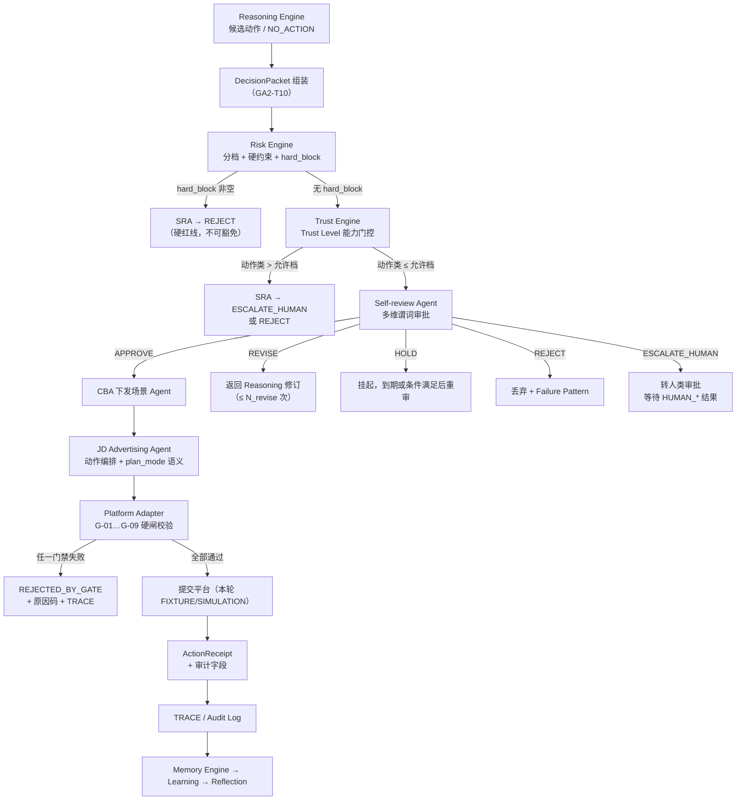

# GA-2：门禁联调手册——Risk × Trust × Self-review × JD G-01–G-09 可执行检查表

**文档编号：** GA-2-GATE-001  
**版本：** v0.1  
**状态：** Draft（历史，已被 `Gate_Integration_Playbook_v0.2.md` 承接；勿作现行权威引用）  
**阶段：** GA-2 Engineering Design  
**任务编号：** GA2-T12  
**输入基线：** `Research/GA-1/GA-1_Theory_v1.0.md`（GA-1.0 / v1.0，Confirmed）  
**主线架构：** `Architecture_Overview_v0.2.md`（Confirmed，GA-DEC-004）  
**关联详设：** `Risk_Trust_SelfReview_v0.1.md`（Draft）、`JD_Adapter_Interface_v0.1.md`（Draft；历史，已被 v0.2 承接）  
**授权依据：** `GA-DEC-003` + `GA-DEC-004`（Accepted，2026-09-11）  
**作者角色：** Research Engineer 子代理（工程派生，不新增理论主张）  
**约束：** 与理论冲突时以 GA-1 为准；与架构冲突时以 Architecture v0.2 + GA-DEC-004 为准。本文不包含真实 API 调用代码。所有数值阈值一律标注 **Proposed**。

---

## 1. 文档目的与范围

将 Risk Engine、Trust Engine、Self-review Agent 的审批状态机与京东 Adapter 前置硬闸 G-01–G-09 打成**一张可执行检查表**，供后续实现（Adapter 硬闸、SRA 谓词引擎、JDA 编排）与评审（M2 门禁闭环验收）使用。

**覆盖范围：**

1. 端到端门禁流水线（从 Reasoning 产出到 ActionReceipt）；  
2. 全部抽象动作类型 × 门禁检查矩阵；  
3. G-01–G-09 与 Risk / Trust / Self-review 结果的组合裁决表；  
4. ESCALATE_HUMAN 升级路径；  
5. 门禁绕过 / 回执伪造 / 仿真污染的失败模式与检测点；  
6. 审计字段最小集；  
7. 与 Decision Packet 的衔接；  
8. 待决问题。

**非目标：**

- 不修改 GA-1 理论；不修改 PROJECT_SPEC；  
- 不实现代码、不写真实广告账户操作脚本；  
- 不确定技术栈；不设计 GA-3 实验方案；  
- 不锁定具体数值阈值（全部 Proposed，待 GA2-T07 预标定）。

---

## 2. 端到端门禁流水线

### 2.1 流水线总览



### 2.2 分层职责速查（对齐 Architecture §5 + Risk §2 + JD §1）

| 层级 | 组件 | 在流水线中的职责 | 不负责 |
|---|---|---|---|
| L2 | Reasoning Engine | 产出候选动作与假设 | 绕过门禁 |
| L2 | Risk Engine | 分档、硬约束、hard_block | 生成动作、改 Trust |
| L2 | Trust Engine | Trust Level 能力门控 | 替代审批、放宽 Risk |
| L2 | Self-review Agent | 多维谓词审批、状态机决策 | 执行写操作、改 Trust |
| L3 | CBA | 唯一协调者；APPROVE 后下发 | 直接调平台 |
| L3 | JD Advertising Agent | plan_mode 语义、动作编排 | 自建旁路凭证 |
| L4 | Platform Adapter | G-01–G-09 硬闸、字段映射 | 经营判断、风险裁决 |

### 2.3 门禁顺序不可变性

固定顺序（Architecture §4 回路 A + Risk §2 + JD §3.1）：

```text
Reasoning → Risk → Trust → Self-review → CBA → JDA → Adapter(G-01..G-09) → Submit → Receipt → TRACE
```

**不变量：**

1. 任何组件不得跳过中间层直接触发写操作。  
2. Adapter 硬闸是**最后一道不可绕过的防线**，即使上游已 APPROVE。  
3. `NO_ACTION` 是合法终态，不触发 Adapter 写路径（G-01 不适用）。  
4. `REVISE` 循环回到 Reasoning 重新走完整门禁，不缓存旧 Risk/Trust 结果。

---

## 3. 动作类型 × 门禁检查矩阵

### 3.1 动作类型定义（对齐 JD §3.2）

| 代码 | 动作类 | 对应 WA-* ID | 典型 Trust 门槛（Proposed） |
|---|---|---|---|
| `ADVISE` | 建议 / 只读分析 | — （不产生 WA） | L0 |
| `LOW_RISK_ADJ` | 低风险调参（标签/备注/展示开关） | 部分 WA-PLAN-01/02 | L1 |
| `BID_ADJ` | 关键词/策略出价 | WA-BID-01, WA-BID-02 | L2 |
| `PREMIUM_ADJ` | 人群/资源位溢价 | WA-PRM-01, WA-PRM-02 | L2 |
| `BUDGET_ADJ` | 计划/账户预算 | WA-BGT-01, WA-BGT-02 | L3–L4 |
| `CREATE_PLAN` | 新建计划 | WA-PLAN-03 | L4 |
| `PAUSE_PLAN` | 暂停/归档计划 | WA-PLAN-01, WA-PLAN-04 | L2–L3 |
| `ROI_TARGET_ADJ` | 目标 ROI 调整 | WA-ROI-01 | L2–L3 |
| `NO_ACTION` | 显式维持现状 | WA-CLS-01 | L0 |

### 3.2 矩阵：动作类型 × 门禁检查（Adapter 视角）

| 门禁 | ADVISE | LOW_RISK_ADJ | BID_ADJ | PREMIUM_ADJ | BUDGET_ADJ | CREATE_PLAN | PAUSE_PLAN | ROI_TARGET_ADJ | NO_ACTION |
|---|:---:|:---:|:---:|:---:|:---:|:---:|:---:|:---:|:---:|
| **G-01** 决策包 APPROVE | N/A | ✅ | ✅ | ✅ | ✅ | ✅ | ✅ | ✅ | N/A |
| **G-02** Trust ≥ 最低档 | ✅ L0 | ✅ L1 | ✅ L2 | ✅ L2 | ✅ L3/L4 | ✅ L4 | ✅ L2 | ✅ L2 | ✅ L0 |
| **G-03** Risk 允许幅度/频率 | — | 宽松 | 严 | 严 | 更严 | 最严 | 宽松 | 严 | — |
| **G-04** plan 可写状态 | N/A | ✅ | ✅ | ✅ | ✅ | N/A | ✅ | ✅ | N/A |
| **G-05** 幂等键未重复 | N/A | ✅ | ✅ | ✅ | ✅ | ✅ | ✅ | ✅ | N/A |
| **G-06** 库存/预算约束 | — | — | 预算 | — | 库存+预算 | 库存+预算 | — | 预算 | — |
| **G-07** dry_run=true | N/A | ✅ | ✅ | ✅ | ✅ | ✅ | ✅ | ✅ | N/A |
| **G-08** 日内频率/间隔 | — | 宽松 | 中 | 中 | 紧 | 单次 | 宽松 | 中 | — |
| **G-09** plan_mode 白名单 | — | 双方 | 种草为主 | 种草为主 | 双方 | 双方 | 双方 | 收割为主 | — |

**图例：** ✅ = 必须检查；— = 该动作不适用此门禁；N/A = 该门禁对该动作类不执行。

### 3.3 矩阵：动作类型 × Risk 约束参数（Proposed 默认）

| 参数 | ADVISE | LOW_RISK | BID | PREMIUM | BUDGET | CREATE | PAUSE | ROI |
|---|---|---|---|---|---|---|---|---|
| `max_bid_delta_pct` | — | — | U_bid(L,R) | — | — | — | — | — |
| `max_budget_delta_pct` | — | — | — | — | U_bud(L,R) | — | — | — |
| `max_daily_adjust_count` | — | F_max | F_max | F_max | F_max | N_new_max | F_max | F_max |
| `min_response_window` | — | 短 | 中 | 中 | 长 | 单次 | 短 | 中 |
| `allow_new_plan` | — | — | — | — | — | 受探索预算约束 | — | — |
| `review_mode` | — | LITE | STANDARD | STANDARD | STRICT | STRICT | LITE | STANDARD |

> 幅度示意（Risk §7.2 Proposed）：R0–R1/L≥2 约 10%–20%；R2 约 5%–10%；R3 约 0%–5% 或禁；R4 = 0（硬阻断）。种草计划幅度可略宽于收割计划（JD §6.1）。

### 3.4 矩阵：动作类型 × Trust Level 允许性（对齐 Risk §5.2）

| Trust | ADVISE | LOW_RISK | BID | PREMIUM | BUDGET(计划) | BUDGET(账户) | CREATE(种草) | CREATE(收割) | PAUSE | ROI |
|---|:---:|:---:|:---:|:---:|:---:|:---:|:---:|:---:|:---:|:---:|
| L0 | ✅ | ❌ | ❌ | ❌ | ❌ | ❌ | ❌ | ❌ | ❌ | ❌ |
| L1 | ✅ | ✅* | ❌ | ❌ | ❌ | ❌ | ❌ | ❌ | ❌ | ❌ |
| L2 | ✅ | ✅* | ✅* | ✅* | ❌ | ❌ | ❌ | ❌ | 建议 | ✅* |
| L3 | ✅ | ✅* | ✅* | ✅* | ✅* | ❌ | ❌ | ❌ | ✅* | ✅* |
| L4 | ✅ | ✅* | ✅* | ✅* | ✅* | ✅* | ✅* | 受限* | ✅* | ✅* |
| L5 | ✅ | ✅* | ✅* | ✅* | ✅* | ✅* | ✅* | ✅* | ✅* | ✅* |

\* 类型允许，仍须通过 Self-review 且满足 Risk constraints。  
**矩阵不变量：** 任何 Level 均不得绕过 Self-review；任何 Level 均不得执行硬红线动作。

---

## 4. G-01–G-09 组合裁决表

### 4.1 单门禁裁决规则

| 门禁 | 检查谓词（伪逻辑） | 失败结果 | 失败原因码（Proposed） |
|---|---|---|---|
| G-01 | `DP.status == APPROVE && DP.decision_id 有效` | `REJECTED_BY_GATE` | `DECISION_PACKAGE_INVALID` |
| G-02 | `agent.trust_level ≥ action.min_trust` | `REJECTED_BY_GATE` | `TRUST_INSUFFICIENT` |
| G-03 | `RKE.constraints.satisfied(action)` | `REJECTED_BY_GATE` | `RISK_CONSTRAINT_VIOLATED` |
| G-04 | `plan.status ∉ {UNDER_REVIEW, FROZEN}` | `REJECTED_BY_GATE` | `PLAN_NOT_WRITABLE` |
| G-05 | `idempotency_key` 未出现 | 去重返回原回执 | `DUPLICATE_SUBMISSION` |
| G-06 | `INV-GATE-* / BUD-GATE-*` 全满足 | `REJECTED_BY_GATE` 或 `REVISE` | `INVENTORY_OR_BUDGET_VIOLATED` |
| G-07 | `req.dry_run == true` | `REJECTED_BY_GATE` | `DRY_RUN_REQUIRED` |
| G-08 | `F_day(c) < F_max && now - t_last ≥ W_resp` | `REJECTED_BY_GATE` | `FREQ_OR_WINDOW_VIOLATED` |
| G-09 | `action_type ∈ whitelist(plan_mode)` | `REJECTED_BY_GATE` | `ACTION_NOT_ALLOWED_FOR_PLAN_MODE` |

### 4.2 组合裁决表：Risk × Trust × Self-review → Adapter 行为

下表给出**上游三种信号组合时，Adapter 的最终行为**。Adapter 是硬闸，不做软判断——上游状态不满足即拒绝。

| # | Risk Level | hard_block | Trust Level | SRA 结果 | Adapter 行为 | 备注 |
|---|:---:|:---:|:---:|---|---|---|
| 1 | R0–R2 | 空 | ≥ 动作门槛 | APPROVE | 执行 G-01–G-09 全检 | 正常路径 |
| 2 | R0–R2 | 空 | < 动作门槛 | APPROVE | **G-02 拒绝** | Trust 不足，SRA 不应 APPROVE（上游 bug） |
| 3 | R0–R2 | 空 | ≥ 门槛 | REVISE | 不提交 | DP 状态非 APPROVE，G-01 拒绝 |
| 4 | R0–R2 | 空 | ≥ 门槛 | HOLD | 不提交 | 同上 |
| 5 | R0–R2 | 空 | ≥ 门槛 | REJECT | 不提交 | 同上 |
| 6 | R0–R2 | 空 | ≥ 门槛 | ESCALATE_HUMAN | 不提交 | 等待 HUMAN_* 再审 |
| 7 | R3 | 空 | ≥ 门槛 | APPROVE | 执行全检；G-03 限幅更严 | R3 倾向 HOLD，APPROVE 需充分证据 |
| 8 | R3 | 空 | < 门槛 | APPROVE | **G-02 拒绝** | 同 #2 |
| 9 | R4 | 非空 | 任意 | APPROVE | **G-01 拒绝**（DP 不应为 APPROVE） | SRA 违反 Risk 硬于 Trust 原则 |
| 10 | R4 | 非空 | 任意 | REJECT | 不提交 | 正确路径 |
| 11 | R4 | 非空 | 任意 | ESCALATE_HUMAN | 不提交；标记审计异常 | R4 默认应 REJECT；ESCALATE 需说明 |
| 12 | 任意 | 空 | 任意 | NO_ACTION | 不触发 Adapter | 合法终态 |
| 13 | 任意 | 空 | ≥ 门槛 | APPROVE 但 G-04 失败 | **G-04 拒绝** | plan 状态变化，上游未感知 |
| 14 | 任意 | 空 | ≥ 门槛 | APPROVE 但 G-06 失败 | **G-06 拒绝或降级 REVISE** | 库存/预算变化 |
| 15 | 任意 | 空 | ≥ 门槛 | APPROVE 但 G-08 失败 | **G-08 拒绝** | 频率/窗口违规 |
| 16 | 任意 | 空 | ≥ 门槛 | APPROVE 但 G-09 失败 | **G-09 拒绝** | plan_mode 白名单外 |
| 17 | 任意 | 空 | ≥ 门槛 | APPROVE 但 dry_run=false | **G-07 拒绝** | 本轮环境强制 dry_run |

### 4.3 裁决不变量（实现与评审必查）

1. **Risk 硬于 Trust**：R4 + hard_block 时，Trust L5 也不得 APPROVE（Risk §2.1）。  
2. **Trust 不替代审批**：Trust L5 仍须过 SRA；每个动作独立审批。  
3. **SRA 不写穿审计**：所有状态转移写 TRACE（Risk §6.6）。  
4. **Adapter 硬闸不可绕过**：即使上游全绿，G-01–G-09 任一失败即拒绝（JD §3.4）。  
5. **REVISE 不缓存旧评估**：每次重提必须重新走 Risk → Trust → SRA。  
6. **NO_ACTION 不触发写路径**：Adapter 不得为"有交互"制造写操作（JD §3.1.3）。

---

## 5. 升级路径：何时 ESCALATE_HUMAN

### 5.1 触发条件汇总

| 触发 ID | 条件 | 来源 | 优先级 |
|---|---|---|---|
| ESC-01 | `risk_level == R4` 且非纯硬阻断场景（如合规存疑需人工确认） | Risk §3.2 | 高 |
| ESC-02 | Trust Level 不足但动作高影响（大额预算/新建） | Risk §6.3 TrustGate | 高 |
| ESC-03 | 单笔预算/新建超过 `L_max_threshold`（Proposed） | Risk §6.5 | 高 |
| ESC-04 | REVISE 循环次数超过 `N_revise`（默认 Proposed: 2） | Risk §6.5 | 中 |
| ESC-05 | SRA 谓词冲突（如 CHK_GOAL 与 CHK_MODEL 矛盾且无优先规则） | Risk §6.5 | 中 |
| ESC-06 | 新场景无知识模板（KE 无匹配 Rule/Strategy） | Risk §6.5 | 中 |
| ESC-07 | 人类抽检策略触发（L0–L1 高比例；L4–L5 低比例随机） | Risk Q-R8 | 低 |
| ESC-08 | HOLD 超时 `T_hold_max` 仍未解锁 | Risk §6.5 | 低 |
| ESC-09 | 合规/审核风险信号（CHK_COMP 失败） | Risk §6.4 | 高 |
| ESC-10 | 企业经营目标重大冲突（CHK_GOAL 失败且无自动优先规则） | Risk §6.4 | 高 |

### 5.2 人类结果映射与回流

```text
ESCALATE_HUMAN
  → HUMAN_APPROVE  → DP.status=APPROVE → 继续 Adapter 路径
  → HUMAN_MODIFY   → 修改参数后 → 回 Reasoning → 重新走门禁
  → HUMAN_REVISE   → 回 Reasoning → 重新走门禁（不消耗 N_revise）
  → HUMAN_REJECT   → DP.status=REJECT → Failure Pattern + Trust P_human 惩罚
```

**审计要求：** 每次 ESCALATE 必须写 `human_ticket_id`；HUMAN 结果回填 `ReviewEvent`。

### 5.3 Trust Level 与抽检比例（Proposed）

| Trust Level | 抽检比例 | 说明 |
|---|---|---|
| L0–L1 | 高（Proposed: 50%+） | 新部署/低信任，人工监护 |
| L2–L3 | 中（Proposed: 20%） | 逐步放权 |
| L4–L5 | 低（Proposed: 5%） | 信任高，保留随机审计 |

---

## 6. 失败模式与检测点

### 6.1 门禁被绕过

| 失败模式 | 描述 | 检测点 | 检测方法（设计） |
|---|---|---|---|
| B-01 | 绕过 Risk/Trust/SRE 直接调 Adapter | Adapter 入口日志 | 每次 `write` 必须携带有效 `decision_package_id`；无包即拒绝（G-01） |
| B-02 | 伪造 DP.status=APPROVE | DP 状态变更日志 | DP 状态机不可逆跳转；`decided_at` 必须由 SRA 写入 |
| B-03 | 绕过 Adapter 直接操作平台 | 网络出口审计 | 本轮 LiveTransport 硬失败；SIMULATION 仅本地 |
| B-04 | L2 引擎持有写句柄 | 依赖注入审计 | 架构约束：L2 引擎不得注入 Adapter 写接口 |
| B-05 | SRA 无记录静默改动作 | TRACE 完整性 | 每次状态转移必须写 ReviewEvent；缺失则 TRACE 校验失败 |
| B-06 | REVISE 循环中跳过重评 | 门禁执行日志 | 每次重提必须重新执行 Risk→Trust→SRA；缓存校验 |

### 6.2 回执伪造

| 失败模式 | 描述 | 检测点 | 检测方法（设计） |
|---|---|---|---|
| F-01 | 伪造 ActionReceipt.status=ACCEPTED | Receipt 与平台侧交叉验证 | LIVE 模式下 Receipt 必须携带 `platform_ack_ref`；FIXTURE 下标记 `source=FIXTURE` |
| F-02 | 篡改 applied_change 参数 | Receipt 与请求 diff | Receipt.applied_change 必须与 req.change 一致或有合法转换记录 |
| F-03 | 伪造 ValidationReport 为 PASS | BDV 校验链 | ValidationReport 必须由 BDV 组件生成；Adapter/其他组件不得写 PASS |
| F-04 | 伪造 RiskAssessment 放行 | RKE 输出签名/引用 | RiskAssessment 必须携带 `baseline_version`；SRA 校验版本有效性 |

### 6.3 仿真污染

| 失败模式 | 描述 | 检测点 | 检测方法（设计） |
|---|---|---|---|
| P-01 | SIMULATION 回执进入 Memory 被当成真实经验 | ME 入口过滤 | ActionReceipt 必须携带 `source` 字段；SIMULATION 默认降权或隔离池（JD-Q10） |
| P-02 | Fixture 数据被误用于 Trust Score 更新 | TE 输入过滤 | Trust 更新仅接受 `source=REAL` 的 TRACE 事件 |
| P-03 | dry_run=true 的"成功"被计为真实达成 | Reflection 输入过滤 | dry_run 回执不计入 T2/T5 |
| P-04 | 测试用 Trust Level 被提升污染生产 | TE 作用域隔离 | 测试环境 Trust 与生产 Trust 分离存储 |
| P-05 | 仿真中调整响应窗口被 Learning 采信 | Reflection 输入标记 | SIMULATION 产生的 W_resp 观测默认不更新生产参数 |

**统一检测原则：** 所有进入 Memory/Trust/Reflection 的事件必须携带 `source ∈ {REAL, SIMULATION, FIXTURE, HUMAN}`；非 REAL 来源默认降权或隔离。

---

## 7. 审计字段最小集

### 7.1 全链路必填审计字段

以下字段在**任何写路径事件**中必须存在（对齐 Architecture §6 + Risk §6.6 + JD §4.9）：

| 字段 | 来源组件 | 说明 |
|---|---|---|
| `decision_id` | DecisionPacket | 全局唯一决策标识 |
| `action_id` | AbstractActionRequest | 动作级标识 |
| `ts` | 各组件 | 事件时间戳 |
| `risk_level` | Risk Engine | R0–R4 |
| `trust_level` | Trust Engine | L0–L5 |
| `plan_mode` | JDA | SEEDING/HARVEST/MIXED/UNKNOWN |
| `baseline_version` | Risk Engine | 基线版本号 |
| `trust_version` | Trust Engine | Trust 快照版本号 |
| `source` | Adapter/环境 | REAL / SIMULATION / FIXTURE |
| `reason_codes[]` | 各组件 | 失败/成功原因码数组 |
| `dry_run` | 请求 | 本轮强制 true |

### 7.2 决策阶段必填

| 字段 | 说明 |
|---|---|
| `DP.status` | DRAFT → PENDING_REVIEW → APPROVE/REVISE/HOLD/REJECT/ESCALATE_HUMAN |
| `DP.approved_by` | AGENT / HUMAN |
| `objective_weights_ref` | OFG 目标函数快照引用 |
| `hypothesis` | 观察 → 假设 |
| `evidence_refs[]` | 证据引用 |
| `proposed_actions[]` | 动作、幅度、对象、预期窗口 |
| `expected_response_window` | 调整响应窗口 |

### 7.3 审批阶段必填

| 字段 | 说明 |
|---|---|
| `review_from_state` / `review_to_state` | SRA 状态机转移 |
| `predicates` | `{ id: pass|fail|unknown, detail }` 结构 |
| `human_ticket_id?` | ESCALATE 时必填 |

### 7.4 执行阶段必填

| 字段 | 说明 |
|---|---|
| `receipt.status` | ACCEPTED / REJECTED_BY_PLATFORM / REJECTED_BY_GATE / TIMEOUT / UNKNOWN |
| `receipt.platform_ack_ref?` | 平台确认引用（LIVE）或 Fixture 标记 |
| `receipt.applied_change` | 实际生效变更 |
| `receipt.audit.decision_id` | 回链决策 |
| `receipt.audit.response_window_due_at?` | 验证任务到期时间 |
| `receipt.audit.failure_pattern_candidate` | 是否进入失败模式候选 |

### 7.5 回写阶段必填

| 字段 | 说明 |
|---|---|
| `outcome_ref` | 执行结果回填 |
| `reflection_ref` | 复盘结论回填 |
| `causal_memory_pending` | 因果记忆是否已入 ME |

---

## 8. 与 Decision Packet 的衔接说明

### 8.1 Decision Packet 在门禁流水线中的位置

Decision Packet（DP）是**回路 A→B 的物理连接点**（Architecture §6）。它在流水线中的角色：

```text
Reasoning 产出候选动作
  → 组装 DecisionPacket（含 Risk/Trust/SRE 结果）
  → SRA 审批写入 DP.status
  → CBA 下发时携带 DP.decision_id
  → JDA 编排时引用 DP
  → Adapter G-01 校验 DP.status==APPROVE
  → 执行后 Receipt 回填 DP.outcome_ref
  → 复盘后 Reflection 回填 DP.reflection_ref
```

### 8.2 DP Schema 与门禁字段映射

| DP 字段 | 对应门禁 | 消费方 |
|---|---|---|
| `decision_id` | G-01 | Adapter |
| `status` | G-01 | Adapter（必须 APPROVE） |
| `risk_level` | G-03, G-06 | Adapter + RKE 约束 |
| `trust_level_required` | G-02 | Adapter |
| `plan_mode` | G-09 | Adapter |
| `proposed_actions[].change.relative_pct` | G-03 | Adapter 幅度校验 |
| `proposed_actions[].constraints.idempotency_key` | G-05 | Adapter 幂等校验 |
| `expected_response_window` | G-08 | Adapter 频率/间隔校验 |
| `self_review_result_ref` | 全门禁上游 | SRA → Adapter |

### 8.3 DP 状态机与 SRA 状态机的对齐

| DP.status | SRA 状态 | Adapter 行为 |
|---|---|---|
| DRAFT | 未进入 | 不触发 |
| PENDING_REVIEW | Submitted | 不触发 |
| APPROVE | Approved | 执行 G-01–G-09 |
| REVISE | Revise | 不触发；回 Reasoning |
| HOLD | Hold | 不触发；等待解锁 |
| REJECT | Rejected | 不触发 |
| ESCALATE_HUMAN | Escalated | 不触发；等待 HUMAN_* |

**衔接不变量：** DP.status 只能由 SRA（或 HUMAN 结果映射）写入 APPROVE；任何其他组件写入 APPROVE 均为违规。

---

## 9. 实现检查清单（供后续编码与评审）

### 9.1 Adapter 硬闸实现检查项

- [ ] G-01: 校验 DP 存在且 status=APPROVE  
- [ ] G-02: 校验 agent.trust_level ≥ action.min_trust  
- [ ] G-03: 校验幅度/频率在 RKE constraints 内  
- [ ] G-04: 校验 plan.status 可写  
- [ ] G-05: 幂等键去重  
- [ ] G-06: 库存/预算约束  
- [ ] G-07: dry_run=true  
- [ ] G-08: 日内频率与最小间隔  
- [ ] G-09: plan_mode 动作白名单  
- [ ] 所有拒绝均返回 `REJECTED_BY_GATE` + 原因码  
- [ ] 所有拒绝均写 TRACE

### 9.2 SRA 谓词引擎实现检查项

- [ ] CHK_MODEL / CHK_RISK / CHK_INV / CHK_BUD / CHK_COMP / CHK_LC / CHK_GOAL / CHK_CONF  
- [ ] CHK_WINDOW / CHK_FREQ / CHK_AMP / CHK_STAB / CHK_TRUST / CHK_EXPLORE  
- [ ] N_revise 循环计数  
- [ ] HOLD 超时 T_hold_max  
- [ ] ESCALATE 触发条件  
- [ ] 所有谓词结果写 TRACE

### 9.3 Trust Engine 实现检查项

- [ ] T1–T8 维度得分计算  
- [ ] 指数平滑与惩罚项  
- [ ] 升降级门限与迟滞  
- [ ] 仅 REAL 来源事件计入 Trust  
- [ ] 硬红线事件即时降档

---

## 10. 待决问题

| ID | 问题 | 建议 | 阻塞 |
|---|---|---|---|
| GIP-Q1 | G-03 幅度校验由 Adapter 独立执行还是仅透传 RKE constraints？ | Adapter 独立执行（不可绕过子集），RKE 定策略 | 否 |
| GIP-Q2 | G-06 库存/预算校验失败时，降级 REVISE 的判定权在 Adapter 还是 SRA？ | Adapter 仅拒绝；是否 REVISE 由 SRA 重新评估 | 否 |
| GIP-Q3 | 幂等键的 TTL 与存储策略？ | Proposed: 24h TTL；存储由 GA2-T04 Memory 边界定 | 否 |
| GIP-Q4 | G-08 的 W_resp 默认值如何按 plan_mode 差异化？ | 种草短、收割长；具体值待 GA2-T07 | 否 |
| GIP-Q5 | 仿真污染检测的 `source` 字段是否需要加密签名防篡改？ | 本轮不需要；LIVE 阶段评估 | 否 |
| GIP-Q6 | 组合裁决表 #9（R4 + APPROVE）是上游 bug 还是合法路径？ | 默认为 bug；Adapter 仍 G-01 拒绝并告警 | 否 |
| GIP-Q7 | DP Schema 与本文门禁字段是否有遗漏？ | 待 GA2-T10 DP Schema 定稿后对齐 | 部分 |
| GIP-Q8 | 抽检比例是否需要按动作类型进一步细分？ | 先按 Trust Level 分档；GA2-T07 预标定时细化 | 否 |

---

## 11. 理论追踪

| 本文章节 | GA-1 锚点 | 架构锚点 | 详设锚点 | 覆盖状态 |
|---|---|---|---|---|
| §2 门禁流水线 | §6.7 验证→信任→权限 | §4 回路 A | Risk §2 | Mapped |
| §3 动作×门禁矩阵 | §6.7 权限路径 | §7 权限模型 | Risk §5, JD §3.2 | Mapped |
| §4 组合裁决表 | §11.1–11.2 | §4.8–4.10 | Risk §3/§6, JD §3.4 | Mapped |
| §5 升级路径 | §11.2 | — | Risk §6.5 | Mapped |
| §6 失败模式 | §6.3 数据不可直信 | §2 P3 | JD §5, §7.2 | Mapped |
| §7 审计字段 | §12 | §6 决策包 | Risk §6.6, JD §4.9 | Mapped |
| §8 DP 衔接 | — | §6 | JD §4.8 | Mapped |

**明确不声称：** 本文全部阈值、比例、超时参数均为 Proposed 工程预标定，不是 GA-1 理论结论；有效性待 GA-3 验证。

---

## 12. 变更记录

| 日期 | 版本 | 变更 | 依据 |
|---|---|---|---|
| 2026-09-11 | v0.1 | 首次建立门禁联调手册：流水线、矩阵、裁决表、升级路径、失败模式、审计字段、DP 衔接 | GA2-T12；Risk_Trust_SelfReview_v0.1；JD_Adapter_Interface_v0.1；Architecture_Overview_v0.2；GA-DEC-004 |

---

**Document Status:** Draft  
**Next Stage Input:** GA2-T10 Decision Packet Schema 定稿后对齐字段；GA2-T07 参数预标定后更新 Proposed 阈值  
**Owner Review:** 待项目负责人 / Research Architect 评审
