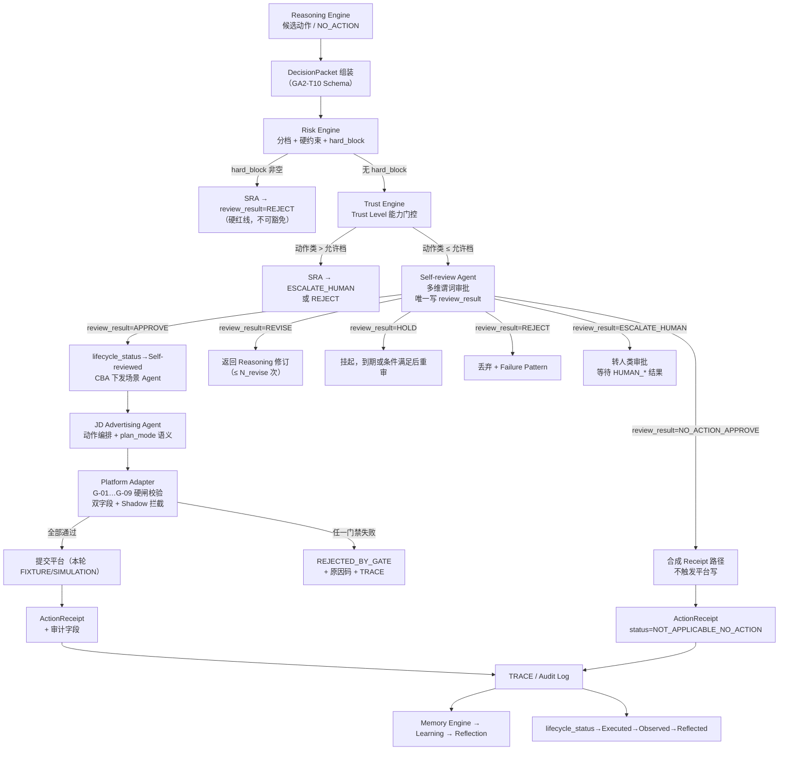

# GA-2：门禁联调手册——Risk × Trust × Self-review × JD G-01–G-09 可执行检查表

**文档编号：** GA-2-GATE-001  
**版本：** v0.2  
**状态：** Draft  
**阶段：** GA-2 Engineering Design  
**任务编号：** GA2-T19（原 GA2-T12 演进）  
**输入基线：** `Research/GA-1/GA-1_Theory_v1.0.md`（GA-1.0 / v1.0，Confirmed）  
**主线架构：** `Architecture_Overview_v0.2.md`（Confirmed，GA-DEC-004）  
**权威契约：** `Decision_Packet_Schema_v0.1.md`（GA2-T10）  
**关联详设：** `Risk_Trust_SelfReview_v0.1.md`（Draft）、`JD_Adapter_Interface_v0.2.md`（Draft）、`Shadow_Mode_Design_v0.1.md`  
**前序版本：** `Gate_Integration_Playbook_v0.1.md`（GA2-T12）  
**授权依据：** `GA-DEC-003` + `GA-DEC-004`（Accepted，2026-09-11）  
**作者角色：** Research Engineer 子代理（工程派生，不新增理论主张）  
**约束：** 与理论冲突时以 GA-1 为准；与架构/决策包契约冲突时以 Architecture_Overview_v0.2 + Decision_Packet_Schema_v0.1 为准并修订本文。本文不包含真实 API 调用代码。所有数值阈值一律标注 **Proposed**。不修改 GA-1 / PROJECT_SPEC。

---

## 变更说明（v0.1 → v0.2，强制阅读）

> **本节为相对 v0.1 的关键 diff。** 全文其余章节已按双字段语义改写；本表列出迁移影响与**关闭 JD-Q12** 的依据。

| # | 变更项 | v0.1 | v0.2 | 依据 |
|---|---|---|---|---|
| **C1** | **可执行判断语义（核心）** | `DP.status == APPROVE`（单一字段混用生命周期与审批） | **双字段同时满足**：`lifecycle_status ∈ {Self-reviewed, Executed}` **且** `review_result ∈ {APPROVE, NO_ACTION_APPROVE}` | Decision_Packet_Schema §2.2/§3/DPK-I1；JD_Adapter_Interface_v0.2 §3.4 G-01 |
| **C2** | **关闭 JD-Q12** | GIP v0.1 仍写 `status==APPROVE`，与 JD Adapter v0.2 双字段契约不一致 | 本文全文替换；**JD-Q12 关闭** | 任务 GA2-T19；JD-Q12 |
| **C3** | **NO_ACTION 审批结果** | 无专用枚举；NO_ACTION 在流水线中易被“不触发”含糊表述 | 增加 `review_result=NO_ACTION_APPROVE`；**仍必须成包**并走完整生命周期（DPK-I2） | Decision_Packet_Schema §5.3；JD v0.2 D5 |
| **C4** | **Shadow 写硬拒绝** | 未显式绑定 `execution_mode` | G-01 扩展：`execution_mode=SHADOW_READ_ONLY` 时写路径**硬拒绝**（`SHADOW_WRITE_FORBIDDEN`）；最多生成 `SIMULATED` 回执 | GA-DEC-004 红线；DPK-I5；JD v0.2 D4 |
| **C5** | **review_result 写入权** | “DP.status 只能由 SRA 写入 APPROVE” | 显式硬规则：**`review_result` 仅 SRA 可写**（HUMAN_* 经 SRA 映射回填）；其他组件只读 | Decision_Packet_Schema §2.6；Risk §6.6；JD v0.2 §1.5 |
| **C6** | **ActionReceipt 扩展** | 无 `SIMULATED` / `NOT_APPLICABLE_NO_ACTION` | 对齐 JD v0.2：Shadow/Fixture → `SIMULATED`；NO_ACTION → `NOT_APPLICABLE_NO_ACTION` | JD v0.2 D3；Decision_Packet_Schema §2.7 |
| **C7** | **组合裁决表与状态机** | 以单字段 `status` 为轴 | 以 `lifecycle_status` × `review_result` 为轴重写 §4.2、§8.3 | 本文 §4/§8 |
| **C8** | **G-07 dry_run / 环境** | 仅 `dry_run=true` | 非 LIVE 环境或 `execution_mode=SHADOW_READ_ONLY` 强制 `dry_run=true` | JD v0.2 G-07；本轮 FIXTURE/SIMULATION |
| **C9** | **审计字段** | `DP.status` 单字段 | 拆为 `lifecycle_status` + `review_result`（+ `review.approved_by` / `review.review_event_id`） | Decision_Packet_Schema §2.2/§2.6 |
| **C10** | **阈值与红线不变项** | Risk 硬于 Trust；Shadow 红线（隐含）；ESCALATE 条件；全部阈值 Proposed | **保持不变**：Risk 硬红线优先；Shadow 写硬拒绝；ESC-01…ESC-10；阈值仍 Proposed | 任务硬约束 4–6 |
| **C11** | **待决问题** | GIP-Q1…Q8；JD-Q12 开启 | 关闭 JD-Q12；更新 GIP-Q6/Q7；新增 GIP-Q9/Q10 | 本文 §10 |
| **C12** | **不改动范围** | — | **不修改** GA-1 / PROJECT_SPEC；不写真实 API 脚本；G-01…G-09 集合不变 | 任务硬约束 1–2 |

**迁移对照（旧 → 新，速查）：**

| v0.1 表述 | v0.2 等价表述 |
|---|---|
| `status=APPROVE` / `status==APPROVE` | `lifecycle_status ∈ {Self-reviewed, Executed}` **且** `review_result ∈ {APPROVE, NO_ACTION_APPROVE}` |
| `status=REVISE/HOLD/REJECT/ESCALATE_HUMAN` | `lifecycle_status=Self-reviewed` 且 `review_result ∈ {REVISE, HOLD, REJECT, ESCALATE_HUMAN}` |
| `status=DRAFT` / `PENDING_REVIEW` | `lifecycle_status=Draft`（审批过程态不进入包 status） |
| SRA 写 `status=APPROVE` | SRA 写 `review_result=APPROVE`（或 `NO_ACTION_APPROVE`），并推进 `lifecycle_status→Self-reviewed` |
| HUMAN_APPROVE → `status=APPROVE` | HUMAN_APPROVE → SRA 映射写 `review_result=APPROVE`，`approved_by=HUMAN` |

---

## 1. 文档目的与范围

将 Risk Engine、Trust Engine、Self-review Agent 的审批结果与京东 Adapter 前置硬闸 G-01–G-09 打成**一张可执行检查表**，供后续实现（Adapter 硬闸、SRA 谓词引擎、JDA 编排）与评审（M2 门禁闭环验收）使用。v0.2 将可执行判断统一为 Decision Packet **双字段**语义。

**覆盖范围：**

1. 端到端门禁流水线（从 Reasoning 产出到 ActionReceipt）；  
2. 全部抽象动作类型 × 门禁检查矩阵；  
3. G-01–G-09 与 Risk / Trust / Self-review 结果的组合裁决表；  
4. ESCALATE_HUMAN 升级路径；  
5. 门禁绕过 / 回执伪造 / 仿真污染的失败模式与检测点；  
6. 审计字段最小集；  
7. 与 Decision Packet（双字段状态机）的衔接；  
8. 迁移影响与待决问题。

**非目标：**

- 不修改 GA-1 理论；不修改 PROJECT_SPEC；  
- 不实现代码、不写真实广告账户操作脚本；  
- 不确定技术栈；不设计 GA-3 实验方案；  
- 不锁定具体数值阈值（全部 Proposed，待 GA2-T07 预标定）。

### 1.1 双字段可执行判定（全文统一语义）

```text
可执行（写路径准入）⇔
    lifecycle_status ∈ { Self-reviewed, Executed }
    AND review_result ∈ { APPROVE, NO_ACTION_APPROVE }
    AND execution_mode ≠ SHADOW_READ_ONLY          // Shadow 写硬拒绝
    AND risk.hard_block == []                      // Risk 硬红线优先（G-03 并行复检）
```

| 概念 | 字段 | 枚举 | 写入者 |
|---|---|---|---|
| 生命周期 | `lifecycle_status` | `Draft` → `Self-reviewed` → `Executed` → `Observed` → `Reflected` → `Archived` / `Superseded` | CBA/执行链（推进）；SRA 写入审批后置位 `Self-reviewed` |
| 审批结果 | `review_result` | `APPROVE` / `NO_ACTION_APPROVE` / `REVISE` / `HOLD` / `REJECT` / `ESCALATE_HUMAN` | **仅 SRA**（HUMAN_* 经 SRA 映射回填）；其他组件只读 |
| 执行语义 | `execution_mode` | `LIVE` / `SHADOW_READ_ONLY`（本轮仅后者） | CBA；冻结后不可改 |
| 包类型 | `packet_kind` | `standard` / `shadow_decision` | CBA；冻结后不可改 |

> **消歧：** v0.1 的 `DP.status==APPROVE` 在本文一律读作 §1.1 双条件。`review_result` 仅在 `lifecycle_status` 达到 `Self-reviewed` 起必填（Decision_Packet_Schema §2.2）。

---

## 2. 端到端门禁流水线

### 2.1 流水线总览



### 2.2 分层职责速查（对齐 Architecture §5 + Risk §2 + JD v0.2 §1）

| 层级 | 组件 | 在流水线中的职责 | 不负责 |
|---|---|---|---|
| L2 | Reasoning Engine | 产出候选动作与假设；NO_ACTION 成包 | 绕过门禁；写 `review_result` |
| L2 | Risk Engine | 分档、硬约束、hard_block | 生成动作、改 Trust、写 `review_result` |
| L2 | Trust Engine | Trust Level 能力门控 | 替代审批、放宽 Risk、写 `review_result` |
| L2 | Self-review Agent | 多维谓词审批；**唯一写入 `review_result`**；推进 `lifecycle_status→Self-reviewed` | 执行写操作、改 Trust |
| L3 | CBA | 唯一协调者；双字段允许执行后下发 | 直接调平台；改 `review_result` |
| L3 | JD Advertising Agent | plan_mode 语义、动作编排 | 自建旁路凭证；改双字段 |
| L4 | Platform Adapter | G-01–G-09 硬闸（双字段 + Shadow）、字段映射 | 经营判断、风险裁决、写审批字段 |

### 2.3 门禁顺序不可变性

固定顺序（Architecture §4 回路 A + Risk §2 + JD §3.1）：

```text
Reasoning → Risk → Trust → Self-review → CBA → JDA → Adapter(G-01..G-09) → Submit → Receipt → TRACE
```

**不变量：**

1. 任何组件不得跳过中间层直接触发写操作。  
2. Adapter 硬闸是**最后一道不可绕过的防线**，即使上游双字段已满足可执行条件。  
3. `NO_ACTION` 是合法终态：`review_result=NO_ACTION_APPROVE`，不触发 Adapter 写路径（G-01 对写动作 N/A；合成回执仍审计）。  
4. `REVISE` 循环回到 Reasoning 重新走完整门禁，不缓存旧 Risk/Trust 结果；`review_result` 由 SRA 在新一轮重新写入。  
5. **`review_result` 仅 SRA 可写**：JDA / Adapter / CBA / L2 其他引擎均只读。

---

## 3. 动作类型 × 门禁检查矩阵

### 3.1 动作类型定义（对齐 JD v0.2 §3.2）

| 代码 | 动作类 | 对应 WA-* ID | 典型 Trust 门槛（Proposed） |
|---|---|---|---|
| `ADVISE` | 建议 / 只读分析 | — （不产生 WA） | L0 |
| `LOW_RISK_ADJ` | 低风险调参（标签/备注/展示开关） | 部分 WA-PLAN-01/02 | L1 |
| `BID_ADJ` | 关键词/策略出价 | WA-BID-01, WA-BID-02 | L2 |
| `PREMIUM_ADJ` | 人群/资源位溢价 | WA-PRM-01, WA-PRM-02 | L2 |
| `BUDGET_ADJ` | 计划/账户预算 | WA-BGT-01, WA-BGT-02 | L3–L4 |
| `CREATE_PLAN` | 新建计划 | WA-PLAN-03 | L4 |
| `PAUSE_PLAN` | 暂停/归档计划 | WA-PLAN-01, WA-PLAN-04 | L2–L3 |
| `ROI_TARGET_ADJ` | 目标 ROI 调整 | WA-ROI-01 | L2–L3 |
| `NO_ACTION` | 显式维持现状 | WA-CLS-01 | L0 |

### 3.2 矩阵：动作类型 × 门禁检查（Adapter 视角）

| 门禁 | ADVISE | LOW_RISK_ADJ | BID_ADJ | PREMIUM_ADJ | BUDGET_ADJ | CREATE_PLAN | PAUSE_PLAN | ROI_TARGET_ADJ | NO_ACTION |
|---|:---:|:---:|:---:|:---:|:---:|:---:|:---:|:---:|:---:|
| **G-01** 双字段可执行 | N/A | ✅ | ✅ | ✅ | ✅ | ✅ | ✅ | ✅ | N/A* |
| **G-02** Trust ≥ 最低档 | ✅ L0 | ✅ L1 | ✅ L2 | ✅ L2 | ✅ L3/L4 | ✅ L4 | ✅ L2 | ✅ L2 | ✅ L0 |
| **G-03** Risk 允许幅度/频率 | — | 宽松 | 严 | 严 | 更严 | 最严 | 宽松 | 严 | — |
| **G-04** plan 可写状态 | N/A | ✅ | ✅ | ✅ | ✅ | N/A | ✅ | ✅ | N/A |
| **G-05** 幂等键未重复 | N/A | ✅ | ✅ | ✅ | ✅ | ✅ | ✅ | ✅ | N/A* |
| **G-06** 库存/预算约束 | — | — | 预算 | — | 库存+预算 | 库存+预算 | — | 预算 | — |
| **G-07** dry_run=true | N/A | ✅ | ✅ | ✅ | ✅ | ✅ | ✅ | ✅ | N/A |
| **G-08** 日内频率/间隔 | — | 宽松 | 中 | 中 | 紧 | 单次 | 宽松 | 中 | — |
| **G-09** plan_mode 白名单 | — | 双方 | 种草为主 | 种草为主 | 双方 | 双方 | 双方 | 收割为主 | — |

**图例：** ✅ = 必须检查；— = 该动作不适用此门禁；N/A = 该门禁对该动作类不执行。  
\* **NO_ACTION：** 不触发平台写接口；不走 Adapter 写 G-01。上游仍须 `review_result=NO_ACTION_APPROVE` 且 `lifecycle_status=Self-reviewed`；ADAPT/JDA 生成 `NOT_APPLICABLE_NO_ACTION` 合成回执（DPK-I2）。

**G-01 双字段校验（伪逻辑，对齐 JD v0.2 §3.4）：**

```text
G-01(packet, req):
  packet = load(decision_package_id)
  if packet is null: return REJECT(DECISION_PACKAGE_INVALID)
  if packet.lifecycle_status not in {Self-reviewed, Executed}:
      return REJECT(DECISION_PACKAGE_INVALID)
  if packet.review_result not in {APPROVE, NO_ACTION_APPROVE}:
      return REJECT(DECISION_PACKAGE_INVALID)
  if packet.execution_mode == SHADOW_READ_ONLY:
      return REJECT(SHADOW_WRITE_FORBIDDEN)   // DPK-I5；可选 SIMULATED 回执
  return PASS
```

### 3.3 矩阵：动作类型 × Risk 约束参数（Proposed 默认）

| 参数 | ADVISE | LOW_RISK | BID | PREMIUM | BUDGET | CREATE | PAUSE | ROI |
|---|---|---|---|---|---|---|---|---|
| `max_bid_delta_pct` | — | — | U_bid(L,R) | — | — | — | — | — |
| `max_budget_delta_pct` | — | — | — | — | U_bud(L,R) | — | — | — |
| `max_daily_adjust_count` | — | F_max | F_max | F_max | F_max | N_new_max | F_max | F_max |
| `min_response_window` | — | 短 | 中 | 中 | 长 | 单次 | 短 | 中 |
| `allow_new_plan` | — | — | — | — | — | 受探索预算约束 | — | — |
| `review_mode` | — | LITE | STANDARD | STANDARD | STRICT | STRICT | LITE | STANDARD |

> 幅度示意（Risk §7.2 Proposed）：R0–R1/L≥2 约 10%–20%；R2 约 5%–10%；R3 约 0%–5% 或禁；R4 = 0（硬阻断）。种草计划幅度可略宽于收割计划（JD §6.1）。

### 3.4 矩阵：动作类型 × Trust Level 允许性（对齐 Risk §5.2）

| Trust | ADVISE | LOW_RISK | BID | PREMIUM | BUDGET(计划) | BUDGET(账户) | CREATE(种草) | CREATE(收割) | PAUSE | ROI |
|---|:---:|:---:|:---:|:---:|:---:|:---:|:---:|:---:|:---:|:---:|
| L0 | ✅ | ❌ | ❌ | ❌ | ❌ | ❌ | ❌ | ❌ | ❌ | ❌ |
| L1 | ✅ | ✅* | ❌ | ❌ | ❌ | ❌ | ❌ | ❌ | ❌ | ❌ |
| L2 | ✅ | ✅* | ✅* | ✅* | ❌ | ❌ | ❌ | ❌ | 建议 | ✅* |
| L3 | ✅ | ✅* | ✅* | ✅* | ✅* | ❌ | ❌ | ❌ | ✅* | ✅* |
| L4 | ✅ | ✅* | ✅* | ✅* | ✅* | ✅* | ✅* | 受限* | ✅* | ✅* |
| L5 | ✅ | ✅* | ✅* | ✅* | ✅* | ✅* | ✅* | ✅* | ✅* | ✅* |

\* 类型允许，仍须通过 Self-review 且满足 Risk constraints。  
**矩阵不变量：** 任何 Level 均不得绕过 Self-review；任何 Level 均不得执行硬红线动作。

---

## 4. G-01–G-09 组合裁决表

### 4.1 单门禁裁决规则

| 门禁 | 检查谓词（伪逻辑） | 失败结果 | 失败原因码（Proposed） |
|---|---|---|---|
| G-01 | `lifecycle_status ∈ {Self-reviewed, Executed}` **且** `review_result ∈ {APPROVE, NO_ACTION_APPROVE}` **且** `decision_id` 有效 **且** `execution_mode ≠ SHADOW_READ_ONLY`（写路径） | `REJECTED_BY_GATE` | `DECISION_PACKAGE_INVALID` / `SHADOW_WRITE_FORBIDDEN` |
| G-02 | `trust.trust_actual ≥ trust.trust_required`（或 agent 档 ≥ 动作 min_trust） | `REJECTED_BY_GATE` | `TRUST_INSUFFICIENT` |
| G-03 | `risk.hard_block` 为空 **且** `risk.constraints.satisfied(action)`；`risk_level=R4` 默认拒绝 | `REJECTED_BY_GATE` | `RISK_CONSTRAINT_VIOLATED` / `HARD_BLOCK` |
| G-04 | `plan.status ∉ {UNDER_REVIEW, FROZEN}` | `REJECTED_BY_GATE` | `PLAN_NOT_WRITABLE` |
| G-05 | `idempotency_key` 未出现 | 去重返回原回执 | `DUPLICATE_SUBMISSION` |
| G-06 | `INV-GATE-* / BUD-GATE-*` 全满足 | `REJECTED_BY_GATE` 或上游 `REVISE` | `INVENTORY_OR_BUDGET_VIOLATED` |
| G-07 | `req.dry_run == true`；非 LIVE 或 Shadow 强制 | `REJECTED_BY_GATE` | `DRY_RUN_REQUIRED` |
| G-08 | `F_day(c) < F_max && now - t_last ≥ W_resp` | `REJECTED_BY_GATE` | `FREQ_OR_WINDOW_VIOLATED` |
| G-09 | `action_type ∈ whitelist(plan_mode)` | `REJECTED_BY_GATE` | `ACTION_NOT_ALLOWED_FOR_PLAN_MODE` |

### 4.2 组合裁决表：Risk × Trust × Self-review → Adapter 行为（双字段轴）

下表给出**上游信号组合时 Adapter 的最终行为**。Adapter 是硬闸，不做软判断——双字段不满足或任一门禁失败即拒绝。  
**轴定义：** `lifecycle_status`（LS）与 `review_result`（RR）。「可执行」= `LS ∈ {Self-reviewed, Executed}` 且 `RR ∈ {APPROVE, NO_ACTION_APPROVE}`。

| # | risk_level | hard_block | trust | lifecycle_status | review_result | Adapter 行为 | 备注 |
|---|:---:|:---:|:---:|---|---|---|---|
| 1 | R0–R2 | 空 | ≥ 门槛 | Self-reviewed | APPROVE | 执行 G-01–G-09 全检 | 正常写路径 |
| 2 | R0–R2 | 空 | < 门槛 | Self-reviewed | APPROVE | **G-02 拒绝** | Trust 不足，SRA 不应 APPROVE（上游 bug） |
| 3 | R0–R2 | 空 | ≥ 门槛 | Self-reviewed | REVISE | 不提交（G-01） | RR 不在可执行集 |
| 4 | R0–R2 | 空 | ≥ 门槛 | Self-reviewed | HOLD | 不提交（G-01） | 同上 |
| 5 | R0–R2 | 空 | ≥ 门槛 | Self-reviewed | REJECT | 不提交（G-01） | 同上 |
| 6 | R0–R2 | 空 | ≥ 门槛 | Self-reviewed | ESCALATE_HUMAN | 不提交（G-01） | 等待 HUMAN_* 再审 |
| 7 | R3 | 空 | ≥ 门槛 | Self-reviewed | APPROVE | 执行全检；G-03 限幅更严 | R3 倾向 HOLD；APPROVE 需充分证据 |
| 8 | R3 | 空 | < 门槛 | Self-reviewed | APPROVE | **G-02 拒绝** | 同 #2 |
| 9 | R4 | **非空** | 任意 | 任意 | APPROVE | **G-01/G-03 拒绝**（不应进入可执行双条件） | SRA 违反「Risk 硬于 Trust」；告警 |
| 10 | R4 | 非空 | 任意 | Self-reviewed | REJECT | 不提交 | 正确路径 |
| 11 | R4 | 非空 | 任意 | Self-reviewed | ESCALATE_HUMAN | 不提交；标记审计异常 | R4 默认应 REJECT；ESCALATE 需说明 |
| 12 | 任意 | 空 | 任意 | Self-reviewed→Observed | NO_ACTION_APPROVE | 不触发 Adapter 写；合成 `NOT_APPLICABLE_NO_ACTION` | 合法终态（DPK-I2） |
| 13 | 任意 | 空 | ≥ 门槛 | Self-reviewed | APPROVE 但 G-04 失败 | **G-04 拒绝** | plan 状态变化，上游未感知 |
| 14 | 任意 | 空 | ≥ 门槛 | Self-reviewed | APPROVE 但 G-06 失败 | **G-06 拒绝**；是否 REVISE 由 SRA 再评 | 库存/预算变化 |
| 15 | 任意 | 空 | ≥ 门槛 | Self-reviewed | APPROVE 但 G-08 失败 | **G-08 拒绝** | 频率/窗口违规 |
| 16 | 任意 | 空 | ≥ 门槛 | Self-reviewed | APPROVE 但 G-09 失败 | **G-09 拒绝** | plan_mode 白名单外 |
| 17 | 任意 | 空 | ≥ 门槛 | Self-reviewed | APPROVE 但 dry_run=false | **G-07 拒绝** | 本轮环境强制 dry_run |
| 18 | 任意 | 空 | ≥ 门槛 | Self-reviewed | APPROVE | **G-01 拒绝 `SHADOW_WRITE_FORBIDDEN`** | `execution_mode=SHADOW_READ_ONLY`；DPK-I5 |
| 19 | 任意 | 空 | 任意 | **Draft** | （空/进行中） | 不提交（G-01） | 未过审，LS 未达 Self-reviewed |
| 20 | 任意 | 空 | ≥ 门槛 | Executed | APPROVE（重试/幂等） | 按 G-05 幂等；其余全检 | 已执行包的合法重入须幂等键去重 |

### 4.3 裁决不变量（实现与评审必查）

1. **Risk 硬于 Trust：** `risk.hard_block` 非空或 `risk_level=R4` 时，Trust L5 也不得使包进入可执行双条件（Risk §2.1）。SRA 不得写 `review_result=APPROVE`。  
2. **Trust 不替代审批：** Trust L5 仍须过 SRA；每个动作独立审批；`review_result` 仅 SRA 写。  
3. **SRA 不写穿审计：** 所有 `review_result` / `lifecycle_status` 转移写 TRACE / ReviewEvent（Risk §6.6）。  
4. **Adapter 硬闸不可绕过：** 即使双字段可执行且上游全绿，G-01–G-09 任一失败即拒绝（JD §3.4）。  
5. **REVISE 不缓存旧评估：** 每次重提必须重新走 Risk → Trust → SRA；`review_result` 重新写入。  
6. **NO_ACTION 不触发写路径：** Adapter 不得为“有交互”制造写操作（JD §3.1.3 / DPK-I2）。  
7. **Shadow 写硬拒绝：** `execution_mode=SHADOW_READ_ONLY` 时写路径硬失败，与双字段是否满足无关（DPK-I5）。  
8. **review_result 写入权：** 仅 SRA（含 HUMAN_* 经 SRA 映射）可写 `review_result`；任何其他组件写入均为违规。

---

## 5. 升级路径：何时 ESCALATE_HUMAN

### 5.1 触发条件汇总（与 v0.1 保持一致）

| 触发 ID | 条件 | 来源 | 优先级 |
|---|---|---|---|
| ESC-01 | `risk_level == R4` 且非纯硬阻断场景（如合规存疑需人工确认） | Risk §3.2 | 高 |
| ESC-02 | Trust Level 不足但动作高影响（大额预算/新建） | Risk §6.3 TrustGate | 高 |
| ESC-03 | 单笔预算/新建超过 `L_max_threshold`（Proposed） | Risk §6.5 | 高 |
| ESC-04 | REVISE 循环次数超过 `N_revise`（默认 Proposed: 2） | Risk §6.5 | 中 |
| ESC-05 | SRA 谓词冲突（如 CHK_GOAL 与 CHK_MODEL 矛盾且无优先规则） | Risk §6.5 | 中 |
| ESC-06 | 新场景无知识模板（KE 无匹配 Rule/Strategy） | Risk §6.5 | 中 |
| ESC-07 | 人类抽检策略触发（L0–L1 高比例；L4–L5 低比例随机） | Risk Q-R8 | 低 |
| ESC-08 | HOLD 超时 `T_hold_max` 仍未解锁 | Risk §6.5 | 低 |
| ESC-09 | 合规/审核风险信号（CHK_COMP 失败） | Risk §6.4 | 高 |
| ESC-10 | 企业经营目标重大冲突（CHK_GOAL 失败且无自动优先规则） | Risk §6.4 | 高 |

### 5.2 人类结果映射与回流（双字段）

```text
review_result = ESCALATE_HUMAN（lifecycle_status=Self-reviewed）
  → HUMAN_APPROVE
      → SRA 映射写 review_result=APPROVE, approved_by=HUMAN
      → 继续 Adapter 可执行路径（LS 仍 Self-reviewed；执行后 → Executed）
  → HUMAN_MODIFY
      → 修改参数后 → 回 Reasoning → 重新走门禁（新 review 轮次）
  → HUMAN_REVISE
      → SRA 写 review_result=REVISE → 回 Reasoning（不消耗 N_revise）
  → HUMAN_REJECT
      → SRA 写 review_result=REJECT → Failure Pattern + Trust P_human 惩罚
      → lifecycle_status → Archived
```

**审计要求：** 每次 ESCALATE 必须写 `review.human_ticket_id`；HUMAN 结果经 **SRA** 回填 `ReviewEvent` 与 `review_result`（**禁止**人工/其他组件直写包字段）。

### 5.3 Trust Level 与抽检比例（Proposed）

| Trust Level | 抽检比例 | 说明 |
|---|---|---|
| L0–L1 | 高（Proposed: 50%+） | 新部署/低信任，人工监护 |
| L2–L3 | 中（Proposed: 20%） | 逐步放权 |
| L4–L5 | 低（Proposed: 5%） | 信任高，保留随机审计 |

---

## 6. 失败模式与检测点

### 6.1 门禁被绕过

| 失败模式 | 描述 | 检测点 | 检测方法（设计） |
|---|---|---|---|
| B-01 | 绕过 Risk/Trust/SRA 直接调 Adapter | Adapter 入口日志 | 每次 `write` 必须携带有效 `decision_package_id`；无包即拒绝（G-01） |
| B-02 | 伪造 `review_result=APPROVE` 或篡改 `lifecycle_status` 使双条件成立 | DP 状态变更日志 | 双字段状态机不可逆跳转；`decided_at` / `review.*` 必须由 **SRA** 写入；其他组件写审计违规 |
| B-03 | 绕过 Adapter 直接操作平台 | 网络出口审计 | 本轮 LiveTransport 硬失败；SIMULATION 仅本地 |
| B-04 | L2 引擎持有写句柄 | 依赖注入审计 | 架构约束：L2 引擎不得注入 Adapter 写接口 |
| B-05 | SRA 无记录静默改动作 | TRACE 完整性 | 每次状态转移必须写 ReviewEvent；缺失则 TRACE 校验失败 |
| B-06 | REVISE 循环中跳过重评 | 门禁执行日志 | 每次重提必须重新执行 Risk→Trust→SRA；缓存校验 |
| B-07 | 在 Shadow 包上强写平台 | G-01 + execution_mode | `SHADOW_WRITE_FORBIDDEN`；可选仅 `SIMULATED` 回执 |

### 6.2 回执伪造

| 失败模式 | 描述 | 检测点 | 检测方法（设计） |
|---|---|---|---|
| F-01 | 伪造 ActionReceipt.status=ACCEPTED | Receipt 与平台侧交叉验证 | LIVE 模式下 Receipt 必须携带 `platform_ack_ref`；FIXTURE/Shadow 标记 `source` / `SIMULATED` |
| F-02 | 篡改 applied_change 参数 | Receipt 与请求 diff | Receipt.applied_change 必须与 req.change 一致或有合法转换记录 |
| F-03 | 伪造 ValidationReport 为 PASS | BDV 校验链 | ValidationReport 必须由 BDV 组件生成；Adapter/其他组件不得写 PASS |
| F-04 | 伪造 RiskAssessment 放行 | RKE 输出签名/引用 | RiskAssessment 必须携带 `baseline_version`；SRA 校验版本有效性 |

### 6.3 仿真污染

| 失败模式 | 描述 | 检测点 | 检测方法（设计） |
|---|---|---|---|
| P-01 | SIMULATION 回执进入 Memory 被当成真实经验 | ME 入口过滤 | ActionReceipt 必须携带 `source` / `audit.source_env`；SIMULATION 默认降权或隔离池（JD-Q10） |
| P-02 | Fixture / Shadow 数据被误用于 Trust Score 更新 | TE 输入过滤 | Trust 更新仅接受 `audit.source_env=LIVE` 的 TRACE 事件（canonical；REAL 为废弃别名，实现须归一为 LIVE） |
| P-03 | dry_run=true 的"成功"被计为真实达成 | Reflection 输入过滤 | dry_run 回执不计入 T2/T5 |
| P-04 | 测试用 Trust Level 被提升污染生产 | TE 作用域隔离 | 测试环境 Trust 与生产 Trust 分离存储 |
| P-05 | 仿真中调整响应窗口被 Learning 采信 | Reflection 输入标记 | SIMULATION 产生的 W_resp 观测默认不更新生产参数 |

**统一检测原则（GA-DEC-006 canonical）：** 所有进入 Memory/Trust/Reflection 的事件必须携带 `audit.source_env ∈ {LIVE, SHADOW, SIMULATION, FIXTURE, HUMAN}`；非 LIVE 来源默认降权或隔离。历史字段名 `source` 与字面量 `REAL` 为别名，实现必须映射为 `source_env=LIVE`。

---

## 7. 审计字段最小集

### 7.1 全链路必填审计字段

以下字段在**任何写路径事件**中必须存在（对齐 Architecture §6 + Risk §6.6 + JD v0.2 §4.9 + Decision_Packet_Schema）：

| 字段 | 来源组件 | 说明 |
|---|---|---|
| `decision_id` | DecisionPacket | 全局唯一决策标识 |
| `action_id` | AbstractActionRequest | 动作级标识 |
| `ts` | 各组件 | 事件时间戳 |
| `risk.risk_level` | Risk Engine | R0–R4（子对象） |
| `risk.hard_block` | Risk Engine | 非空禁止可执行 |
| `trust.trust_actual` / `trust.trust_required` | Trust Engine | 0–5 |
| `plan_mode` | JDA | SEEDING/HARVEST/MIXED/UNKNOWN |
| `risk.baseline_version` | Risk Engine | 基线版本号 |
| `trust.version` | Trust Engine | Trust 快照版本号 |
| `audit.source_env`（历史别名 `source`） | Adapter/环境 | **LIVE** / SIMULATION / FIXTURE / SHADOW / HUMAN（REAL→LIVE 归一） |
| `reason_codes[]` | 各组件 | 失败/成功原因码数组 |
| `dry_run` | 请求 | 本轮强制 true |

### 7.2 决策阶段必填（双字段）

| 字段 | 说明 |
|---|---|
| `lifecycle_status` | Draft → Self-reviewed → Executed → Observed → Reflected → Archived / Superseded |
| `review_result` | 自 Self-reviewed 起：APPROVE / NO_ACTION_APPROVE / REVISE / HOLD / REJECT / ESCALATE_HUMAN |
| `review.approved_by` | AGENT / HUMAN |
| `review.review_event_id` | SRA 审批事件引用 |
| `objective_snapshot` | OFG 目标函数快照（取代 v0.1 objective_weights_ref） |
| `hypothesis` | 观察 → 假设 |
| `evidence_refs[]` / `knowledge_refs[]` | 证据与知识引用 |
| `proposed_actions[]` | 动作、幅度、对象、预期窗口 |
| `expected_response_window` | 调整响应窗口 |
| `packet_kind` / `execution_mode` | standard/shadow；LIVE/SHADOW_READ_ONLY |

### 7.3 审批阶段必填

| 字段 | 说明 |
|---|---|
| `review.review_result` | **仅 SRA 可写** |
| `review.predicate_trace` | `{ id: pass|fail|unknown, detail }` 结构 |
| `review.revise_round?` | 上限 Proposed N_revise=2 |
| `review.human_ticket_id?` | ESCALATE 时必填 |

### 7.4 执行阶段必填

| 字段 | 说明 |
|---|---|
| `action_receipts[].status` | ACCEPTED / REJECTED_BY_PLATFORM / REJECTED_BY_GATE / TIMEOUT / UNKNOWN / **SIMULATED** / **NOT_APPLICABLE_NO_ACTION** |
| `platform_ack_ref?` | 平台确认引用（LIVE）或 Fixture 标记 |
| `applied_change` | 实际生效变更 |
| `audit.decision_id` | 回链决策 |
| `audit.response_window_due_at?` | 验证任务到期时间 |
| `audit.failure_pattern_candidate` | 是否进入失败模式候选 |

### 7.5 回写阶段必填

| 字段 | 说明 |
|---|---|
| `outcome_ref` | 执行结果回填（Observed） |
| `reflection_ref` | 复盘结论回填（Reflected） |
| `causal_ids` / `causal_memory_pending` | 因果记忆是否已入 ME |

---

## 8. 与 Decision Packet 的衔接说明

### 8.1 Decision Packet 在门禁流水线中的位置

Decision Packet（DP）是**回路 A→B 的物理连接点**（Architecture §6）。双字段语义下：

```text
Reasoning 产出候选动作
  → 组装 DecisionPacket（含 risk/trust 子对象；lifecycle_status=Draft）
  → SRA 审批：唯一写 review_result；lifecycle_status → Self-reviewed
  → CBA 下发时校验双字段可执行并携带 decision_id
  → JDA 编排时引用 DP（只读双字段）
  → Adapter G-01 校验双字段 + execution_mode
  → 执行后 lifecycle_status → Executed；Receipt 回填 action_receipts
  → 观察后 lifecycle_status → Observed；outcome_ref 回填
  → 复盘后 lifecycle_status → Reflected；reflection_ref 回填
```

### 8.2 DP Schema 与门禁字段映射

| DP 字段 | 对应门禁 | 消费方 |
|---|---|---|
| `decision_id` | G-01 | Adapter |
| `lifecycle_status` | G-01 | Adapter（须 ∈ {Self-reviewed, Executed}） |
| `review_result` / `review.review_result` | G-01 | Adapter（须 ∈ {APPROVE, NO_ACTION_APPROVE}）；**写者仅 SRA** |
| `execution_mode` | G-01 / G-07 | Adapter（Shadow 写硬拒绝） |
| `risk.risk_level` / `risk.hard_block` / `risk.constraints` | G-03, G-06 | Adapter + RKE 约束 |
| `trust.trust_required` / `trust.trust_actual` | G-02 | Adapter |
| `plan_mode` | G-09 | Adapter |
| `proposed_actions[].change.relative_pct` | G-03 | Adapter 幅度校验 |
| `proposed_actions[].constraints.idempotency_key` | G-05 | Adapter 幂等校验 |
| `expected_response_window` | G-08 | Adapter 频率/间隔校验 |
| `review.predicate_trace` | 全门禁上游 | SRA → Adapter 审计 |

### 8.3 DP 状态机与 SRA 状态机的对齐（双字段）

| lifecycle_status | review_result | SRA 过程态 | Adapter 行为 |
|---|---|---|---|
| Draft | 空 / 进行中 | Submitted / RiskGate / TrustGate / ReviewEval | 不触发（G-01） |
| Self-reviewed | APPROVE | Approved | 执行 G-01–G-09（写路径） |
| Self-reviewed | NO_ACTION_APPROVE | Approved（NO_ACTION） | 不触发写；合成 NOT_APPLICABLE_NO_ACTION |
| Self-reviewed | REVISE | Revise | 不触发；回 Reasoning |
| Self-reviewed | HOLD | Hold | 不触发；等待解锁 |
| Self-reviewed | REJECT | Rejected | 不触发；→ Archived |
| Self-reviewed | ESCALATE_HUMAN | Escalated | 不触发；等待 HUMAN_* |
| Executed | APPROVE / NO_ACTION_APPROVE（只读锁定） | （审批结果不再变更） | 幂等重入 / 仅审计 |
| Observed / Reflected / Archived / Superseded | 审批结果只读 | — | 不触发新写 |

**迁移规则摘要（对齐 Decision_Packet_Schema §3.3）：**

| 从 → 到 | 条件 |
|---|---|
| Draft → Self-reviewed | SRA 写入 `review_result`（任一终态枚举） |
| Self-reviewed → Draft | `REVISE` 且 `revise_round < N_revise` |
| Self-reviewed → Archived | `REJECT`；或 HOLD 超时；或 HUMAN_REJECT |
| Self-reviewed → Executed | `APPROVE` 且非 Shadow 写；或 `NO_ACTION_APPROVE`；或 HUMAN_APPROVE/MODIFY |
| Executed → Observed → Reflected → Archived | 回填 outcome / reflection；默认终态 |

**衔接不变量：**  
`review_result` **只能由 SRA**（或 HUMAN 结果经 SRA 映射）写入；`lifecycle_status` 由既定执行链推进。任何其他组件写入 `review_result=APPROVE` 或伪造 `lifecycle_status≥Self-reviewed` 均为违规。

---

## 9. 实现检查清单（供后续编码与评审）

### 9.1 Adapter 硬闸实现检查项

- [ ] G-01: 校验 DP 存在 **且** `lifecycle_status ∈ {Self-reviewed, Executed}` **且** `review_result ∈ {APPROVE, NO_ACTION_APPROVE}`  
- [ ] G-01-S: `execution_mode=SHADOW_READ_ONLY` 时写路径返回 `SHADOW_WRITE_FORBIDDEN`  
- [ ] G-02: 校验 `trust.trust_actual ≥ trust.trust_required`（或 agent.trust_level ≥ action.min_trust）  
- [ ] G-03: 校验 `hard_block` 为空且幅度/频率在 `risk.constraints` 内  
- [ ] G-04: 校验 plan.status 可写  
- [ ] G-05: 幂等键去重  
- [ ] G-06: 库存/预算约束  
- [ ] G-07: dry_run=true（非 LIVE / Shadow 强制）  
- [ ] G-08: 日内频率与最小间隔  
- [ ] G-09: plan_mode 动作白名单  
- [ ] 所有拒绝均返回 `REJECTED_BY_GATE` + 原因码  
- [ ] 所有拒绝均写 TRACE  
- [ ] NO_ACTION：不调平台写；生成 `NOT_APPLICABLE_NO_ACTION`

### 9.2 SRA 谓词引擎实现检查项

- [ ] CHK_MODEL / CHK_RISK / CHK_INV / CHK_BUD / CHK_COMP / CHK_LC / CHK_GOAL / CHK_CONF  
- [ ] CHK_WINDOW / CHK_FREQ / CHK_AMP / CHK_STAB / CHK_TRUST / CHK_EXPLORE  
- [ ] N_revise 循环计数  
- [ ] HOLD 超时 T_hold_max  
- [ ] ESCALATE 触发条件  
- [ ] **唯一**组件可写 `review_result`；写后 `lifecycle_status→Self-reviewed`  
- [ ] `risk.hard_block` 非空 ⇒ 禁止写 `review_result=APPROVE`  
- [ ] 所有谓词结果写 TRACE / ReviewEvent  

### 9.3 Trust Engine 实现检查项

- [ ] T1–T8 维度得分计算  
- [ ] 指数平滑与惩罚项  
- [ ] 升降级门限与迟滞  
- [ ] 仅 `source_env=LIVE` 来源事件计入 Trust  
- [ ] 硬红线事件即时降档  

---

## 10. 迁移影响与待决问题

### 10.1 迁移影响登记（v0.1 → v0.2）

| 影响面 | 内容 | 处置 |
|---|---|---|
| G-01 谓词 | 单字段 → 双字段 + Shadow 拦截 | 本文 §3.2/§4.1；与 JD v0.2 对齐 |
| 组合裁决表 | 增加 LS/RR 双轴；#12 NO_ACTION；#18 Shadow；#19 Draft；#20 Executed 幂等 | §4.2 |
| 升级路径 | HUMAN_* 经 SRA 映射写 RR | §5.2 |
| 失败模式 | B-02 改为伪造 RR/LS；新增 B-07 Shadow 强写 | §6.1 |
| 审计字段 | status 拆为 lifecycle_status + review_result | §7.2 |
| DP 衔接 | 状态机表全面双字段化 | §8.3 |
| 实现清单 | 增加 G-01-S、SRA 唯一写权、NO_ACTION 合成回执 | §9 |
| 下游文档 | JD-Q12 关闭；Shadow_Mode_Design 交叉引用保持；Risk 详设状态机枚举在实现层映射为 RR | 待评审确认 |

**明确不变：** G-01…G-09 集合；Risk 硬于 Trust；ESCALATE 条件 ESC-01…10；全部阈值 Proposed；不改 GA-1/PROJECT_SPEC；无真实 API。

### 10.2 待决问题（相对 v0.1 更新）

| ID | 问题 | 状态 / 建议 | 阻塞 |
|---|---|---|---|
| GIP-Q1 | G-03 幅度校验由 Adapter 独立执行还是仅透传 RKE constraints？ | 保持：Adapter 独立执行（不可绕过子集），RKE 定策略 | 否 |
| GIP-Q2 | G-06 库存/预算校验失败时，降级 REVISE 的判定权在 Adapter 还是 SRA？ | 保持：Adapter 仅拒绝；是否 REVISE 由 SRA 重新评估并写 `review_result` | 否 |
| GIP-Q3 | 幂等键的 TTL 与存储策略？ | Proposed: 24h TTL；存储由 GA2-T04 Memory 边界定 | 否 |
| GIP-Q4 | G-08 的 W_resp 默认值如何按 plan_mode 差异化？ | 种草短、收割长；具体值待 GA2-T07 | 否 |
| GIP-Q5 | 仿真污染检测的 `source` 字段是否需要加密签名防篡改？ | 本轮不需要；LIVE 阶段评估 | 否 |
| GIP-Q6 | 组合裁决表 #9（R4 + hard_block + RR=APPROVE）是上游 bug 还是合法路径？ | **保持为 bug**；Adapter 仍 G-01/G-03 拒绝并告警；双字段下 SRA 本就不应写 APPROVE | 否 |
| GIP-Q7 | DP Schema 与本文门禁字段是否有遗漏？ | **部分关闭**：已对齐 Decision_Packet_Schema_v0.1 + JD v0.2 双字段；剩余字段级校验在联调时补齐 | 否 |
| GIP-Q8 | 抽检比例是否需要按动作类型进一步细分？ | 先按 Trust Level 分档；GA2-T07 预标定时细化 | 否 |
| **GIP-Q9**（新增） | `lifecycle_status=Executed` 且 `review_result=APPROVE` 的包再次进入 Adapter（重试/多动作部分失败）时，幂等与部分执行语义如何统一？ | 按 G-05 幂等；部分失败标记进 Receipt；不重写 RR | 否 |
| **GIP-Q10**（新增） | Risk 详设状态机枚举（Approved/Revise/…）与 Schema `review_result` 的工程映射是否需在 Risk 文档升版时同步？ | Risk v0.1 维持理论/状态机表述；实现层以 Schema RR 为准；Risk 下版可加映射表 | 否 |
| ~~JD-Q12~~ | ~~GIP 中 `DP.status==APPROVE` 何时改写？~~ | **已关闭（本文 v0.2）**：全文双字段；可执行条件见 §1.1 | 否（已对齐） |

---

## 11. 理论追踪

| 本文章节 | GA-1 锚点 | 架构锚点 | 详设锚点 | 覆盖状态 |
|---|---|---|---|---|
| §2 门禁流水线 | §6.7 验证→信任→权限 | §4 回路 A | Risk §2；DPK §5.2 | Mapped |
| §3 动作×门禁矩阵 | §6.7 权限路径 | §7 权限模型 | Risk §5, JD v0.2 §3.2 | Mapped |
| §4 组合裁决表 | §11.1–11.2 | §4.8–4.10 | Risk §3/§6, JD v0.2 §3.4 | Mapped |
| §5 升级路径 | §11.2 | — | Risk §6.5 | Mapped |
| §6 失败模式 | §6.3 数据不可直信 | §2 P3 | JD §5, §7.2；DPK-I5 | Mapped |
| §7 审计字段 | §12 | §6 决策包 | Risk §6.6, JD v0.2 §4.9 | Mapped |
| §8 DP 衔接 | — | §6 | DPK §3；JD v0.2 §4.8 | Mapped |

**明确不声称：** 本文全部阈值、比例、超时参数均为 Proposed 工程预标定，不是 GA-1 理论结论；有效性待 GA-3 验证。

---

## 12. 变更记录

| 日期 | 版本 | 变更 | 依据 |
|---|---|---|---|
| 2026-09-11 | v0.1 | 首次建立门禁联调手册：流水线、矩阵、裁决表、升级路径、失败模式、审计字段、DP 衔接 | GA2-T12；Risk_Trust_SelfReview_v0.1；JD_Adapter_Interface_v0.1；Architecture_Overview_v0.2；GA-DEC-004 |
| 2026-09-11 | v0.2 | 全文改为 `lifecycle_status` + `review_result` 双字段语义；G-01 增加 Shadow 写硬拒绝；组合裁决表与 DP 状态机双轴重写；明确 review_result 仅 SRA 可写；关闭 JD-Q12；新增 GIP-Q9/Q10；阈值仍 Proposed；不改 GA-1/PROJECT_SPEC | GA2-T19；Decision_Packet_Schema_v0.1；JD_Adapter_Interface_v0.2；GA-DEC-004 |

---

**Document Status:** Draft  
**Next Stage Input:** 与 JD_Adapter_Interface_v0.2 / Decision_Packet_Schema_v0.1 联审；GA2-T07 参数预标定后更新 Proposed 阈值  
**Owner Review:** 待项目负责人 / Research Architect 评审  
**JD-Q12:** **Closed by this document (v0.2)**
