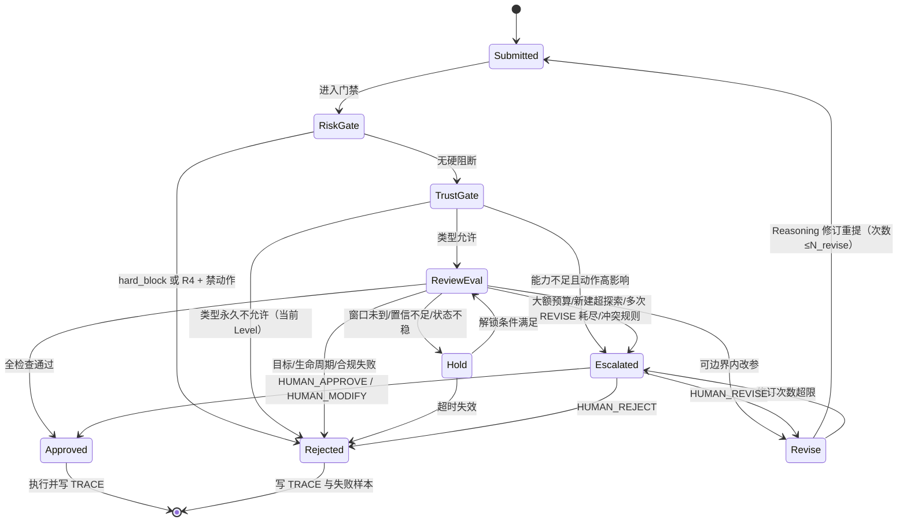

# GA-2：Risk Engine + Trust Engine + Self-review Agent 审批闭环详设

**文档编号：** GA-2-RISK-001  
**版本：** v0.1.1（双字段对齐补丁）  
**状态：** Draft  
**阶段：** GA-2 Engineering Design  
**任务编号：** GA2-T05  
**输入基线：** `Research/GA-1/GA-1_Theory_v1.0.md`（GA-1.0 / v1.0，Confirmed）  
**关联架构：** `Architecture_Overview_v0.2.md`（Confirmed，GA-DEC-004）  
**关联门禁：** `Gate_Integration_Playbook_v0.2.md`；`JD_Adapter_Interface_v0.2.md`  
**关联追踪：** `Theory_Engineering_Trace.md`（Draft）  
**授权依据：** `GA-DEC-003`；`GA-DEC-006`（双字段一致性补丁）  
**作者角色：** Research Engineer 子代理（工程派生，不新增理论主张）  
**约束：** 与理论冲突时以 GA-1 为准并修订本文；本文不包含真实账户操作脚本。

---

## 1. 文档目的与范围

将 GA-1 §6.7、§8、§11、§15 中的风控、信任与自审批主张，收敛为可实现的工程详设：

1. Dynamic Risk Baseline 如何按商品/计划/库存/活动分档；  
2. Trust Score 如何由可度量信号构成并更新；  
3. Trust Level 0–5 如何映射到允许动作；  
4. Self-review 审批状态机如何流转（含 REVISE / ESCALATE_HUMAN 分支）；  
5. 调整幅度、日内频率、探索预算如何参数化约束；  
6. 周期反思如何输入失败计划并输出阈值修正建议。

**非目标：**

- 不修改 GA-1 理论；不新增与理论冲突的理论主张；  
- 不实现代码、不写真实广告账户操作脚本；  
- 不确定具体 LLM / 数据库 / 消息队列技术栈；  
- 不设计 GA-3 实验方案。

---

## 2. 组件边界与门禁顺序

与架构草案 §7 一致，门禁顺序固定为：

```text
Reasoning Engine 候选动作
    → Risk Engine（Dynamic Risk Baseline 分档 + 硬约束校验）
    → Trust Engine（Trust Level 能力门控）
    → Self-review Agent（多维预审批）
    → CBA 下发场景 Agent 执行（经 Platform Adapter）
```

| 组件 | 职责边界 | 不负责 |
|---|---|---|
| Risk Engine (RKE) | 维护风险基线、输出风险等级与动作约束参数；识别硬红线 | 不直接生成经营动作；不改 Trust Score |
| Trust Engine (TE) | 维护 Trust Score / Level；将信任映射为权限档；输出能力门控结果 | 不替代 Self-review 审批；不放宽 Risk 硬约束 |
| Self-review Agent (SRA) | 在动作落地前做多维预审批，输出状态机决策 | 不执行平台写操作；不单独升降 Trust Level |
| Reflection Engine (RFE) | 周期反思失败计划与阈值表现，产出 Trust / Baseline 修正建议 | 不直接写穿 Trust Score；不直接改基线（需建议→确认通道） |

**控制原则（工程派生）：**

1. **Risk 硬于 Trust**：任一硬红线触发时，Trust Level 再高也不能 APPROVE。  
2. **Trust 限制能力，不替代审批**：高等级可解锁动作类型，但每个动作仍须过 Self-review。  
3. **Self-review 不写穿审计**：所有审批决策写入 `TRACE`（Action / Decision Audit Log）。  
4. **`NO_ACTION` 合法**：稳定性优先原则下，不调整是合法输出，不触发执行门禁（§8.5）。

---

## 3. Risk Baseline 分类表（Dynamic Risk Baseline）

### 3.1 理论锚点

- GA-1 §11.1：不同计划类型与商品目标对应不同风险基线；低于最低成效比应停止新建。  
- GA-1 §7.2–7.4：低/中高客单、种草/收割、生命周期差异。  
- GA-1 §8.5–8.6：稳定性优先；Adjustment Response Window。  
- 架构 §4.8：Risk Engine 维护基线并限制探索预算/调价幅度/日内频率/新建权限。

### 3.2 风险维度与分档

风险等级采用有序枚举（工程表达，非新理论）：

| 风险等级 | 符号 | 含义 | 默认权限倾向 |
|---|---|---|---|
| 极低 | `R0` | 成熟稳定、库存充足、无活动扰动 | 允许在 Trust 能力范围内常规调整 |
| 低 | `R1` | 常规在投，略有波动 | 常规调整，频率正常 |
| 中 | `R2` | 新品探索 / 日内大幅波动 / 库存中等 | 小步调整，提高审批强度 |
| 高 | `R3` | 库存紧张 / 预算超损风险 / 活动峰值冲突 | 限制加预算与扩量，倾向 HOLD |
| 极高 | `R4` | 触发硬红线（合规、预算红线、库存归零风险、最低成效比击穿） | 默认 REJECT / ESCALATE_HUMAN |

### 3.3 分类表（按商品 / 计划类型 / 库存 / 活动）

默认基线（Draft 预标定；数值符号化，终值待 GA2-T07 与企业配置）：

| 维度 | 取值 | 典型目标（理论 §11.1） | 默认风险档 | 调整幅度上限 | 日内频率上限 | 新建/探索 | 备注 |
|---|---|---|---|---|---|---|---|
| 商品价格带 × 目标 | 低客单快消 · 快速成交 | 成交 ROI 优先 | R1 | 小步高频可容忍 | 中高 | 中 | 权重见 §7.2 |
| 商品价格带 × 目标 | 中高客单/品牌 · 种草触达 | 点击/加购优先 | R2 | 小步 | 中 | 中高（种草） | 转化周期长，避免日内过拟合 |
| 商品价格带 × 目标 | 中高客单/品牌 · 收割 ROI | 成交与稳定性 | R0–R1 | 极小步 | 低 | 低 | §8.5：稳定性优先于单日 ROI |
| 计划类型 | 种草计划 | 曝光/点击/加购 | R1–R2 | 中小 | 中高 | 中高 | 理论允许更高频调整 |
| 计划类型 | 收割计划 | 成交/ROI | R0–R1 | 极小 | 低 | 低 | 依赖系统托管，少动 |
| 生命周期 | 新品探索期 | 获取人群与数据 | R2 | 小步 | 中 | 受探索预算约束 | §7.4 种草权重高 |
| 生命周期 | 成长放量期 | 扩大有效流量 | R1–R2 | 中 | 中 | 中 | 监控边际 ROI |
| 生命周期 | 成熟稳定期 | 成交效率 | R0 | 极小 | 低 | 低 | 稳定优先 |
| 生命周期 | 活动爆发期 | 抢占爆发流量 | R2（可放宽 ROI） | 中（保获量） | 高（事件窗口内） | 动态放宽 | §11.1「动态放宽 ROI」 |
| 生命周期 | 衰退/清仓期 | 快速转化清库存 | R1 | 中 | 中高 | 低（禁扩种草） | 收割权重高 |
| 库存 | 充足 | 正常投放 | 按其他维度 | 正常 | 正常 | 正常 | — |
| 库存 | 中等/去化偏快 | 控制扩量速度 | +1 档 | 下调 | 下调 | 收紧 | 防断货毁计划 |
| 库存 | 紧张 | 限制加预算/暂停扩量 | R3 | 极小或禁 | 低 | **禁止新建扩量** | §11.1 明文 |
| 库存 | 临界/仓配异常 | 保护履约 | R4 | **禁** | **禁** | **禁** | 默认 REJECT |
| 活动 | 无 | 常态 | 按其他维度 | 正常 | 正常 | 正常 | — |
| 活动 | 预热期 | 蓄水 | R1–R2 | 中 | 中 | 中 | 关注加购 |
| 活动 | 爆发窗口 | 抢量 | R2，ROI 阈值下修 | 中 | 高 | 窗口内放宽 | 窗口结束后回落 |
| 活动 | 收尾/回落 | 防浪费 | R2–R3 | 下调 | 下调 | 收紧 | 历史易超支 |
| 组合硬条件 | 最低成效比击穿 | 停止新建，转优化既有 | **R4** | 仅允许优化既有（受限） | 低 | **禁止新建** | §11.1 起步阶段规则 |
| 组合硬条件 | 审核/合规风险 | 合规优先 | **R4** | **禁** | **禁** | **禁** | §11.2 审批项 |
| 组合硬条件 | 预算红线（日/计划/账户） | 损失控制 | **R4** | **禁增预算** | 低 | **禁** | §11.3 预算损失控制 |

**综合规则：**

1. **取最高档**：多维度同时命中时，风险等级取各维最大值。  
2. **硬红线优先**：`R4` 条件为布尔开关，覆盖一切放宽策略（含活动爆发期）。  
3. **动态调整**：基线由周度反思建议 + 企业配置确认后更新，不由单次动作即时改写。

### 3.4 Risk Engine 输出结构（逻辑接口）

```text
RiskAssessment {
  action_id,
  entity_ref,                 // 商品 / 计划 / 账户
  dimensions: { price_band, plan_type, lifecycle, inventory, campaign, hard_flags },
  risk_level: R0|R1|R2|R3|R4,
  hard_block: [ flag_id... ], // 非空则 Self-review 不得 APPROVE
  constraints: {
    max_bid_delta_pct,        // 出价单次相对幅度上限
    max_budget_delta_pct,     // 预算单次相对幅度上限
    max_daily_adjust_count,   // 日内同类调整次数上限
    min_response_window,      // 同对象再次调整最小间隔（§8.6）
    allow_new_plan: bool,
    exploration_budget_cap,   // 新建/探索花费上限
    require_higher_trust: TrustLevel,
    review_mode: LITE|STANDARD|STRICT|HUMAN
  },
  reason_codes: [ ... ],
  baseline_version
}
```

---

## 4. Trust Score 构成维度与更新规则（工程化公式草案）

### 4.1 理论锚点

GA-1 §11.3 给出八项构成因素（原文顺序保留）：

1. 历史预测准确率；  
2. 调整后达成率；  
3. 风险控制能力；  
4. 预算损失控制；  
5. 高产出计划比例；  
6. 失败复盘质量；  
7. 知识更新有效性；  
8. 自审批准确性。

§6.7：信任来自真实经营验证结果，而非模型宣传。

### 4.2 维度定义与度量草案

| 代码 | 理论因素 | 工程度量（0–100） | 数据来源 | 默认权重 |
|---|---|---|---|---|
| `T1` | 历史预测准确率 | 预测窗口内 MAPE/分位误差映射得分；分花费/成交/ROI 子项加权 | FE + TRACE | 0.15 |
| `T2` | 调整后达成率 | 已批准动作在 Adjustment Response Window 内达到预期方向/幅度的比例 | TRACE + RFE | 0.15 |
| `T3` | 风险控制能力 | 未触发硬红线比例 + 主动规避风险次数/应避次数 | RKE + TRACE | 0.12 |
| `T4` | 预算损失控制 | 相对预算红线的超损事件率与超损幅度（负向） | RKE + 账户回执 | 0.12 |
| `T5` | 高产出计划比例 | 接受范围内且达目标函数主目标的计划占比（分计划类型） | LE/KE + STATE | 0.10 |
| `T6` | 失败复盘质量 | Failure Pattern 是否含 O-H-A-R-R 完整因果链、可迁移结论条数（§9.2） | ME + LE | 0.10 |
| `T7` | 知识更新有效性 | 经验升级/降权建议被后续验证正确的比例（Experience Quality 反馈） | KE + LE | 0.08 |
| `T8` | 自审批准确性 | APPROVE 后成功 vs 误放行；REJECT/HOLD 后人工/结果证明应放行 vs 误杀 | SRA + TRACE + RFE | 0.18 |

权重合计 = 1.00（Draft，可配置；`T8` 权重较高以对齐 §11.2 自审批机制本身）。

### 4.3 Trust Score 公式草案

**原始得分：**

```text
TS_raw(t) = Σ_{i=1..8} w_i * T_i(t)     ，其中 Σ w_i = 1,  w_i ≥ 0
```

**窗口与平滑（防单日噪声，§8.4）：**

```text
T_i(t) 使用滚动窗口 W（默认 28 天）与最小样本数 n_min（默认 n_min=30 个可判定事件）
若有效样本 < n_min：该维度标记 sparse，使用先验中心 50 或继承父级 Trust，不涨不降罚。

指数平滑（默认 α = 0.3）：
TS_smooth(t) = α * TS_raw(t) + (1-α) * TS_smooth(t-1)
```

**惩罚项（乘性，封底）：**

```text
TS(t) = clamp(
  TS_smooth(t) * (1 - P_hard) * (1 - P_repeat) * (1 - P_human),
  0, 100
)

P_hard ∈ [0, 0.5]   // 硬红线违规次数映射，如 1 次 0.25，2 次 0.5
P_repeat ∈ [0, 0.3] // 同类 REVISE 循环超过 N 次或高频违反 response window
P_human ∈ [0, 0.4]  // ESCALATE_HUMAN 被人类否决的严重程度
```

**升级/降级门限（Trust Level 映射，Draft）：**

| Trust Level | 进入分数带 | 升级附加条件 | 降级条件 |
|---|---|---|---|
| 0 | TS < 40 或新部署 | — | — |
| 1 | 40 ≤ TS < 55 | 完成 ≥1 个完整预测-调整-验证周期且无硬红线 | TS 回落出带或硬红线 |
| 2 | 55 ≤ TS < 70 | `T2≥60` 且 `T4≥60`，样本达标 | 同上 |
| 3 | 70 ≤ TS < 82 | `T1≥65` 且 `T8≥65`，近 14 天无 R4 违规 | 同上 |
| 4 | 82 ≤ TS < 90 | `T5≥70` 且 `T6≥60`，探索预算执行偏差在限内 | 同上 |
| 5 | TS ≥ 90 | 连续 2 个周期无 REJECT 误放行；人类抽检通过 | 任一 P_hard>0 立即降档 |

**迟滞（防抖动）：** 升/降级各需连续 `k` 次周期评估满足（默认 k=2 升级，k=1 降级），硬红线除外。

**作用域：** Trust Score 默认按「账户 × 场景 Agent」维护；可下钻「计划簇」子分用于风险补偿，但权限门控以作用域主分为准（待决问题 Q-T3）。

**更新触发：**

1. 周期：Weekly Reflection 结束后批量更新；  
2. 事件：硬红线、重大预算超损、人类强制降级；  
3. 样本不足：仅记事件，不更新带位。

---

## 5. Trust Level 0–5 与允许动作矩阵

### 5.1 理论锚点

GA-1 §6.7 权限成长路径：

```text
只提供建议 → 低风险参数调整 → 关键词/人群出价调整 → 预算调整 → 新建计划 → 完整自主经营
```

架构 §7 已映射为 Level 0–5；Level 5 仍保留审计与否决。

### 5.2 允许动作矩阵

| 动作类 | L0 | L1 | L2 | L3 | L4 | L5 |
|---|:---:|:---:|:---:|:---:|:---:|:---:|
| 只读感知 / 分析 / 建议 | ✅ | ✅ | ✅ | ✅ | ✅ | ✅ |
| 低风险微调（如展示开关、标签、备注类非投放参数） | ❌ | ✅* | ✅* | ✅* | ✅* | ✅* |
| 关键词出价 | ❌ | ❌ | ✅* | ✅* | ✅* | ✅* |
| 人群溢价 | ❌ | ❌ | ✅* | ✅* | ✅* | ✅* |
| 计划内预算调整（±限幅内） | ❌ | ❌ | ❌ | ✅* | ✅* | ✅* |
| 账户级预算重分配 | ❌ | ❌ | ❌ | ❌ | ✅* | ✅* |
| 新建种草计划（探索预算内） | ❌ | ❌ | ❌ | ❌ | ✅* | ✅* |
| 新建收割计划 | ❌ | ❌ | ❌ | ❌ | 受限* | ✅* |
| 批量/跨计划策略切换 | ❌ | ❌ | ❌ | ❌ | ❌ | ✅* |
| 暂停/下线高花费异常计划 | ❌ | ❌ | 建议 | ✅* | ✅* | ✅* |
| 触碰 Risk 硬红线动作 | ❌ | ❌ | ❌ | ❌ | ❌ | ❌ |
| 绕过 Self-review | ❌ | ❌ | ❌ | ❌ | ❌ | ❌ |

\* 表示「类型允许，仍须通过 Self-review 且满足 Risk constraints」。  
**矩阵不变量：** 任何 Level 均不得绕过 Self-review；任何 Level 均不得执行硬红线动作。

### 5.3 门控伪逻辑（非实现代码）

```text
allow(action, agent):
  if Risk.hard_block: return REJECT
  if action.class not in Trust.allowed_classes(agent.level): return REJECT or ESCALATE
  if not Risk.constraints.satisfied(action): return REVISE or REJECT
  decision = SelfReview.evaluate(action, Risk, Trust)
  log(TRACE)
  return decision
```

---

## 6. Self-review 审批状态机

### 6.1 理论锚点

GA-1 §11.2 审批内容清单；架构 §4.10 状态枚举；TRACE 矩阵缺口「REVISE/ESCALATE 分支」由本节补齐。

### 6.2 状态与含义

> **双字段对齐（GA-DEC-006 / 审计 C-01）：** 本状态机输出写入 Decision Packet 的 **`review_result`** 字段，而非 `lifecycle_status`。  
> `review_result` **仅 SRA 可写**；Risk/Trust 不得直接改写。  
> 生命周期字段独立维护，详见 `Decision_Packet_Schema_v0.1.md` 与 Architecture v0.2 §6。

| 状态（review_result） | 含义 | 下游行为 |
|---|---|---|
| `APPROVE` | 全维度通过，按提交参数执行 | CBA 下发场景 Agent；lifecycle → Self-reviewed（可执行） |
| `NO_ACTION_APPROVE` | 合法不调整决策获批（稳定性优先） | **仍成包**；写 Causal/Trace；用于 Trust T2/T8 样本 |
| `REVISE` | 可修正：返回具体改参建议与边界，Reasoning 修订后重提 | 回到 Reasoning → 再次 Risk/Trust/Review |
| `HOLD` | 观察：信息不足或未到 Adjustment Response Window / 趋势不可信 | 挂起，到期或触发条件后重审 |
| `REJECT` | 明确否决：触碰底线或与目标/生命周期严重不符 | 丢弃动作；记 Failure/Reject Pattern |
| `ESCALATE_HUMAN` | 超出自治边界或重大不确定 | 转人类审批；等待人类结果 |

人类结果映射：`HUMAN_APPROVE` / `HUMAN_REVISE` / `HUMAN_REJECT` / `HUMAN_MODIFY`（经 SRA 映射回填 review_result，见 GIP v0.2）。

### 6.3 状态机图



### 6.4 §11.2 审批检查项 → 工程谓词

| 理论检查项 | 谓词 ID | 通过条件（Draft） | 失败倾向状态 |
|---|---|---|---|
| 符合历史优秀计划模型 | `CHK_MODEL` | 与 KE 中高分模板/基因距离 ≤ τ_model；或标注为有意探索且在探索预算内 | REVISE / REJECT |
| 低于风控底线 | `CHK_RISK` | `risk_level < R4` 且 constraints 全满足 | REJECT |
| 库存风险 | `CHK_INV` | 库存档允许该动作幅度；清仓/扩量互斥规则满足 | REVISE / REJECT |
| 预算风险 | `CHK_BUD` | 动作后预算轨迹仍在红线内（FE.BudgetLifetime 辅助） | REVISE / HOLD / REJECT |
| 审核或合规风险 | `CHK_COMP` | 无平台审核阻断、无类目/宣称违规信号 | REJECT / ESCALATE_HUMAN |
| 符合商品生命周期策略 | `CHK_LC` | 动作方向与 §7.4 权重方向一致 | REVISE / REJECT |
| 符合企业当前经营目标 | `CHK_GOAL` | 与 OFG 动态目标函数主目标不冲突 | REVISE / ESCALATE_HUMAN |
| 足够置信度 | `CHK_CONF` | 预测区间宽度、样本量、§8.4 趋势可信度均过阈 | HOLD |

**额外工程谓词（派生，不替代上表）：**

| 谓词 | 条件 | 倾向 |
|---|---|---|
| `CHK_WINDOW` | 距同对象上次调整 ≥ min_response_window（§8.6） | HOLD |
| `CHK_FREQ` | 当日调整次数 < max_daily_adjust_count | REVISE / HOLD |
| `CHK_AMP` | 相对幅度 ≤ Risk 约束上限 | REVISE |
| `CHK_STAB` | 成熟/高客单/收割：若无显著恶化证据，倾向不调整 | HOLD / 改判 NO_ACTION |
| `CHK_TRUST` | 动作类 ≤ Trust Level | REJECT / ESCALATE_HUMAN |
| `CHK_EXPLORE` | 新建计划累计花费 ≤ exploration_budget_cap 且基线未击穿 | REJECT |

### 6.5 转移条件摘要

| 转移 | 条件 |
|---|---|
| → APPROVE | 全部必检谓词通过；无 hard_block；Trust 允许；置信与窗口满足 |
| → REVISE | 存在可参数化修正（幅度/时段/对象）使谓词可满足；未超 `N_revise`（默认 2） |
| → HOLD | `CHK_CONF`/`CHK_WINDOW`/状态感知不稳；预计可解锁 |
| → REJECT | 硬红线；合规失败；生命周期/目标根本不符；HOLD 超时；修订超限仍不达标 |
| → ESCALATE_HUMAN | 单笔预算/新建超过 L_max_threshold；规则冲突；多次 REVISE 耗尽；人类抽检策略触发；新场景无模板 |

`N_revise`、超时 `T_hold_max`、升级阈值进入配置表（GA2-T07）。

### 6.6 审计与回写

每次转移写入 TRACE：

```text
ReviewEvent {
  action_id, ts, risk_level, trust_level, from_state, to_state,
  predicates: { id: pass|fail|unknown, detail },
  reason_codes, human_ticket_id?, baseline_version, trust_version
}
```

审批结果作为 Trust `T8` 与失败学习样本；执行回执作为 `T2`/`T5` 输入。

---

## 7. 调整幅度 / 频率 / 探索预算的参数化表达

### 7.1 符号约定

| 符号 | 含义 | 默认来源 |
|---|---|---|
| `Δ_bid` | 出价相对变化比例 | 动作包 |
| `Δ_budget` | 预算相对变化比例 | 动作包 |
| `U_bid(L, R)` | 出价幅度上限，随 Trust L、Risk R | Risk constraints |
| `U_bud(L, R)` | 预算幅度上限 | Risk constraints |
| `F_day(c)` | 日内对计划 c 的有效调整次数 | TRACE 计数 |
| `F_max(c, R)` | 日内频率上限 | Risk constraints |
| `W_resp(action)` | Adjustment Response Window 预估 | FE/KE |
| `B_exp` | 周期探索预算（金额） | 企业配置 |
| `B_spent` | 本期探索已花 | TRACE |
| `N_plans_new` | 本期新建计划数 | TRACE |
| `N_new_max` | 新建数量上限 | Risk/企业配置 |
| `E_min` | 最低成效比底线 | 企业配置（§11.1） |
| `E_actual` | 近期实际成效比 | BDV/STATE |

### 7.2 约束表达式（Draft 预标定形态）

```text
(1) 幅度
  |Δ_bid|     ≤ U_bid(L, R)
  |Δ_budget|  ≤ U_bud(L, R)

示意默认（终值配置化，非理论）：
  R0-R1, L≥2: U_bid ≈ 10%–20%
  R2:         U_bid ≈ 5%–10%
  R3:         U_bid ≈ 0%–5% 或禁止
  R4:         0（硬阻断）
  U_bud 类似且通常更紧；活动爆发窗口可临时上调但须显式窗口标记。

(2) 频率与响应窗口
  F_day(c) < F_max(c, R)
  now - t_last_adjust(c, dim) ≥ W_resp(dim)
  W_resp 由 Reflection 校准（§8.6）；未知时使用保守先验。

(3) 探索 / 新建
  allow_new_plan ⇔
      E_actual ≥ E_min
      AND Trust.level ≥ 4（或 5 视动作）
      AND B_spent + cost(new) ≤ B_exp
      AND N_plans_new < N_new_max
      AND inventory ∉ {紧张, 临界}
      AND no hard_block

(4) 稳定性优先（§8.5）
  IF plan ∈ 成熟收割 ∪ 高客单长期稳定
     AND 无显著恶化证据（CHK_CONF 通过但改善幅度 < τ_improve）
  THEN 建议输出 NO_ACTION，而非微调刷存在感。

(5) 风险补偿
  实际允许幅度 = min(U_bid(L,R), U_bid_default * risk_scale(R))
  risk_scale: R0→1.0, R1→1.0, R2→0.6, R3→0.3, R4→0.0
```

### 7.3 与目标函数联动

OFG 输出的主目标权重不改变硬约束，只改变 Self-review 中 `CHK_GOAL`/`CHK_MODEL` 的偏好方向（例如爆发期允许 ROI 短暂下修但仍受预算红线约束）。

---

## 8. 失败计划与风控阈值的周度反思输入输出

### 8.1 理论锚点

GA-1 §11.4 十项周期反思；§9.1 Failure Pattern；§9.4 失败进入经验池可降权不可无记录丢弃（架构边界）；理论边界 §14 不主张「所有失败都应永久保存」——工程上采用**保留可追溯记录 + 可降权/归档**，不等于不可治理的永久热数据。

### 8.2 输入包（Weekly Reflection Input）

```text
ReflectionInput {
  period: [t0, t1),
  plans_closed_or_failed: [ PlanEpisode... ],
  plan_episode: {
    plan_id, product_id, plan_type, lifecycle,
    objective_trace, budget_trace, risk_events,
    adjustments: [ { ts, dim, before, after, window_met, outcome } ],
    approvals: [ ReviewEvent... ],
    result: SUCCESS | PARTIAL | FAILED | INCONCLUSIVE,
    failure_pattern?: { o,h,a,r,r_complete, hypothesized_causes, reusable? }
  },
  forecast_report: { accuracy_by_horizon, big_miss_cases },
  risk_threshold_stats: {
    false_positive_blocks, false_negative_passes,
    baseline_hit_rates_by_segment
  },
  trust_snapshot: { TS, levels, component_scores },
  exploration_ledger: { B_spent, B_exp, new_plan_count },
  data_quality_flags: { bdv_rejects, attribution_anomalies }
}
```

### 8.3 反思问题 → 分析动作（映射 §11.4）

| # | §11.4 问题 | 分析动作 | 产出类型 |
|---|---|---|---|
| 1 | 哪些计划成功 | 成功因子分解（目标函数维度） | Positive Pattern 候选 |
| 2 | 哪些计划失败 | Failure Pattern 质量评分（§9.3） | 失败知识候选 / 降权 |
| 3 | 哪些预测准确 | 分 horizon 准确率 | Trust T1 更新；FE 校准 |
| 4 | 哪些预测偏差大 | 大偏差根因（数据/活动/归因） | FE 特征与 BDV 规则 |
| 5 | 哪些规则应升级 | 重复验证成功的经验 | KE 升级建议 |
| 6 | 哪些经验应降权 | 连续失效/场景漂移 | KE 降权/遗忘建议 |
| 7 | 哪些风险基线需要更新 | 阈值 FP/FN 与分段命中率 | **RiskBaselinePatch** |
| 8 | 哪些参数模板需要修正 | 基因/模板偏差 | GA2-T07 模板修订建议 |
| 9 | 哪些商品适合继续放量 | 库存×ROI×稳定性联合 | 放量候选清单 |
| 10 | 哪些计划应停止探索 | 探索预算效率与连续失败 | 停止探索清单 |

### 8.4 输出包

```text
ReflectionOutput {
  trust_update: { proposed_TS, proposed_level, component_deltas, needs_confirmation },
  risk_baseline_patch: [
    {
      segment: { price_band?, plan_type?, lifecycle?, inventory?, campaign? },
      field: max_bid_delta_pct | max_daily_adjust_count | min_response_window |
             exploration_budget_cap | roi_floor | review_mode | ...,
      old, new, evidence_refs, confidence, status: PROPOSED
    }
  ],
  knowledge_candidates: [ experience... ],
  demote_or_forget: [ ref... ],
  stop_exploration: [ plan/product... ],
  scale_candidates: [ plan/product... ],
  sra_calibration: { threshold_suggestions, revise_limit_stats },
  human_review_queue: [ ... ],
  summary_metrics: { success_rate, reject_accuracy, hold_timeout_rate }
}
```

**应用通道：** `PROPOSED` 补丁需 CBA 确认或人类确认后写入下一周期 `baseline_version`；Trust 硬降级可事件驱动即时生效。

---

## 9. 理论追踪

| 本文章节 | GA-1 锚点 | 架构锚点 | 覆盖状态 |
|---|---|---|---|
| §3 Risk Baseline | §11.1；§7.2–7.4；§8.5 | §4.8 RKE | Mapped |
| §4 Trust Score | §11.3；§6.7；§8.4 | §4.9 TE | Mapped（公式为工程草案） |
| §5 Level 0–5 矩阵 | §6.7 权限路径 | §7 权限模型 | Mapped |
| §6 状态机 | §11.2；§12 Review Agent | §4.10 SRA | Mapped（补齐 TRACE 缺口） |
| §7 幅度/频率/探索 | §8.5–8.6；§11.1 最低成效比 | §4.8 约束职责 | Mapped |
| §8 周度反思 | §11.4；§9.1/9.2/9.4 | §4.7 RFE | Mapped |
| 门禁顺序 | §6.7 验证→信任→权限 | 架构 §5/§7 | Mapped |

**明确不声称：** 本文权重、阈值、迟滞参数均为工程预标定草案，不是 GA-1 理论结论；有效性待 GA-3 验证。

---

## 10. 待决问题

| ID | 问题 | 建议 | 阻塞 |
|---|---|---|---|
| Q-R1 | Trust Score 作用域（账户/计划簇/商品）如何分层加权 | 主分账户级，计划簇子分仅作 Risk 补偿 | 否 |
| Q-R2 | 八维权重是否按企业类型预置多套 profile | 先单 profile + 配置开关 | 否 |
| Q-R3 | `ESCALATE_HUMAN` 与组织 RBAC（架构 Q5）如何对接 | 本详设保留接口，RBAC 后置 | 与架构 Q5 联动 |
| Q-R4 | 最低成效比 `E_min` 由谁定义、多久复审 | 企业配置 + 周反思建议 | 否 |
| Q-R5 | 活动爆发期 ROI 放宽是否需要独立 Trust 补偿系数 | 先仅 Risk 档位放宽，Trust 不变 | 否 |
| Q-R6 | REVISE 循环与 Exploration 预算是否共享同一计数 | 建议分计数，避免误耗探索额度 | 否 |
| Q-R7 | 失败记录「可追溯保留」的存储分级与归档策略 | 热/温/冷分层；细节归 GA2-T04 | 否 |
| Q-R8 | 自审批与人类抽检比例如何随 Trust Level 变化 | L0–L1 高抽检，L4–L5 低比例随机检 | 否 |
| Q-R9 | 多场景 Agent 并行时 Trust 是否可互相借贷 | 默认不借贷；架构 Q1 关闭前禁止 | 与架构 Q1 联动 |

### 10.1 上游谓词 ↔ JD/GIP 门禁编号对照（关闭审计 C-06）

| 本详设谓词/概念 | JD v0.2 门禁 | GIP v0.2 衔接 |
|---|---|---|
| `risk.hard_block` / CHK_RISK 失败 | G-03 | 组合裁决 hard_block 空才可执行 |
| Trust Level / CHK_TRUST | G-02 | Trust 子对象校验 |
| SRA `review_result` | G-01（双字段之一） | §1.1 可执行四条件 |
| Shadow / dry_run | G-07 | Shadow 写硬拒绝 |
| 库存/预算约束 CHK_INV/CHK_BUD | G-05 / G-06 | 与 Risk 约束矩阵联动 |
| 合规 CHK_COMP | G-08 | ESCALATE/REJECT 倾向 |
| NO_ACTION_APPROVE | —（非写） | 成包 + 合成回执；见 DPK-I2 |

---

## 11. 变更记录

| 日期 | 版本 | 变更 | 依据 |
|---|---|---|---|
| 2026-09-11 | v0.1 | 首次建立 Risk/Trust/Self-review 审批闭环详设（GA2-T05） | GA-1 §6.7/§8/§11/§15；Architecture_Overview_v0.1；GA-DEC-003 |
| 2026-09-14 | v0.1.1 | 双字段对齐：review_result 六元含 NO_ACTION_APPROVE；SRA 独占写；关联改 Architecture/GIP/JD v0.2；增 G-* 对照表 | GA-DEC-006；审计 C-01/C-06 |

---

**Document Status:** Draft  
**Next Stage Input:** 架构评审后更新 Engineering_TODO GA2-T05 状态；参数终值进入 GA2-T07  
**Owner Review:** 待项目负责人 / Research Architect 评审
