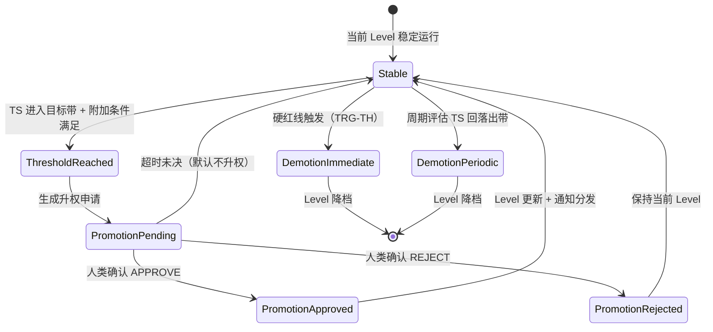

# GA-2：Trust 自治回路（回路 D）运行时详设

**文档编号：** GA-2-TAR-001  
**任务编号：** GA2-T38  
**版本：** v0.1  
**状态：** Draft  
**阶段：** GA-2 Engineering Design（回路 D 运行时）  
**输入基线：** `Research/GA-1/GA-1_Theory_v1.0.md`（GA-1.0 / v1.0，Confirmed）  
**上游架构：** `Architecture_Overview_v0.2.md`（Confirmed，GA-DEC-004）  
**强关联：**  
- `Risk_Trust_SelfReview_v0.1.md`（Trust Score 公式 / L0–L5 矩阵 / SRA 状态机）  
- `Learning_Reflection_Runtime_v0.1.md`（RFE 信号 / TR-SIG-* 契约）  
- `Runtime_Envelope_Selfcheck_v0.1.md`（env 透传 / trust_credit_allowed / 熔断）  
- `Shadow_Mode_Design_v0.1.md`（防污染 / 升权阶梯 / shadow_trust_proxy）  
- `CBA_OFG_Interface_v0.1.md`（trust_snapshot / CBAContext）  
- `Error_Reason_Code_Catalog_v0.1.md`（错误码命名空间）  
- `Decision_Packet_Schema_v0.1.md`（trust_required / trust_actual 字段）  
**授权依据：** GA-DEC-004（主线冻结）；GA2-T38  
**作者角色：** Research Engineer 子代理（工程派生，不新增理论主张）  
**约束：** 本文为回路 D 运行时编排契约；**不改 GA-1；不含真实 API、无可执行投放脚本、无任何凭证**；所有阈值与默认值一律 **Proposed**；`env≠LIVE` 不得写入 live Trust Score；与理论冲突时以 GA-1 为准并修订本文。

---

## 0. 安全边界与范围声明（强制阅读）

### 0.1 本轮明确不做

| 项 | 说明 |
|---|---|
| 真实平台写操作 | 不调用任何真实投放/改价/改预算接口；Trust 更新不触发平台副作用 |
| 凭证与密钥 | 不创建、不示例、不落盘任何密钥 |
| 修改 GA-1 理论 | 本文为纯工程派生，不新增/修订理论主张 |
| 自动升权到可写档 | 升权必须经人类审批，不得由 Trust Score 单独决定 |
| Shadow/Fixture 驱动 live Trust | `env≠LIVE` 样本永不直接写入 live Trust Score（RE-I2 / LR-P03） |
| 实现代码 | 只定义契约与伪逻辑，不提供可执行实现 |
| 阈值确认 | 所有权重、门限、迟滞参数均为 Proposed，须经 GA2-T14/T15 标定后替换 |

### 0.2 本轮明确要做

1. 定义 Trust Score 更新任务（`TrustUpdateJob`）的角色、触发、幂等与状态机。  
2. 定义 Trust Level 升降权状态机（L0–L5）：升权审批流程、降权自动策略、迟滞防抖。  
3. 定义与 ReflectionReport / RFE TR-SIG-* 信号的衔接（仅 live）。  
4. 定义与 SRA T2/T8 样本的衔接契约。  
5. 定义权限半径变化如何通知 CBA / Adapter（能力集快照 `CapabilitySnapshot`）。  
6. 定义防污染硬约束：Shadow/Fixture/Simulation 永不直接升 live Trust。  
7. 定义审计字段与错误码。  
8. 给出理论追踪与待决问题。

### 0.3 一句话定位

> Trust 自治回路运行时是回路 D 的**调度与治理层**：把"何时重算、谁在升权、权限如何传导"工程化；它不替代 Risk 的硬约束、不替代 Self-review 的终审、不替代 CBA 的编排。

---

## 1. 运行时角色与组件边界

### 1.1 职责边界

对齐 Architecture §5 与 Risk_Trust_SelfReview §2：

| 组件 | 主责 | 本文新增（运行时） | 绝不做 |
|---|---|---|---|
| **Trust Engine (TE)** | 消费信号、重算 Trust Score、映射 Trust Level、输出能力集 | 作业入队、幂等、状态机推进、通知分发 | 无证据升权；直接改 Risk 基线；替代 SRA 审批 |
| **Trust Autonomy Orchestrator** | 统一队列、触发源、租约、重试、隔离分流 | 本文主体 | 生成业务结论；直接改 Level |
| **CBA** | 消费 `trust_snapshot` 进行编排 | 接收 `CapabilitySnapshot` 变更通知 | 不改 Trust Score/Level |
| **SRA** | 消费 Trust Level 作为门禁输入 | — | 不改 Trust Score/Level |
| **RFE** | 产生 TR-SIG-* 建议信号 | — | 不直接改 Trust Score 本体 |
| **人类审批者** | 升权确认 | 接收升权评审材料 | 不直接操作 Trust Score 本体 |

**控制原则（继承 Risk 文档 §2）：**

1. **Risk 硬于 Trust**：硬红线触发时，Trust Level 再高也不能 APPROVE。  
2. **Trust 限制能力，不替代审批**：高等级解锁动作类型，但每个动作仍须过 Self-review。  
3. **升权需人类确认**（L1–L5 全部）：Trust Score 达标是**必要条件**，不是充分条件。  
4. **降权可自动**：硬红线 / P_hard 触发可立即降档，无需等待周期。  
5. **Shadow 永不升 live Trust**：影子表现只进 `shadow_trust_proxy`，不映射 live Level。

### 1.2 Trust Update Job（逻辑对象）

```text
TrustUpdateJob {
  job_id*             : string          // 前缀 TJOB-
  trigger_type*       : enum { PERIODIC_WEEKLY, PERIODIC_DAILY, EVENT_HARD_FLAG,
                               EVENT_HUMAN_FORCE, EVENT_SAMPLE_THRESHOLD, MANUAL }
  trigger_ref         : string          // episode_id / event_id / iso_week / ticket_id
  priority*           : int             // P0–P2
  idempotency_key*    : string          // §1.4
  scope*              : object          // { tenant_id, shop_id?, agent_id }
  envelope*           : RuntimeEnvelope  // 快照
  trust_credit_allowed* : bool          // 强制校验：false 则拒绝
  status*             : enum { queued, running, completed, failed, quarantined }
  worker_id / lease_until : string / ts
  attempts / max_retry    : int         // Proposed max_retry=3
  error_code          : string
  input_refs*         : object          // signal_ids, report_ids, review_event_ids
  output_refs         : object          // trust_version, proposed_level, capability_snapshot_id
  created_at / updated_at / finished_at : ts
}
```

### 1.3 触发器（Trigger Sources）

| 触发器 ID | 名称 | 来源 | 默认优先级 | 说明 |
|---|---|---|---|---|
| TRG-TW | 周期重算 | 日历调度（周反思后） | P2 | 理论 §11.4；Risk §4.3 |
| TRG-TD | 日批 | 日历调度（可选） | P2 | LRR-Q08 建议日批 + 周汇总 |
| TRG-TH | 硬红线事件 | RKE hard_block 触发 | **P0** | 立即降权，不等周期 |
| TRG-THM | 人类强制降权 | 负责人指令 | **P0** | 必须记录操作者与原因 |
| TRG-TS | 样本阈值 | 可判定事件数达 n_min | P1 | 样本充足才更新 |
| TRG-TMAN | 人工触发 | 负责人/运营 | P0 | 必须记录操作者与原因 |

### 1.4 幂等（Idempotency）

| 场景 | 幂等键（建议） | 冲突行为 |
|---|---|---|
| 周期重算 | `TE:WEEK:{tenant_id}:{iso_week}` | 已有 completed → 返回既有 trust_version |
| 日批 | `TE:DAY:{tenant_id}:{date}` | 同日重复合并到同一 Session |
| 硬红线 | `TE:EVENT:{event_id}` | 同 event_id 不重复降权 |
| 人类强制 | `TE:HUMAN:{ticket_id}` | 同 ticket 不重复应用 |
| 样本阈值 | `TE:SAMPLE:{scope_hash}:{window_end}` | 同窗口不重复 |

**硬规则：** 任何 completed job 不得静默重写 Trust Score；若需修订，创建 `trust_version+1` 并保留 lineage。

### 1.5 编排状态机

对齐 Learning_Reflection_Runtime §3.1，状态语义一致：

```text
queued → running → completed / failed / quarantined
```

**迁移规则（Trust 侧特有）：**

| 从 → 到 | 条件 | 审计 |
|---|---|---|
| running → completed | Trust Score 重算完成；Level 变更评估完成；通知分发完成 | trust_version, proposed_level |
| running → quarantined | `trust_credit_allowed=false`；env 非法；数据源未校验却当 LIVE | policy_id |
| running → completed (partial) | 维度样本不足（sparse），仅更新可用维度 | sparse_dimensions |
| failed → quarantined | attempts ≥ max_retry 或不可恢复错误 | quarantine_reason |

---

## 2. Trust Score 更新任务（仅 LIVE、trust_credit_allowed）

### 2.1 入口硬校验

对齐 Runtime_Envelope RE-I2 / RA-06 / LR-P03：

```text
on_trust_update_job_enqueued(job):
  // 硬约束 1：env 必须为 LIVE
  if job.envelope.env != LIVE:
      job.status = quarantined
      job.error_code = GARP-LR-1002  // TRUST_CREDIT_DENIED
      log(audit)
      return

  // 硬约束 2：trust_credit_allowed 必须为 true
  if job.envelope.trust_credit_allowed == false:
      job.status = quarantined
      job.error_code = GARP-LR-1002
      log(audit)
      return

  // 硬约束 3：learning_pool 必须为 LIVE_POOL
  if job.envelope.learning_pool != LIVE_POOL:
      job.status = quarantined
      job.error_code = GARP-LR-1001  // NON_LIVE_POOL_ISOLATED
      log(audit)
      return

  // 通过 → 入队
  job.status = queued
  enqueue(job)
```

**不变式：**

| ID | 不变式 | 依据 |
|---|---|---|
| TAR-I1 | `env≠LIVE` ⇒ Trust Update Job 立即 quarantined | RE-I2；Shadow §5.3 |
| TAR-I2 | `trust_credit_allowed=false` ⇒ 信号只进 SHADOW_POOL，不更新 live TS | RA-06；LR-P03 |
| TAR-I3 | Trust Score 重算只消费 live 样本池 | Risk §4.2 |
| TAR-I4 | 编排器不得在 completed 回调里直接改 Trust Level | LRR §7.3 |
| TAR-I5 | 任何 Trust 变更必须写审计事件 | 架构 P6 |

### 2.2 更新流程

```text
TrustUpdateJob.running():
  // 1. 校验入口（§2.1 已做，此处二次确认）
  assert envelope.env == LIVE
  assert envelope.trust_credit_allowed == true

  // 2. 收集信号
  signals = collect_signals(
    scope = job.scope,
    window = [t0, t1),           // 滚动窗口 W（默认 28 天，Proposed）
    min_samples = n_min           // 默认 30 个可判定事件（Proposed）
  )

  // 3. 按维度聚合
  for each T_i in {T1..T8}:
      T_i_raw = aggregate_dimension(T_i, signals)
      if sample_count(T_i) < n_min:
          T_i_flag = sparse
          T_i_score = 50  // 先验中心（Proposed）
      else:
          T_i_flag = normal
          T_i_score = T_i_raw

  // 4. 计算原始得分
  TS_raw = Σ w_i * T_i_score    // 权重见 Risk §4.2

  // 5. 指数平滑
  TS_smooth = α * TS_raw + (1-α) * TS_smooth(t-1)    // α=0.3（Proposed）

  // 6. 惩罚项（乘性）
  TS = clamp(
    TS_smooth * (1 - P_hard) * (1 - P_repeat) * (1 - P_human),
    0, 100
  )

  // 7. 更新信任版本
  trust_version = trust_version + 1
  persist(TrustRecord {
    scope, trust_version, TS, T_i_scores, T_i_flags,
    P_hard, P_repeat, P_human,
    window, n_total, n_by_dimension,
    created_at, envelope
  })

  // 8. 评估 Level 变更（§3）
  evaluate_level_change(scope, TS, trust_version)

  // 9. 分发通知（§5）
  if level_changed:
      dispatch_capability_snapshot(scope, new_level)

  // 10. 完成
  job.status = completed
  log(audit)
```

### 2.3 窗口与平滑参数（全部 Proposed）

| 参数 | 值 | 说明 |
|---|---|---|
| 滚动窗口 W | 28 天 | Risk §4.3 |
| 最小样本数 n_min | 30 | 有效样本 < n_min 则 sparse |
| 指数平滑 α | 0.3 | Risk §4.3 |
| 先验中心 | 50 | sparse 维度使用 |
| P_hard 范围 | [0, 0.5] | 硬红线违规映射 |
| P_repeat 范围 | [0, 0.3] | REVISE 循环超限 / 高频违反窗口 |
| P_human 范围 | [0, 0.4] | ESCALATE_HUMAN 被人类否决 |

---

## 3. Trust Level 升降权状态机（L0–L5）

### 3.1 理论锚点

- GA-1 §6.7：权限成长路径（建议→低风险→关键词/人群→预算→新建→完整自主）  
- Architecture §7：映射为 Level 0–5  
- Risk §5：允许动作矩阵与门控逻辑  

### 3.2 Level 定义与门限（继承 Risk §4.3，Draft）

| Level | TS 分数带 | 升级附加条件 | 降级条件 | 典型动作半径 |
|---|---|---|---|---|
| **L0** | TS < 40 或新部署 | — | — | 只读感知 / 分析 / 建议 |
| **L1** | 40 ≤ TS < 55 | 完成 ≥1 个完整预测-调整-验证周期且无硬红线 | TS 回落出带或硬红线 | + 低风险微调 |
| **L2** | 55 ≤ TS < 70 | `T2≥60` 且 `T4≥60`，样本达标 | 同上 | + 关键词/人群出价 |
| **L3** | 70 ≤ TS < 82 | `T1≥65` 且 `T8≥65`，近 14 天无 R4 违规 | 同上 | + 计划内预算调整 |
| **L4** | 82 ≤ TS < 90 | `T5≥70` 且 `T6≥60`，探索预算执行偏差在限内 | 同上 | + 账户级预算 / 新建计划 |
| **L5** | TS ≥ 90 | 连续 2 个周期无 REJECT 误放行；人类抽检通过 | 任一 P_hard>0 立即降档 | + 批量/跨计划策略切换 |

**矩阵不变量（继承 Risk §5.2）：**  
任何 Level 均不得绕过 Self-review；任何 Level 均不得执行硬红线动作。

### 3.3 升权状态机



### 3.4 升权审批流程（人类确认）

**原则：升权必须经人类确认。Trust Score 达标是必要条件，不是充分条件。**

```text
PromotionRequest {
  request_id*         : string          // 前缀 TPR-
  scope*              : object
  current_level*      : TrustLevel
  proposed_level*     : TrustLevel
  trust_version*      : int
  evidence_refs*      : string[]        // TrustRecord, ReflectionReport, SRA ReviewEvent
  component_scores*   : object          // T1..T8 当前分
  risk_compliance*    : object          // 近期硬红线 / R4 违规统计
  sample_coverage*    : object          // 样本量、覆盖度
  shadow_proxy?       : object          // 仅参考，不作为升权依据
  status*             : enum { pending, approved, rejected, expired }
  approver?           : string          // 人类审批者
  decided_at?         : ts
  decision_reason?    : string
  created_at*         : ts
  expires_at*         : ts              // Proposed：7 天超时
}
```

**升权触发条件（全部满足）：**

1. Trust Score 进入目标 Level 分数带；  
2. 附加条件满足（T2/T4/T1/T8/T5/T6 等）；  
3. 样本量达标（n ≥ n_min）；  
4. 近期无硬红线违规；  
5. 生成 `PromotionRequest` 并进入人类审批队列。

**人类审批选项：**

| 选项 | 语义 | 后续 |
|---|---|---|
| `HUMAN_APPROVE` | 确认升权 | Level 更新；写审计；分发 CapabilitySnapshot |
| `HUMAN_REJECT` | 拒绝升权 | 保持当前 Level；写审计；记录拒绝原因 |
| `HUMAN_DEFER` | 暂缓 | 保持 pending；到期自动 rejected |
| `HUMAN_MODIFY` | 修改目标 Level | 按修改后的 Level 执行（须记录理由） |

**超时策略（Proposed）：**  
`expires_at` 默认 7 天。超时未决 → 自动 rejected，不升权。原因：宁可保守，不可激进。

**降级抽检频率（Proposed，对齐 Risk Q-R8）：**

| Level | 升权抽检比例 | 说明 |
|---|---|---|
| L0→L1 | 100%（全部人工） | 初始信任建立 |
| L1→L2 | 100% | 早期谨慎 |
| L2→L3 | 50% 抽检 + 人工确认 | 中期 |
| L3→L4 | 30% 抽检 + 人工确认 | 进入写权限前 |
| L4→L5 | 100%（全部人工 + GA-DEC） | 最高权限 |

### 3.5 降权策略

| 类型 | 触发 | 速度 | 是否需人类确认 |
|---|---|---|---|
| **立即降权** | 硬红线违规（P_hard>0） | 立即 | **否**（自动） |
| **立即降权** | 人类强制指令 | 立即 | 是（指令本身） |
| **周期降权** | TS 回落出当前带 | 下一周期 | **否**（自动） |
| **事件降权** | ESCALATE_HUMAN 被人类否决严重 | 立即 | 否（自动） |

**降权不变式：**

| ID | 不变式 |
|---|---|
| TAR-I6 | 降权无需人类确认；升权必须人类确认 |
| TAR-I7 | 硬红线降权立即生效，不等周期 |
| TAR-I8 | 降权后必须重新走升权流程才能恢复 |
| TAR-I9 | 连续降权事件必须进入 Failure Pattern 候选 |

### 3.6 迟滞（防抖动）

继承 Risk §4.3：

| 参数 | 值 | 说明 |
|---|---|---|
| 升级迟滞 k_up | 2 | 连续 2 次周期评估满足才升权 |
| 降级迟滞 k_down | 1 | 1 次即可降权（硬红线除外） |
| 硬红线迟滞 | 0 | 立即生效 |

---

## 4. 与 ReflectionReport / SRA T2/T8 信号衔接

### 4.1 原则

1. RFE / SRA 只产生**建议信号**，不改 Trust Score 本体（继承 LRR §7.1）。  
2. TE 消费信号并决定是否计入维度；权重公式属 Risk §4.2。  
3. **`env≠LIVE` ⇒ 信号只进 SHADOW_POOL，不更新 live TS/Level。**

### 4.2 信号类型映射（继承 LRR §7.2）

| 信号 ID | 对应 Trust 因子 | 来源 | live 可计分 | 本文补充 |
|---|---|---|---|---|
| TR-SIG-PRED | T1 历史预测准确率 | RFE window_hit / prediction_error | 是 | — |
| TR-SIG-ACHV | T2 调整后达成率 | RFE packet outcome vs expected | 是 | — |
| TR-SIG-RISK | T3 风险控制能力 | RKE 无硬红线违规 | 是 | — |
| TR-SIG-BUD | T4 预算损失控制 | RKE 预算事件 Finding | 是 | — |
| TR-SIG-REVIEW | T6 失败复盘质量 | RFE 完整 Report | 是 | — |
| TR-SIG-KNOW | T7 知识更新有效性 | KE accepted 观察→升级命中 | 是（滞后） | — |
| TR-SIG-GATE | T8 自审批准确性 | SRA + TRACE + RFE | 是 | §4.3 详述 |
| TR-SIG-SHADOW | （无对应） | shadow eval | **否** | §6 防污染 |
| TR-SIG-HIGHOUT | T5 高产出计划比例 | LE/KE + STATE | 是 | — |

### 4.3 T8 样本衔接（SRA → TE）

T8 是 Trust 权重最高的维度（0.18），样本来源为 SRA 审批结果与事后验证：

```text
T8_sample_collection():
  // APPROVE 成功样本
  for each ReviewEvent where review_result == APPROVE:
      wait for outcome_ref (executed → observed)
      if outcome_met_expected:     // 达到预期方向/幅度
          T8_positive += 1
      else:
          T8_false_approve += 1    // 误放行

  // REJECT/HOLD 样本
  for each ReviewEvent where review_result in {REJECT, HOLD}:
      // 人工验证或后续结果证明
      if human_or_outcome_proves_should_approve:
          T8_false_reject += 1     // 误杀
      else:
          T8_correct_reject += 1

  // NO_ACTION_APPROVE 样本
  for each ReviewEvent where review_result == NO_ACTION_APPROVE:
      // 稳定性正确性验证
      if plan_stable_as_expected:
          T8_correct_no_action += 1
      else:
          T8_missed_intervention += 1

  T8_score = f(T8_positive, T8_false_approve, T8_correct_reject, T8_false_reject, ...)
```

**T8 样本硬约束：**

| ID | 约束 | 依据 |
|---|---|---|
| TAR-I10 | `env≠LIVE` 的 SRA 结果不得计入 live T8 | RE-I2/I9 |
| TAR-I11 | 影子 SRA 结果仅用于校准反事实 APPROVE 率（`shadow_trust_proxy`） | Shadow §6.3 |
| TAR-I12 | 运营"参考执行"影子建议须补人工 Decision 记录，否则不得计 T2/T8 | SM-R09 |

### 4.4 信号收集伪逻辑

```text
on_governance_signal(signal):
  // 硬约束：env 过滤
  if signal.envelope.env != LIVE:
      record(signal, pool=SHADOW_POOL)
      return  // 不更新 live TS

  if signal.envelope.trust_credit_allowed == false:
      record(signal, pool=SHADOW_POOL)
      return

  // live 信号入池
  live_trust_pool.add(signal)

  // 检查样本阈值
  if sample_count_reached(signal.scope, signal.dimension):
      trigger(TrgUpdateJob(type=EVENT_SAMPLE_THRESHOLD, scope=signal.scope))
```

---

## 5. 权限半径变化如何通知 CBA / Adapter

### 5.1 问题陈述

Trust Level 变更后，CBA 需要知道当前允许的动作类范围，以便：
1. 在编排时过滤掉超权限的任务；  
2. 在 Decision Packet 中正确填写 `trust_required` / `trust_actual`；  
3. 在 SRA 门禁前预判动作是否在权限内。

### 5.2 CapabilitySnapshot（能力集快照）

**新建逻辑对象**，由 TE 在 Level 变更时生成并分发：

```text
CapabilitySnapshot {
  snapshot_id*        : string          // 前缀 CAPS-
  scope*              : object          // { tenant_id, shop_id?, agent_id }
  trust_version*      : int
  trust_level*        : TrustLevel      // L0–L5
  trust_score*        : number          // TS 当前值
  allowed_action_classes* : string[]    // 当前 Level 允许的动作类
  denied_action_classes*  : string[]    // 当前 Level 禁止的动作类
  constraint_preview* : object          // Risk constraints 预览（非终审）
  effective_from*     : ts
  expires_at?         : ts              // 可选：快照有效期
  created_at*         : ts
  actor*              : string          // TE
  reason_codes[]      : string          // 触发原因（升权/降权/周期）
}
```

**动作类枚举（对齐 Risk §5.2）：**

| 动作类代码 | 名称 | 最低 Level |
|---|---|---|
| `ACT_READ` | 只读感知/分析/建议 | L0 |
| `ACT_LOW_RISK` | 低风险微调（展示开关/标签） | L1 |
| `ACT_KEYWORD_BID` | 关键词出价 | L2 |
| `ACT_CROWD_PREMIUM` | 人群溢价 | L2 |
| `ACT_PLAN_BUDGET` | 计划内预算调整 | L3 |
| `ACT_ACCOUNT_BUDGET` | 账户级预算重分配 | L4 |
| `ACT_NEW_SEEDING` | 新建种草计划 | L4 |
| `ACT_NEW_HARVEST` | 新建收割计划 | L4/5 |
| `ACT_BATCH_SWITCH` | 批量/跨计划策略切换 | L5 |
| `ACT_PAUSE_ANOMALY` | 暂停/下线高花费异常计划 | L2（建议）/L3（执行） |

### 5.3 通知分发流程

```text
on_level_changed(scope, old_level, new_level, trust_version):
  // 1. 生成 CapabilitySnapshot
  snapshot = build_capability_snapshot(scope, new_level, trust_version)

  // 2. 持久化
  persist(snapshot)

  // 3. 分发到消费方
  dispatch(snapshot, to=CBA)        // CBA 编排时消费
  dispatch(snapshot, to=SRA)        // SRA 门禁时消费
  dispatch(snapshot, to=DomainAgent) // 场景 Agent 执行前消费
  dispatch(snapshot, to=Audit)      // 审计记录

  // 4. 写审计
  log(audit, event_type=CAPABILITY_SNAPSHOT_DISPATCHED)
```

### 5.4 CBA 消费契约

对齐 CBA_OFG_Interface §1.2 `CBAContext.trust_snapshot`：

```text
// CBAContext.trust_snapshot 扩展
trust_snapshot {
  trust_actual*       : TrustLevel      // 当前 Level
  trust_version*      : int
  allowed_action_classes* : string[]    // 从 CapabilitySnapshot 获取
  capability_snapshot_id* : ref         // 引用最新快照
  effective_from*     : ts
}
```

**CBA 编排时的权限过滤（对齐 CBA §1.4 S0）：**

```text
// CBA.enter() 中
for each scope:
  snapshot = get_latest_capability_snapshot(scope)
  if snapshot is None:
      skip(scope, reason=TRUST_SNAPSHOT_MISSING)
      continue

  // 过滤超权限动作
  allowed = snapshot.allowed_action_classes

  // 在 Decision Packet 中填写 trust 字段
  packet.trust_required = action.min_required_level
  packet.trust_actual = snapshot.trust_level

  // 预判：trust_required > trust_actual → 标记为 ESCALATE 候选
  if packet.trust_required > packet.trust_actual:
      packet.tags += "trust_insufficient"
```

### 5.5 Adapter 消费契约

Adapter 本身不直接消费 CapabilitySnapshot（由 Domain Agent 消费后决定调用哪些写接口）。但 Adapter 的 `write` 入口应校验：

```text
// Adapter.write() 入口
assert request.envelope.env == LIVE
assert request.envelope.dry_run == false  // 仅 LIVE 模式
// 信任校验由上游 CBA/SRA 完成，Adapter 只做最终确认
```

### 5.6 通知失败处理

| 场景 | 处理 |
|---|---|
| CBA 暂时不可用 | 快照持久化；CBA 恢复后拉取最新快照 |
| 通知超时 | 重试 3 次；失败后标记 degraded；CBA 使用上一次快照 |
| 快照过期 | CBA 编排时若快照 `expires_at` 已过，标记 `trust_snapshot_stale` 并触发 TRG-TD |

---

## 6. 防污染：Shadow/Fixture 永不直接升 live Trust

### 6.1 硬不变式

| ID | 不变式 | 依据 |
|---|---|---|
| TAR-I13 | `env∈{SHADOW, SIMULATION, FIXTURE}` ⇒ 信号只进 `SHADOW_POOL` | RE-I2；Shadow §5.3 |
| TAR-I14 | `trust_credit_allowed=false` ⇒ Trust 更新接口拒绝 | RA-06；LR-P03 |
| TAR-I15 | `shadow_trust_proxy` 与 `trust_score` 字段完全隔离 | LRR §7.3；SM-Q2 |
| TAR-I16 | 影子表现可作为升权评审**材料**，不可作为升权**依据** | Shadow §7.3 |
| TAR-I17 | 任何 shadow 样本写入 live Trust 的尝试 → 立即 quarantine | DR-06 |

### 6.2 过滤伪逻辑（对齐 Shadow §5.3 / RESC §6.3）

```text
on_trust_signal(signal):
  // 链路 1：env 过滤
  if signal.envelope.env != LIVE:
      record(signal, pool=SHADOW_POOL)
      // 不更新 live TS / Level
      // 可写入 shadow_trust_proxy（仅影子域）
      update_shadow_trust_proxy(signal)
      return

  // 链路 2：trust_credit_allowed 过滤
  if signal.envelope.trust_credit_allowed == false:
      record(signal, pool=SHADOW_POOL)
      return

  // 链路 3：receipt_source 过滤
  if signal.receipt_source != PLATFORM:
      // 非平台来源不得计 T2/T8
      record(signal, pool=SHADOW_POOL)
      return

  // 通过 → live 信任池
  live_trust_pool.add(signal)
```

### 6.3 shadow_trust_proxy（仅影子域）

| 问题 | 约定 |
|---|---|
| 公式 | 可复用 live TS 公式，但样本池完全隔离 |
| 用途 | 影子评估报告；升权评审材料；FE/门禁校准 |
| 不映射 | **不映射** live Level；不作为升权依据 |
| 字段隔离 | `shadow_trust_proxy` ≠ `trust_score`；不同存储命名空间 |

### 6.4 防污染验收检查

| 检查 ID | 检查项 | 通过条件 |
|---|---|---|
| TAR-P01 | Trust 更新接口拒绝 `trust_credit_allowed=false` | 接口存在且正确拒绝 |
| TAR-P02 | `env≠LIVE` 样本 0 条进入 live Trust 池 | 抽样审计 |
| TAR-P03 | `shadow_trust_proxy` 与 `trust_score` 无交叉引用 | 代码/接口审计 |
| TAR-P04 | 升权评审材料中 shadow 数据明确标注 `origin_env` | 文档审计 |
| TAR-P05 | 无 shadow 样本驱动 Level 变更事件 | 审计日志检索 |

---

## 7. 审计与错误码

### 7.1 审计事件（TRACE）

每次状态迁移与关键动作写审计事件：

```text
TrustAuditEvent {
  audit_id*           : string
  job_id?             : string          // TrustUpdateJob
  request_id?         : string          // PromotionRequest
  snapshot_id?        : string          // CapabilitySnapshot
  event_type*         : enum {
    ENQUEUE, CLAIM, COMPLETE, FAIL, QUARANTINE,
    TRUST_SCORE_UPDATED,
    LEVEL_EVALUATED,
    PROMOTION_REQUESTED,
    PROMOTION_APPROVED, PROMOTION_REJECTED, PROMOTION_EXPIRED,
    DEMOTION_IMMEDIATE, DEMOTION_PERIODIC,
    CAPABILITY_SNAPSHOT_DISPATCHED,
    SIGNAL_INGESTED, SIGNAL_REJECTED,
    HUMAN_DECISION
  }
  actor*              : string          // orchestrator / te_worker / human:{id}
  envelope*           : RuntimeEnvelope  // 快照
  from_state?         : string
  to_state?           : string
  trust_version_old?  : int
  trust_version_new?  : int
  level_old?          : TrustLevel
  level_new?          : TrustLevel
  reason_codes[]      : string
  payload_digest      : string          // 产物哈希
  occurred_at*        : timestamp
}
```

**规则：** 审计事件只追加；不得物理删除失败记录（架构 P6 / DPK-I6 同源）。

### 7.2 错误码（对齐 Error_Reason_Code_Catalog）

本回路新增错误码（TRUST 码段）：

| 码 | 短名 | 含义 | 处置 |
|---|---|---|---|
| `GARP-TRUST-1001` | TRUST_CREDIT_DENIED | `trust_credit_allowed=false` 尝试更新 live Trust | quarantine |
| `GARP-TRUST-1002` | TRUST_ENV_INVALID | `env≠LIVE` 尝试更新 live Trust | quarantine |
| `GARP-TRUST-1003` | TRUST_POOL_MISMATCH | `learning_pool≠LIVE_POOL` | quarantine |
| `GARP-TRUST-1004` | TRUST_SAMPLE_INSUFFICIENT | 样本量 < n_min | partial completed |
| `GARP-TRUST-1005` | TRUST_PROMOTION_EXPIRED | 升权申请超时未决 | rejected |
| `GARP-TRUST-1006` | TRUST_PROMOTION_REJECTED | 人类拒绝升权 | 保持当前 Level |
| `GARP-TRUST-1007` | TRUST_DEMOTION_HARD_FLAG | 硬红线触发降权 | 立即降档 |
| `GARP-TRUST-1008` | TRUST_SNAPSHOT_MISSING | CBA 无可用 CapabilitySnapshot | 标记 degraded |
| `GARP-TRUST-1009` | TRUST_SNAPSHOT_STALE | CapabilitySnapshot 过期 | 触发重算 |
| `GARP-TRUST-1010` | TRUST_SIGNAL_REJECTED | 信号被防污染过滤拒绝 | 记录入 SHADOW_POOL |
| `GARP-TRUST-1011` | TRUST_VERSION_CONFLICT | trust_version 冲突 | 重试 |
| `GARP-TRUST-1012` | TRUST_HUMAN_TICKET_INVALID | 人类指令票据无效 | 拒绝 |

**映射到现有目录：**

| 现有码 | 本回路关联 |
|---|---|
| `GARP-LR-1002` | TRUST_CREDIT_DENIED（旧短名） |
| `GARP-LR-1001` | NON_LIVE_POOL_ISOLATED |
| `GARP-GATE-2001` | TRUST_CAPABILITY_INSUFFICIENT（SRA 门禁侧） |

### 7.3 失败与重试策略（Proposed）

| 参数 | 占位 | 说明 |
|---|---|---|
| max_retry | 3 | 含首次共 3 次尝试后 quarantined |
| backoff | 指数：1m, 5m, 30m | 可配置 |
| heartbeat | 60s | running 需续约 lease |
| lease_timeout | 5m | 过期可被重新 claim |
| 不可恢复错误 | 直接 quarantined | env 伪造、trust_credit 伪造、越权升权尝试 |
| 部分失败 | degraded completed | 维度样本不足但主结论可出 |

---

## 8. 理论追踪与待决问题

### 8.1 理论 → 工程追踪

| 理论主张 | GA-1 锚点 | 本文落点 | 覆盖 |
|---|---|---|---|
| Trust-based Autonomous Growth | §6.7；GA-INNOV-007 | §1 运行时角色；§2 Score 更新；§3 Level 状态机 | Mapped |
| Trust Score 八维构成 | §11.3 | §2.2 更新流程；§4.2 信号映射 | Mapped |
| 权限随信任生长 | §6.7 权限路径 | §3.2 Level 定义；§5 CapabilitySnapshot | Mapped |
| 验证→信任→权限 | §6.7 | §4 信号衔接；§3.4 升权审批 | Mapped |
| 自审批前置 | §11.2 | §4.3 T8 样本衔接 | Mapped |
| 风险硬于信任 | §11.1；架构 P5 | §1.1 控制原则；§3.5 降权策略 | Mapped |
| Shadow 不污染 live Trust | GA-DEC-004 红线 | §6 防污染 | Mapped |
| 周期反思驱动信任更新 | §11.4 | §1.3 TRG-TW；§2.2 更新流程 | Mapped |
| 稳定性 / NO_ACTION | §8.5 | §4.3 T8 NO_ACTION_APPROVE 样本 | Mapped |

**明确不声称：** 本文权重、阈值、迟滞参数均为工程预标定草案，不是 GA-1 理论结论；有效性待 GA-3 验证。

### 8.2 与上游不变式对齐声明

1. 未修改 GA-1 / PROJECT_SPEC。  
2. 与 Risk_Trust_SelfReview：公式、L0–L5 矩阵、门控逻辑完全继承。  
3. 与 Learning_Reflection_Runtime：TR-SIG-* 信号契约完全继承；仅 live 语义一致。  
4. 与 Runtime_Envelope：`trust_credit_allowed` / RA-06 / RE-I2 完全继承。  
5. 与 Shadow_Mode_Design：防污染 P-01..P-05；升权阶梯 S0–S8；`shadow_trust_proxy` 隔离。  
6. 与 CBA_OFG_Interface：`trust_snapshot` / `CapabilitySnapshot` 消费契约对齐。  
7. 与 Error_Reason_Code_Catalog：错误码命名空间对齐。  
8. 无真实账户脚本与写路径。

### 8.3 待决问题

| ID | 问题 | 影响 | 建议（Draft） | 归属 |
|---|---|---|---|---|
| TAR-Q01 | Trust Update Job 是否需要独立于 RFE 编排器？ | 实现拓扑 | 逻辑独立、物理可共用 worker 池 | 技术栈后置 |
| TAR-Q02 | 日批与周批的关系？是否需要日批？ | 自治节奏 | 先周批；日批可选（LRR-Q08） | GA2-T14 标定 |
| TAR-Q03 | 升权审批的组织 RBAC 如何对接？ | 治理 | 保留接口；RBAC 后置（Risk Q-R3 联动） | 与架构 Q5 联动 |
| TAR-Q04 | CapabilitySnapshot 是否需要版本化与回滚？ | 审计 | 快照持久化；回滚走信任版本追溯 | 实现评审 |
| TAR-Q05 | 多场景 Agent 并行时 Trust 是否可互相借贷？ | 权限隔离 | 默认不借贷（Risk Q-R9） | 与架构 Q1 联动 |
| TAR-Q06 | Trust Score 作用域（账户/计划簇/商品）如何分层加权？ | 精度 | 主分账户级，计划簇子分仅作 Risk 补偿（Risk Q-R1） | 待确认 |
| TAR-Q07 | 人类抽检比例是否按 Level 动态调整？ | 效率/安全 | 先固定比例（§3.4）；后可配置 | GA2-T14 |
| TAR-Q08 | 升权申请超时时间（7 天）是否合适？ | 节奏 | 先 7 天（Proposed）；后标定 | GA2-T14 |
| TAR-Q09 | `shadow_trust_proxy` 公式是否纳入本文？ | 范围 | 不纳入；仅约定不映射 live（SM-Q2） | Shadow 详设 |
| TAR-Q10 | Trust 版本冲突重试策略？ | 一致性 | 乐观锁 + 重试；冲突次数 > 3 则 quarantine | 实现 |

---

## 9. 最小运行时时序（端到端）

```text
[周期 / 事件触发]
        │ TRG-TW / TRG-TD / TRG-TH / TRG-TS
        ▼
  TrustUpdateJob queued → running
        │
        ├─ 校验 envelope（env=LIVE, trust_credit_allowed=true）
        ├─ 收集 live 信号池
        ├─ 按 T1..T8 聚合
        ├─ 计算 TS_raw → TS_smooth → TS（含惩罚项）
        ├─ 持久化 TrustRecord（trust_version+1）
        │
        ├─ 评估 Level 变更
        │     ├─ 升权条件满足？
        │     │     ├─ 是 → 生成 PromotionRequest → 人类审批队列
        │     │     │         ├─ HUMAN_APPROVE → Level 更新
        │     │     │         ├─ HUMAN_REJECT → 保持
        │     │     │         └─ 超时 → rejected
        │     │     └─ 否 → 保持
        │     │
        │     └─ 降权条件满足？
        │           ├─ 硬红线 → 立即降档（自动）
        │           ├─ TS 回落 → 下周期降档（自动）
        │           └─ 否 → 保持
        │
        ├─ Level 变更？
        │     ├─ 是 → 生成 CapabilitySnapshot → 分发 CBA/SRA/Domain
        │     └─ 否 → 不分发
        │
        └─ job.status = completed
           写审计事件

[硬红线事件]
  RKE hard_block 触发 → TRG-TH → 立即降权 → 分发 CapabilitySnapshot
```

---

## 10. 与后续任务的接口

| 下游 | 本文供给 |
|---|---|
| 实现（TE / CBA / SRA） | TrustUpdateJob 状态机、CapabilitySnapshot schema、防污染检查器 |
| GA2-T14 阈值标定 | 全部 Proposed 参数清单与标定入口 |
| GA-3 验证 | Trust 演进指标、防污染审计钩子（TAR-P01..P05） |
| 抖音 Domain Agent（GA2-T16） | 复用同一 CapabilitySnapshot 契约 |
| 负责人评审 | 升权审批流程、降权自动策略 |

---

## 11. 变更记录

| 日期 | 版本 | 变更 | 依据 |
|---|---|---|---|
| 2026-09-14 | v0.1 | 首次建立 Trust 自治回路运行时：TrustUpdateJob、Level 升降权状态机（人类确认升权）、ReflectionReport/SRA T2/T8 信号衔接、CapabilitySnapshot 通知分发、Shadow/Fixture 防污染、审计与错误码、理论追踪与待决 | GA2-T38；Architecture v0.2；Risk_Trust_SelfReview；Learning_Reflection_Runtime；Runtime_Envelope_Selfcheck；Shadow_Mode_Design；CBA_OFG_Interface；Error_Reason_Code_Catalog |

---

**Document Status:** Draft  
**Next Stage:** 负责人 / Research Architect 评审 → 修订 v0.2；阈值与升权审批流程并入 GA2-T14 / GA2-T05  
**Owner Review:** 待评审  
**Explicit Non-claim:** 本文不代表已接入真实京东账户；所有阈值、权重、迟滞参数均为 Proposed；Trust 运行时不得产生真实投放副作用；Shadow/Fixture 永不直接升 live Trust Score；升权必须经人类确认。
